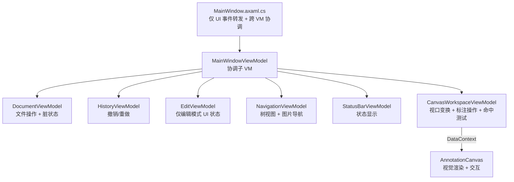
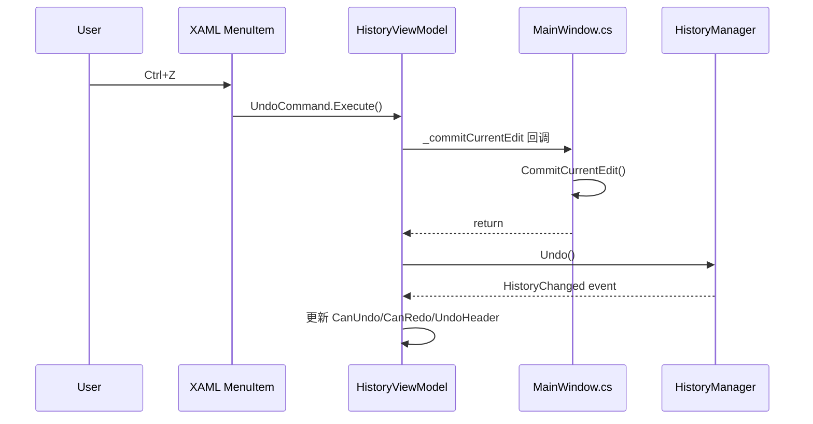

# LabelAva MVVM 重构路线

> 本文档为唯一权威重构计划，整合并替代此前所有 plans/ 下的分析文档。

---

## 一、目标架构



### 子 VM 存在原则

**子 VM 必须同时拥有状态和命令（行为）**。仅有属性无行为的"属性袋"不应独立存在——应合并到父 VM 或有行为的 VM 中。

| 子 VM | 状态 | 命令/行为 | 存在理由 |
|-------|------|----------|---------|
| StatusBarViewModel | StatusText, ZoomText | UpdateStatus 自动恢复, UpdateZoom | ✅ 封装定时器+消息过期 |
| HistoryViewModel | CanUndo, CanRedo, UndoHeader | UndoCommand, RedoCommand, ExecuteCommand | ✅ 封装 HistoryManager 交互 |
| EditViewModel | IsEditMode, CurrentGroupIndex | ToggleEditModeCommand, SwitchGroupCommand | ✅ 封装编辑模式 UI 状态 |
| DocumentViewModel | IsDirty, FilePath | NewCommand, SaveCommand, CloseCommand | ✅ 封装文件操作+脏状态 |
| NavigationViewModel | TreeItems, SelectedItem | SelectItemCommand, NavigateNext | ✅ 封装树视图行为 |
| CanvasWorkspaceViewModel | TransformMatrix, ZoomPercent, HighlightedLabelIndex | ZoomIn/Out, Pan, FitToScreen, AddLabel, DeleteLabel, MoveLabel | ✅ 封装画布工作区（视口+标注） |

---

## 二、重构进度

### Phase 0：基础状态绑定 ✅ 已完成

| 步骤 | 状态 | 说明 |
|------|------|------|
| 菜单栏 IsEnabled/Header 绑定到 ViewModel | ✅ | 替代 FindControl 命令式操控 |
| 合并 MenuBarViewModel 到 MainWindowViewModel | ✅ | 消除无行为子 VM |
| IsEditMode IsChecked TwoWay 绑定 | ✅ | 消除 _isEditMode 双源状态 |
| 移除 _isEditMode 字段，统一使用 ViewModel.IsEditMode | ✅ | 19 处引用全部迁移 |

**变更文件**：`MainWindowViewModel.cs`, `MainWindow.axaml`, `MainWindow.axaml.cs`

### Phase 1：HistoryViewModel ✅ 已完成

> 详见下方第三节

### Phase 2：EditViewModel ✅ 已完成

> 详见 `plans/Phase2-EditViewModel迁移方案.md`

- [x] 迁移编辑模式切换逻辑 → `EditViewModel.ToggleEditModeCommand`
- [x] 迁移标签添加/删除/移动/分组切换命令 → `EditViewModel.AddLabel/DeleteLabel/MoveLabel/ChangeGroup/ReorderLabels`
- [x] 迁移编辑面板显示/隐藏 → XAML 绑定 `Edit.IsEditPanelVisible`/`Edit.AreGroupButtonsVisible`
- [x] 迁移 `_currentGroupIndex` → `Edit.CurrentGroupIndex`
- [x] 迁移 `_pendingNewLabelIndex` → `Edit.PendingNewLabelIndex`
- [x] 移除 `OnToggleEditMode`/`UpdateEditModeButton`/`UpdateGroupButtonsVisibility`

### Phase 3：DocumentViewModel ✅ 已完成

> 详见 `plans/Phase3-DocumentViewModel迁移方案.md`

- [x] 引入 IFileService 抽象（解决 StorageProvider 依赖）
- [x] 迁移新建/打开/保存/另存为/关闭逻辑 → `DocumentViewModel.New/Open/Save/SaveAs/Close`
- [x] 迁移脏状态管理和自动保存 → `DocumentViewModel.IsDirty` + 自动保存定时器
- [x] 迁移窗口标题管理 → `DocumentViewModel.WindowTitle` 绑定
- [x] 移除 `OnNewTranslation`/`OnOpenTranslationFile`/`OnSaveTranslation`/`OnSaveAsTranslation`/`OnCloseTranslation`
- [x] 移除 `CreateNewTranslationAsync`/`OpenTranslationFileAsync`/`GenerateTranslationFileContent`
- [x] 移除 `ShowUnsavedChangesDialogAsync`/`ShowCloseTranslationDialogAsync`/`CloseTranslationInternal`
- [x] 移除 `SetDirty`/`UpdateTitle`/`OnAutoSaveTimerTick`
- [x] 移除 `_isDirty`/`_autoSaveTimer`/`_forceClose`/`_currentTranslationFilePath` 字段
- [x] 文件菜单 XAML 绑定：`Click` → `Command`
- [x] 窗口标题 XAML 绑定：`Title="{Binding Document.WindowTitle}"`

### Phase 4：NavigationViewModel ✅ 已完成

> 详见 `plans/Phase4-NavigationViewModel迁移方案.md`

- [x] 迁移树视图数据状态（_treeItems, _currentTreeItem, _currentImageIndex 等）→ NavigationViewModel
- [x] 迁移 BuildTreeView 逻辑 → NavigationViewModel.BuildTreeView
- [x] 迁移 OnTreeViewSelectionChanged 中的导航状态逻辑（图片切换、手风琴展开/收起）
- [x] 迁移键盘/鼠标导航命令 → NavigateUp / NavigateDown
- [x] 迁移辅助方法（GetParentImageItem, SelectLabelByIndex, GetVisibleItems）
- [x] 迁移树视图拖拽数据验证逻辑
- [x] XAML 绑定 TreeView ItemsSource
- [x] 清理 MainWindow 过渡期引用

### Phase 5：ImageViewportViewModel ✅ 已完成

> 详见 `plans/Phase5-ImageViewportViewModel迁移方案.md`

- [x] 创建 `ImageViewportViewModel`：封装变换矩阵、缩放/平移/Fit 纯数学逻辑
- [x] 迁移缩放命令 → `Viewport.ZoomInCommand`/`ZoomOutCommand`/`ResetZoomCommand`
- [x] 迁移滚轮缩放 → `Viewport.ApplyZoomDelta()`
- [x] 迁移平移逻辑 → `Viewport.StartPan()`/`UpdatePan()`/`EndPan()`
- [x] 迁移 CalculateFitTransform → `Viewport.CalculateFitTransform()`
- [x] 迁移 CenterOnLabel → `Viewport.CenterOnLabel(normalizedX, normalizedY)`
- [x] 迁移容器尺寸变化 → `Viewport.UpdateContainerSize()` + `OnContainerSizeChanged()`
- [x] 添加 `TransformChanged` 事件同步矩阵到 UI + 状态栏 + FitScale
- [x] XAML 视图菜单绑定：`Click` → `Command`
- [x] 移除 `_transformMatrix`/`_isPanning`/`_lastPanPoint` 字段
- [x] 移除 `ApplyZoom`/`ApplyCentering`/`GetScaledImageSize`/`GetCurrentScale`/`GetZoomText` 方法
- [x] 移除 `MainWindowViewModel` 中 `_canZoomIn`/`_canZoomOut`/`_canResetZoom` 属性

### Phase 6：废弃代码清理 ✅ 已完成

> 详见 `plans/Phase6-废弃代码清理方案.md`

### Phase 7：CanvasWorkspaceViewModel + AnnotationCanvas ✅ 已完成

> 详见 `plans/Phase7-CanvasViewModel迁移方案.md`、`plans/Phase7-Step2-AnnotationCanvas迁移方案.md`、`plans/Phase7-Step3-清理与瘦身迁移方案.md`

- [x] Step 1：创建 `CanvasWorkspaceViewModel`（合并 ImageViewportViewModel + EditViewModel 标签操作）
- [x] Step 2：创建 `AnnotationCanvas` UserControl（视觉渲染 + 交互迁入）
- [x] Step 3：清理与瘦身
  - [x] 重命名 `CanvasViewModel` → `CanvasWorkspaceViewModel`，属性 `CanvasVM` → `CanvasWorkspace`
  - [x] 修复 `ClearCanvas()` 未重置 `_isFirstImageLoaded` 的 Bug
  - [x] 消除 MainWindow 3 个重复字段（`_currentImage`/`_currentImagePath`/`_isFirstImageLoaded`）
  - [x] 移除 4 个空壳 Pointer 事件方法
  - [x] 移除 4 个孤立方法（`OnImageContainerSizeChanged`/`OnResetZoom`/`OnAddLabel`/`OnDeleteLabel`）
  - [x] 清理注释块和过时注释（约 60 行）
  - [x] 修复 XAML 调试残留色

---

## 三、Phase 1：HistoryViewModel 迁移方案

### 3.1 当前代码分析

MainWindow 中与历史记录相关的代码分布：

| 位置 | 行号 | 功能 | 依赖 |
|------|------|------|------|
| `_historyManager` 字段 | 88 | HistoryManager 实例 | 无 |
| 构造函数中初始化 | 184-185 | new + 订阅 HistoryChanged | 无 |
| `OnUndo` / `OnRedo` | 837-848 | 菜单事件 → ExecuteGlobalUndo/Redo | CommitCurrentEdit |
| `OnHistoryChanged` | 852-856 | SetDirty + 更新菜单状态 | SetDirty, UpdateUndoRedoMenuState, UpdateHistoryMenuItems |
| `UpdateUndoRedoMenuState` | 975-982 | 同步 CanUndo/CanRedo 到 VM | ViewModel |
| `UpdateHistoryMenuItems` | 987-1003 | 同步 UndoHeader/RedoHeader 到 VM | ViewModel |
| `ExecuteGlobalUndo` | 1387-1397 | CommitCurrentEdit + Undo + 状态栏 | CommitCurrentEdit, StatusBar |
| `ExecuteGlobalRedo` | 1402-1412 | CommitCurrentEdit + Redo + 状态栏 | CommitCurrentEdit, StatusBar |
| 全局快捷键处理 | 1452-1466 | Ctrl+Z/Y 路由 | ExecuteGlobalUndo/Redo |
| `_historyManager.ExecuteCommand` 调用 | 1377,1673,1775,2912,2944,3620 | 各业务操作推入历史栈 | 无 |
| `_historyManager.Clear` 调用 | 308,1977 | 关闭/重置时清空 | 无 |
| 窗口关闭清理 | 306-308 | Clear | 无 |

### 3.2 核心难点：ExecuteGlobalUndo/Redo 依赖 CommitCurrentEdit

```csharp
private void ExecuteGlobalUndo()
{
    CommitCurrentEdit();  // ← 依赖 MainWindow 的 _translationTextBox 等控件
    if (_historyManager != null && _historyManager.CanUndo)
    {
        _historyManager.Undo();
        StatusBar.UpdateStatus("已撤销", StatusBarViewModel.StatusType.Info);
    }
}
```

`CommitCurrentEdit` 访问了 `_translationTextBox`、`_translationData`、`ImageTreeView` 等 UI 控件和状态，**不能直接移入 ViewModel**。

### 3.3 解决方案：回调注入

HistoryViewModel 接受一个 `Func<bool>` 回调，在执行 Undo/Redo 前由 View 层注入"提交当前编辑"逻辑：



### 3.4 HistoryViewModel 设计

```csharp
// ViewModels/HistoryViewModel.cs
using CommunityToolkit.Mvvm.ComponentModel;
using CommunityToolkit.Mvvm.Input;
using LabelAva.Services;

namespace LabelAva.ViewModels;

public partial class HistoryViewModel : ObservableObject
{
    private readonly HistoryManager _historyManager;
    private readonly Func<bool> _commitCurrentEdit;

    // ========================
    // 状态属性
    // ========================

    [ObservableProperty]
    private bool _canUndo;

    [ObservableProperty]
    private bool _canRedo;

    [ObservableProperty]
    private string _undoHeader = "撤销(_U)";

    [ObservableProperty]
    private string _redoHeader = "重做(_R)";

    // ========================
    // 命令
    // ========================

    [RelayCommand(CanExecute = nameof(CanUndo))]
    private void Undo()
    {
        _commitCurrentEdit();
        _historyManager.Undo();
    }

    [RelayCommand(CanExecute = nameof(CanRedo))]
    private void Redo()
    {
        _commitCurrentEdit();
        _historyManager.Redo();
    }

    // ========================
    // 构造函数
    // ========================

    public HistoryViewModel(HistoryManager historyManager, Func<bool> commitCurrentEdit)
    {
        _historyManager = historyManager;
        _commitCurrentEdit = commitCurrentEdit;
        _historyManager.HistoryChanged += OnHistoryChanged;
    }

    // ========================
    // 内部方法
    // ========================

    private void OnHistoryChanged(object? sender, EventArgs e)
    {
        CanUndo = _historyManager.CanUndo;
        CanRedo = _historyManager.CanRedo;

        var recentUndo = _historyManager.GetRecentUndoDescriptions(1);
        var recentRedo = _historyManager.GetRecentRedoDescriptions(1);

        UndoHeader = (CanUndo && recentUndo.Count > 0)
            ? $"撤销 {recentUndo[0]}"
            : "撤销(_U)";
        RedoHeader = (CanRedo && recentRedo.Count > 0)
            ? $"重做 {recentRedo[0]}"
            : "重做(_R)";

        UndoCommand.NotifyCanExecuteChanged();
        RedoCommand.NotifyCanExecuteChanged();

        // 通知外部历史已变化（用于脏标记等）
        HistoryStateChanged?.Invoke(this, EventArgs.Empty);
    }

    /// <summary>
    /// 执行命令并记录到历史（供外部业务操作调用）
    /// </summary>
    public void ExecuteCommand(IUndoableCommand command)
    {
        _historyManager.ExecuteCommand(command);
    }

    /// <summary>
    /// 清空历史记录
    /// </summary>
    public void Clear()
    {
        _historyManager.Clear();
    }

    /// <summary>
    /// 历史状态变化事件（用于通知 MainWindow 设置脏标记）
    /// </summary>
    public event EventHandler? HistoryStateChanged;
}
```

### 3.5 MainWindowViewModel 变更

```csharp
public partial class MainWindowViewModel : ObservableObject
{
    [ObservableProperty]
    private StatusBarViewModel _statusBar = new();

    [ObservableProperty]
    private HistoryViewModel _history = null!; // 由 MainWindow 构造时注入

    // 移除以下属性（已迁入 HistoryViewModel）：
    // - CanUndo, CanRedo, UndoHeader, RedoHeader
    // - SetUndoRedoState()

    // 保留以下属性（仍由 MainWindow 直接使用）：
    // - CanSave, CanSaveAs, CanCloseTranslation
    // - IsEditMode, CanToggleEditMode
    // - SetFileState()
}
```

### 3.6 XAML 变更

```xml
<!-- 修改前 -->
<MenuItem Header="{Binding UndoHeader}" Click="OnUndo" 
         IsEnabled="{Binding CanUndo}" InputGesture="Ctrl+Z"/>
<MenuItem Header="{Binding RedoHeader}" Click="OnRedo" 
         IsEnabled="{Binding CanRedo}" InputGesture="Ctrl+Y"/>

<!-- 修改后 -->
<MenuItem Header="{Binding History.UndoHeader}" 
         Command="{Binding History.UndoCommand}" InputGesture="Ctrl+Z"/>
<MenuItem Header="{Binding History.RedoHeader}" 
         Command="{Binding History.RedoCommand}" InputGesture="Ctrl+Y"/>
```

> ⚠️ 关键变化：`Click` 事件 → `Command` 绑定。`InputGesture` 在 Command 绑定下可由 Avalonia 自动路由（需配合 `KeyBinding`），不再需要全局键盘拦截中的 Ctrl+Z/Y 处理。

### 3.7 MainWindow.axaml.cs 变更

| 变更 | 说明 |
|------|------|
| 移除 `_historyManager` 字段 | 改用 `ViewModel.History` 访问 |
| 移除 `OnUndo` / `OnRedo` 事件处理 | 由 Command 绑定替代 |
| 移除 `UpdateUndoRedoMenuState` / `UpdateHistoryMenuItems` | HistoryViewModel 内部自动更新 |
| 移除 `ExecuteGlobalUndo` / `ExecuteGlobalRedo` | 由 HistoryViewModel.UndoCommand/RedoCommand 替代 |
| 构造函数中创建 HistoryViewModel | `new HistoryViewModel(hm, CommitCurrentEdit)` |
| 订阅 `HistoryStateChanged` | 替代原 `OnHistoryChanged` 中的 SetDirty 逻辑 |
| 所有 `_historyManager.ExecuteCommand(cmd)` → `ViewModel.History.ExecuteCommand(cmd)` | 统一入口 |
| 全局快捷键中移除 Ctrl+Z/Y 处理 | 由 Command + KeyBinding 替代 |

### 3.8 迁移步骤清单

- [x] 创建 `ViewModels/HistoryViewModel.cs`
- [x] 在 `MainWindowViewModel` 中添加 `History` 属性，移除 `CanUndo`/`CanRedo`/`UndoHeader`/`RedoHeader`/`SetUndoRedoState`
- [x] 在 `MainWindow.axaml.cs` 构造函数中创建 `HistoryViewModel` 实例并注入
- [x] 更新 `MainWindow.axaml` 菜单绑定：`Click` → `Command`
- [x] 移除 `MainWindow.axaml.cs` 中的 `OnUndo`/`OnRedo`/`ExecuteGlobalUndo`/`ExecuteGlobalRedo`/`UpdateUndoRedoMenuState`/`UpdateHistoryMenuItems`
- [x] 将所有 `_historyManager.ExecuteCommand(cmd)` 替换为 `ViewModel.History.ExecuteCommand(cmd)`
- [x] 将所有 `_historyManager.Clear()` 替换为 `ViewModel.History.Clear()`
- [x] 订阅 `ViewModel.History.HistoryStateChanged` 处理脏标记
- [x] 移除全局快捷键中 Ctrl+Z/Y 的手动处理（改为隧道拦截手动路由到 Command）
- [ ] 测试：撤销/重做功能、菜单状态、快捷键、脏标记

### 3.9 风险与注意事项

1. **Command 自动路由 InputGesture**：Avalonia 中 `MenuItem` 的 `InputGesture` 在使用 `Click` 事件时不会自动触发，但使用 `Command` 绑定时行为可能不同——需验证 Ctrl+Z/Y 是否自动路由到 Command，否则需保留 `KeyBinding` 显式绑定
2. **CommitCurrentEdit 回调**：该回调访问 UI 控件，确保在 ViewModel 中仅作为 `Func<bool>` 注入，不引入 UI 依赖
3. **HistoryViewModel 生命周期**：与 `HistoryManager` 一致，在 MainWindow 关闭时需取消订阅 `HistoryChanged` 事件

---

## 四、已归档文档

以下文档内容已整合入本文，原始文件可删除：

- `plans/菜单栏MVVM重构分析.md` → 本文 Phase 0
- `plans/菜单栏状态绑定迁移指南.md` → 本文 Phase 0
- `plans/mainwindow重构分析.md` → 本文目标架构
- `plans/welcomeview_mvvm分析.md` → 本文 Phase 2+ 参考
- `plans/welcomeview_mvvm重构计划.md` → 本文 Phase 2+ 参考
