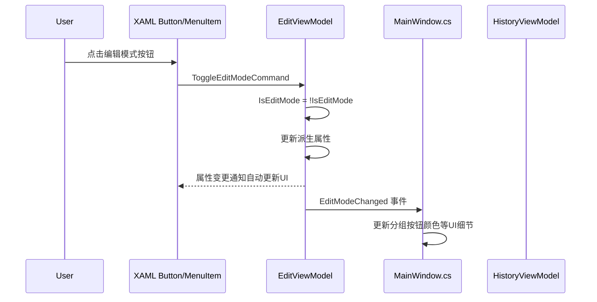

# Phase 2：EditViewModel 迁移方案

> 本文档为 Phase 2 的详细实施计划，遵循 Phase 1 (HistoryViewModel) 建立的模式。

---

## 一、当前代码分析

MainWindow.axaml.cs 中与编辑相关的代码分布：

### 1.1 编辑模式状态与切换

| 位置 | 行号 | 功能 | 依赖 |
|------|------|------|------|
| `_currentGroupIndex` 字段 | 84 | 当前分组 0=框内 1=框外 | 无 |
| `_isProgrammaticTextChange` 字段 | 81 | 程序化文本标志 | 无 |
| `_translationTextBox` 字段 | 82 | TextBox 控件引用 | UI |
| `_editPanel` 字段 | 83 | 编辑面板 Border 引用 | UI |
| `OnToggleEditMode` | 952-1008 | 菜单/工具栏切换编辑模式 | ViewModel, _editPanel, EditModeToggleButton, StatusBar |
| `UpdateEditModeButton` | 1048-1063 | 更新工具栏按钮文本/样式 | EditModeToggleButton |
| `UpdateGroupButtonsVisibility` | 1026-1043 | 显示/隐藏分组按钮 | Group0/1RadioButton |
| `OnGroupSelectionChanged` | 1068-1083 | 分组 RadioButton 点击 | Group0/1RadioButton, StatusBar |
| `SwitchToGroup` | 1409-1429 | 切换到指定分组 | Group0/1RadioButton, StatusBar |

### 1.2 标签操作命令

| 位置 | 行号 | 功能 | 依赖 |
|------|------|------|------|
| `AddNewLabel` | 1649-1689 | 在指定坐标新建标签 | _translationData, _currentImage, _currentImagePath, _currentTreeItem, _currentGroupIndex, History |
| `DeleteSelectedLabel` | 2827-2853 | 删除选中标签 | ImageTreeView.SelectedItem, _translationData, _currentImagePath, History |
| `OnToggleGroup` | 2794-2822 | 切换标签分组 | ImageTreeView.SelectedItem, _translationData, _currentImagePath, History |
| `OnDeleteSelectedLabel` | 2786-2789 | 右键菜单删除入口 | DeleteSelectedLabel |
| `OnAddLabel` | 1999-2002 | 菜单添加占位 | StatusBar |
| `OnDeleteLabel` | 2004-2007 | 菜单删除占位 | StatusBar |

### 1.3 标签拖拽交互

| 位置 | 行号 | 功能 | 依赖 |
|------|------|------|------|
| `_isDraggingLabel` 等拖拽状态字段 | 58-60, 97-99 | 拖拽状态 | UI |
| `_pendingNewLabelIndex` 字段 | 102 | 待选中标签索引 | 无 |
| `OnLabelMarkerPointerPressed` | 1455-1507 | 标签按下：选中+准备拖拽 | UI, _translationData, History |
| `OnLabelMarkerPointerMoved` | 1512-1551 | 标签拖拽移动 | UI, _currentImage |
| `OnLabelMarkerPointerReleased` | 1556-1595 | 标签释放：创建 MoveLabelCommand | _draggingLabelItem, History |
| `UpdateDraggedLabelData` | 1600-1619 | 更新拖拽标签归一化坐标 | _currentImage, _translationData |

### 1.4 文本编辑

| 位置 | 行号 | 功能 | 依赖 |
|------|------|------|------|
| `OnTranslationTextChanged` | 1258-1281 | 文本变更同步到树节点 | _translationTextBox, ImageTreeView |
| `OnTranslationTextBoxLostFocus` | 1286-1292 | 失焦提交 | CommitCurrentEdit |
| `CommitCurrentEdit` | 1298-1326 | 提交文本到历史栈 | _translationTextBox, ImageTreeView, _translationData, History |

### 1.5 画布点击（编辑模式分支）

| 位置 | 行号 | 功能 | 依赖 |
|------|------|------|------|
| `OnImageContainerPointerPressed` | 2086-2139 | 编辑模式下点击添加/选中标签 | ViewModel.IsEditMode, _currentImage, _translationData, CommitCurrentEdit |
| `FindLabelAtPosition` | 2144-2173 | 查找点击位置的标签 | _currentImage, _translationData |

### 1.6 颜色管理（RadioButton 样式）

| 位置 | 行号 | 功能 | 依赖 |
|------|------|------|------|
| `UpdateGroupButtonColors` | 1088-1121 | 更新分组按钮颜色 | ShortcutSettingsService |
| `UpdateColorResource` | 1126-1132 | 更新 Window 资源颜色 | Resources |
| `AdjustBrightness` | 1137-1143 | 调整颜色亮度 | 无 |
| RadioButton 指针事件 | 1146-1252 | 悬停/按下颜色切换 | UI |

---

## 二、核心难点分析

### 2.1 UI 依赖密集

编辑相关代码大量直接操作 UI 控件：
- `_editPanel.IsVisible` — 控制编辑面板显示
- `EditModeToggleButton.Content / .Classes` — 控制按钮文本和样式
- `Group0RadioButton.IsVisible` — 控制分组按钮可见性
- `_translationTextBox` — 文本读写和焦点控制
- `ImageWrapper.Children` — 画布标签控件管理

### 2.2 数据模型依赖

标签操作需要访问 `_translationData`、`_currentImagePath`、`_currentImage` 等数据，这些目前都是 MainWindow 的字段，尚未被任何 ViewModel 管理。

### 2.3 CommitCurrentEdit 回调

与 Phase 1 相同的问题：`CommitCurrentEdit` 访问 UI 控件，不能直接移入 ViewModel。EditViewModel 同样需要通过回调注入。

---

## 三、解决方案：回调注入 + 属性绑定

遵循 Phase 1 的 `Func<bool>` 回调模式，EditViewModel 通过构造函数注入 UI 依赖回调，状态属性通过 XAML 绑定驱动 UI。



---

## 四、EditViewModel 设计

```csharp
// ViewModels/EditViewModel.cs
using CommunityToolkit.Mvvm.ComponentModel;
using CommunityToolkit.Mvvm.Input;
using LabelAva.Commands;
using LabelAva.Models;

namespace LabelAva.ViewModels;

public partial class EditViewModel : ObservableObject
{
    private readonly HistoryViewModel _history;
    private readonly StatusBarViewModel _statusBar;
    private readonly Action _commitCurrentEdit;

    // ========================
    // 状态属性
    // ========================

    [ObservableProperty]
    private bool _isEditMode;

    [ObservableProperty]
    private bool _canToggleEditMode;

    [ObservableProperty]
    private int _currentGroupIndex;

    // ========================
    // 派生属性（供 XAML 绑定）
    // ========================

    /// <summary>编辑面板是否可见</summary>
    public bool IsEditPanelVisible => IsEditMode;

    /// <summary>编辑模式按钮文本</summary>
    public string EditModeButtonText => IsEditMode ? "编辑模式" : "查看模式";

    /// <summary>分组按钮是否可见</summary>
    public bool AreGroupButtonsVisible => IsEditMode;

    // ========================
    // 待选中标签索引（添加标签后自动选中）
    // ========================

    private int? _pendingNewLabelIndex;
    public int? PendingNewLabelIndex => _pendingNewLabelIndex;
    public void ClearPendingNewLabelIndex() => _pendingNewLabelIndex = null;

    // ========================
    // 命令
    // ========================

    [RelayCommand(CanExecute = nameof(CanToggleEditMode))]
    private void ToggleEditMode()
    {
        IsEditMode = !IsEditMode;
        UpdateDerivedProperties();
        EditModeChanged?.Invoke(this, EventArgs.Empty);

        _statusBar.UpdateStatus(
            IsEditMode ? "已进入编辑模式：左键点击图片以新建标签，中键/右键拖动平移"
                       : "已退出编辑模式",
            IsEditMode ? StatusBarViewModel.StatusType.Success
                       : StatusBarViewModel.StatusType.Info);
    }

    [RelayCommand]
    private void SwitchGroup(int groupIndex)
    {
        CurrentGroupIndex = groupIndex;
        GroupChanged?.Invoke(this, EventArgs.Empty);
        _statusBar.UpdateStatus(
            $"当前分组：{(groupIndex == 0 ? "框内" : "框外")}，点击图片添加标记",
            StatusBarViewModel.StatusType.Info);
    }

    // ========================
    // 标签操作方法（由 code-behind 调用，传入模型数据）
    // ========================

    /// <summary>添加标签</summary>
    public void AddLabel(List<LabelItem> labels, LabelItem newItem, int textIndex)
    {
        _pendingNewLabelIndex = textIndex;
        _history.ExecuteCommand(new AddLabelCommand(labels, newItem));
    }

    /// <summary>删除标签</summary>
    public void DeleteLabel(List<LabelItem> labels, LabelItem itemToDelete)
    {
        _commitCurrentEdit();
        _history.ExecuteCommand(new DeleteLabelCommand(labels, itemToDelete));
    }

    /// <summary>切换标签分组</summary>
    public void ChangeGroup(LabelItem label, int oldGroupIndex, int newGroupIndex)
    {
        _commitCurrentEdit();
        _history.ExecuteCommand(new ChangeGroupCommand(label, oldGroupIndex, newGroupIndex));
    }

    /// <summary>移动标签</summary>
    public void MoveLabel(LabelItem label, double oldX, double oldY, double newX, double newY)
    {
        _history.ExecuteCommand(new MoveLabelCommand(label, oldX, oldY, newX, newY));
    }

    /// <summary>重排序标签</summary>
    public void ReorderLabels(List<LabelItem> labels, LabelItem draggedItem, int targetIndex, int pendingIndex)
    {
        _pendingNewLabelIndex = pendingIndex;
        _history.ExecuteCommand(new ReorderLabelsCommand(labels, draggedItem, targetIndex));
    }

    // ========================
    // 构造函数
    // ========================

    public EditViewModel(HistoryViewModel history, StatusBarViewModel statusBar, Action commitCurrentEdit)
    {
        _history = history;
        _statusBar = statusBar;
        _commitCurrentEdit = commitCurrentEdit;
    }

    // ========================
    // 内部方法
    // ========================

    partial void OnIsEditModeChanged(bool value)
    {
        UpdateDerivedProperties();
        ToggleEditModeCommand.NotifyCanExecuteChanged();
    }

    partial void OnCanToggleEditModeChanged(bool value)
    {
        ToggleEditModeCommand.NotifyCanExecuteChanged();
    }

    private void UpdateDerivedProperties()
    {
        OnPropertyChanged(nameof(IsEditPanelVisible));
        OnPropertyChanged(nameof(EditModeButtonText));
        OnPropertyChanged(nameof(AreGroupButtonsVisible));
    }

    // ========================
    // 事件
    // ========================

    /// <summary>编辑模式变更事件（通知 MainWindow 更新 UI 细节）</summary>
    public event EventHandler? EditModeChanged;

    /// <summary>分组变更事件（通知 MainWindow 更新 RadioButton 状态）</summary>
    public event EventHandler? GroupChanged;
}
```

---

## 五、MainWindowViewModel 变更

```csharp
public partial class MainWindowViewModel : ObservableObject
{
    [ObservableProperty]
    private StatusBarViewModel _statusBar = new();

    [ObservableProperty]
    private HistoryViewModel _history = null!;

    [ObservableProperty]
    private EditViewModel _edit = null!; // 由 MainWindow 构造时注入

    // 移除以下属性（已迁入 EditViewModel）：
    // - _isEditMode → Edit.IsEditMode
    // - _canToggleEditMode → Edit.CanToggleEditMode

    // 保留以下属性（仍由 MainWindow 直接使用）：
    // - CanSave, CanSaveAs, CanCloseTranslation
    // - CanZoomIn, CanZoomOut, CanResetZoom

    public void SetFileState(bool hasDocument)
    {
        CanSave = hasDocument;
        CanSaveAs = hasDocument;
        CanCloseTranslation = hasDocument;
    }
}
```

---

## 六、XAML 变更

### 6.1 菜单栏 - 编辑模式 MenuItem

```xml
<!-- 修改前 -->
<MenuItem Header="编辑模式" ToggleType="CheckBox" Click="OnToggleEditMode"
          IsEnabled="{Binding CanToggleEditMode}" IsChecked="{Binding IsEditMode, Mode=TwoWay}"/>

<!-- 修改后 -->
<MenuItem Header="编辑模式" ToggleType="CheckBox"
          Command="{Binding Edit.ToggleEditModeCommand}"
          IsChecked="{Binding Edit.IsEditMode, Mode=TwoWay}"/>
```

> 注意：`IsEnabled` 由 `ToggleEditModeCommand.CanExecute` 自动管理，无需显式绑定。

### 6.2 工具栏 - 编辑模式按钮

```xml
<!-- 修改前 -->
<Button x:Name="EditModeToggleButton" Content="查看模式" Click="OnToggleEditMode"
        Classes="mode-toggle" VerticalAlignment="Center"/>

<!-- 修改后 -->
<Button Content="{Binding Edit.EditModeButtonText}"
        Command="{Binding Edit.ToggleEditModeCommand}"
        Classes.mode-toggle-active="{Binding Edit.IsEditMode}"
        Classes="mode-toggle" VerticalAlignment="Center"/>
```

> 移除 `x:Name="EditModeToggleButton"`，不再需要 code-behind 引用。

### 6.3 分组 RadioButton

```xml
<!-- 修改前 -->
<RadioButton x:Name="Group0RadioButton" ... IsVisible="False" Click="OnGroupSelectionChanged"/>
<RadioButton x:Name="Group1RadioButton" ... IsVisible="False" Click="OnGroupSelectionChanged"/>

<!-- 修改后 -->
<RadioButton x:Name="Group0RadioButton" ... IsVisible="{Binding Edit.AreGroupButtonsVisible}"
            Click="OnGroupSelectionChanged"/>
<RadioButton x:Name="Group1RadioButton" ... IsVisible="{Binding Edit.AreGroupButtonsVisible}"
            Click="OnGroupSelectionChanged"/>
```

> 保留 `x:Name` 和 `Click` 事件，因为 RadioButton 的选中状态和颜色管理仍需 code-behind 参与。

### 6.4 编辑面板

```xml
<!-- 修改前 -->
<Border x:Name="EditPanel" ... IsVisible="False">

<!-- 修改后 -->
<Border x:Name="EditPanel" ... IsVisible="{Binding Edit.IsEditPanelVisible}">
```

> 保留 `x:Name="EditPanel"`，因为 `_translationTextBox` 的焦点控制等仍需 code-behind 访问。

---

## 七、MainWindow.axaml.cs 变更

### 7.1 移除的字段

| 字段 | 原因 |
|------|------|
| `_currentGroupIndex` | 迁入 `Edit.CurrentGroupIndex` |
| `_pendingNewLabelIndex` | 迁入 `Edit.PendingNewLabelIndex` |

### 7.2 移除的方法

| 方法 | 原因 |
|------|------|
| `OnToggleEditMode` | 由 `Edit.ToggleEditModeCommand` + XAML 绑定替代 |
| `UpdateEditModeButton` | 由 `Edit.EditModeButtonText` 绑定替代 |
| `UpdateGroupButtonsVisibility` | 由 `Edit.AreGroupButtonsVisible` 绑定替代 |

### 7.3 修改的方法

| 方法 | 变更说明 |
|------|---------|
| 构造函数 | 创建 `EditViewModel` 实例并注入，订阅 `EditModeChanged`/`GroupChanged` 事件 |
| `OnGroupSelectionChanged` | 改为调用 `ViewModel.Edit.SwitchGroup(index)` |
| `SwitchToGroup` | 改为调用 `ViewModel.Edit.SwitchGroup(index)` + 更新 RadioButton |
| `AddNewLabel` | 改为调用 `ViewModel.Edit.AddLabel(...)` |
| `DeleteSelectedLabel` | 改为调用 `ViewModel.Edit.DeleteLabel(...)` |
| `OnToggleGroup` | 改为调用 `ViewModel.Edit.ChangeGroup(...)` |
| `OnLabelMarkerPointerReleased` | 改为调用 `ViewModel.Edit.MoveLabel(...)` |
| `OnTreeViewDrop` | 改为调用 `ViewModel.Edit.ReorderLabels(...)` |
| `RebuildCurrentView` | 通过 `ViewModel.Edit.PendingNewLabelIndex` 访问待选中索引 |
| `ShowMainContent` | 改为设置 `ViewModel.Edit.CanToggleEditMode` |
| `ShowWelcomeScreen` | 改为设置 `ViewModel.Edit.CanToggleEditMode` + `ViewModel.Edit.IsEditMode` |
| `OnImageContainerPointerPressed` | 改为读取 `ViewModel.Edit.IsEditMode` 和 `ViewModel.Edit.CurrentGroupIndex` |
| `OnGlobalKeyDown` | 分组切换快捷键改为调用 `ViewModel.Edit.SwitchGroup()` |

### 7.4 新增的事件处理

```csharp
// EditViewModel.EditModeChanged 事件处理
private void OnEditModeChanged(object? sender, EventArgs e)
{
    // 更新分组按钮颜色（仍需 code-behind，因为涉及 Window Resources）
    if (ViewModel.Edit.IsEditMode)
    {
        UpdateGroupButtonColors();
    }
}

// EditViewModel.GroupChanged 事件处理
private void OnGroupChanged(object? sender, EventArgs e)
{
    // 同步 RadioButton 选中状态
    var groupIndex = ViewModel.Edit.CurrentGroupIndex;
    if (groupIndex == 0 && Group0RadioButton != null)
        Group0RadioButton.IsChecked = true;
    else if (groupIndex == 1 && Group1RadioButton != null)
        Group1RadioButton.IsChecked = true;
}
```

### 7.5 构造函数变更

```csharp
// 新增：创建 EditViewModel
ViewModel.Edit = new EditViewModel(ViewModel.History, StatusBar, CommitCurrentEdit);
ViewModel.Edit.EditModeChanged += OnEditModeChanged;
ViewModel.Edit.GroupChanged += OnGroupChanged;
```

---

## 八、迁移步骤清单

- [ ] 1. 创建 `ViewModels/EditViewModel.cs`，包含状态属性、命令、标签操作方法
- [ ] 2. 在 `MainWindowViewModel` 中添加 `Edit` 属性，移除 `IsEditMode`/`CanToggleEditMode`
- [ ] 3. 在 `MainWindow.axaml.cs` 构造函数中创建 `EditViewModel` 实例并注入
- [ ] 4. 订阅 `EditModeChanged`/`GroupChanged` 事件
- [ ] 5. 更新 `MainWindow.axaml` 菜单绑定：`Click` → `Command`
- [ ] 6. 更新 `MainWindow.axaml` 工具栏按钮：绑定 Content 和 Command
- [ ] 7. 更新 `MainWindow.axaml` 编辑面板：绑定 `IsVisible`
- [ ] 8. 更新 `MainWindow.axaml` 分组按钮：绑定 `IsVisible`
- [ ] 9. 移除 `OnToggleEditMode`/`UpdateEditModeButton`/`UpdateGroupButtonsVisibility`
- [ ] 10. 迁移 `_currentGroupIndex` → `ViewModel.Edit.CurrentGroupIndex`（所有引用点）
- [ ] 11. 迁移 `_pendingNewLabelIndex` → `ViewModel.Edit.PendingNewLabelIndex`（所有引用点）
- [ ] 12. 将 `AddNewLabel` 改为调用 `ViewModel.Edit.AddLabel(...)`
- [ ] 13. 将 `DeleteSelectedLabel` 改为调用 `ViewModel.Edit.DeleteLabel(...)`
- [ ] 14. 将 `OnToggleGroup` 改为调用 `ViewModel.Edit.ChangeGroup(...)`
- [ ] 15. 将 `OnLabelMarkerPointerReleased` 中的 MoveLabelCommand 改为调用 `ViewModel.Edit.MoveLabel(...)`
- [ ] 16. 将 `OnTreeViewDrop` 中的 ReorderLabelsCommand 改为调用 `ViewModel.Edit.ReorderLabels(...)`
- [ ] 17. 更新 `OnGroupSelectionChanged`/`SwitchToGroup` 调用 `ViewModel.Edit.SwitchGroup()`
- [ ] 18. 更新 `OnGlobalKeyDown` 中分组切换快捷键调用
- [ ] 19. 更新 `ShowMainContent`/`ShowWelcomeScreen` 中编辑状态设置
- [ ] 20. 更新 `OnImageContainerPointerPressed` 中编辑模式判断
- [ ] 21. 测试：编辑模式切换、分组切换、标签增删移、快捷键、面板显示

---

## 九、风险与注意事项

1. **MenuItem ToggleType=CheckBox + Command 绑定**：需验证 Avalonia 中 `ToggleType="CheckBox"` 的 MenuItem 在使用 `Command` 绑定时，`IsChecked` TwoWay 绑定是否正常工作。如果 Command 执行后修改了 `IsEditMode`，绑定应自动同步 `IsChecked`。

2. **EditModeToggleButton 的 active 样式类**：当前通过 code-behind 添加/移除 `active` 类。迁移后可通过 Avalonia 的 `Classes` 绑定或样式选择器实现，但需验证 Avalonia 对 `Classes.xxx="{Binding}"` 语法的支持。

3. **RadioButton 分组切换**：`OnGroupSelectionChanged` 和 `SwitchToGroup` 都操作 RadioButton 的 `IsChecked` 状态。迁移后 `SwitchToGroup` 由 EditViewModel 驱动，需确保不会与 RadioButton 的内置分组逻辑冲突（双向触发问题）。

4. **CommitCurrentEdit 回调共享**：HistoryViewModel 和 EditViewModel 都持有 `_commitCurrentEdit` 回调引用，指向同一个 `CommitCurrentEdit()` 方法。这是安全的，因为该方法无副作用地检查前置条件。

5. **_pendingNewLabelIndex 生命周期**：该字段在 `AddNewLabel`/`OnTreeViewDrop` 中设置，在 `RebuildCurrentView` 中消费并清除。迁移后通过 `ViewModel.Edit.PendingNewLabelIndex` 访问，需确保时序不变。

6. **颜色管理保留在 code-behind**：`UpdateGroupButtonColors`、`UpdateColorResource`、RadioButton 指针事件等颜色管理代码暂不迁移，因为它们深度依赖 Window Resources 和 UI 控件。这些可在后续 Phase 中通过样式系统重构。

---

## 十、预期效果

| 指标 | 迁移前 | 迁移后 |
|------|--------|--------|
| MainWindowViewModel 属性数 | 8 | 6（移除 IsEditMode, CanToggleEditMode，新增 Edit） |
| MainWindow.axaml.cs 编辑相关方法 | ~15 | ~10（移除 3 个，简化多个） |
| MainWindow.axaml.cs 行数 | ~3533 | ~3400（净减约 130 行） |
| XAML 绑定化程度 | 部分 | 大幅提升（面板/按钮/分组均绑定） |
| 编辑逻辑集中度 | 分散在 code-behind | 集中在 EditViewModel |
