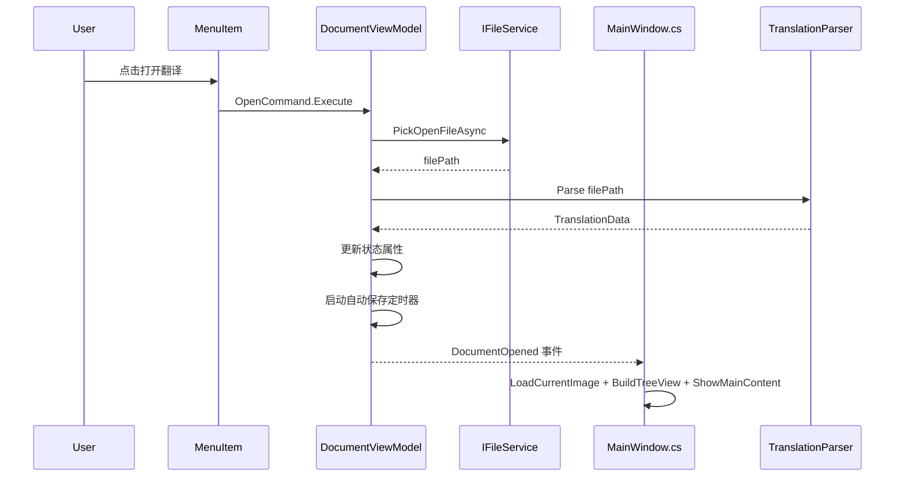

# Phase 3：DocumentViewModel 迁移方案

> 本文档为 Phase 3 的详细实施计划，遵循 Phase 1/2 建立的模式。

---

## 一、当前代码分析

MainWindow.axaml.cs 中与文档操作相关的代码分布：

### 1.1 文档状态字段

| 位置 | 行号 | 功能 | 依赖 |
|------|------|------|------|
| `_translationData` 字段 | 34 | 翻译数据模型 | 无 |
| `_currentTranslationFilePath` 字段 | 35 | 当前文件路径 | 无 |
| `_imageFolderPath` 字段 | 36 | 图片文件夹路径 | 无 |
| `_isDirty` 字段 | 86 | 脏标记 | 无 |
| `_autoSaveTimer` 字段 | 87 | 自动保存定时器 | DispatcherTimer |
| `_forceClose` 字段 | 88 | 强制关闭标志 | 无 |

### 1.2 新建翻译

| 位置 | 行号 | 功能 | 依赖 |
|------|------|------|------|
| `OnNewTranslation` | 581-584 | 菜单入口 | CreateNewTranslationAsync |
| `OnNewTranslationRequested` | 568-571 | WelcomeView 事件入口 | CreateNewTranslationAsync |
| `CreateNewTranslationAsync` | 589-679 | 核心逻辑 | StorageProvider, ImageSelectionWindow, TranslationParser, StatusBar, ShowMainContent |
| `GenerateTranslationFileContent` | 684-711 | 生成翻译文件模板 | 无 |

### 1.3 打开翻译

| 位置 | 行号 | 功能 | 依赖 |
|------|------|------|------|
| `OnOpenTranslationFile` | 573-576 | 菜单入口 | OpenTranslationFileAsync |
| `OnOpenTranslationRequested` | 560-563 | WelcomeView 事件入口 | OpenTranslationFileAsync |
| `OpenTranslationFileAsync` | 716-771 | 核心逻辑 | StorageProvider, TranslationParser, StatusBar, ShowMainContent |

### 1.4 保存/另存为

| 位置 | 行号 | 功能 | 依赖 |
|------|------|------|------|
| `OnSaveTranslation` | 1807-1824 | 保存 | TranslationParser, _isDirty, StatusBar |
| `OnSaveAsTranslation` | 1829-1867 | 另存为 | StorageProvider, TranslationParser, _isDirty, StatusBar |

### 1.5 关闭翻译

| 位置 | 行号 | 功能 | 依赖 |
|------|------|------|------|
| `OnCloseTranslation` | 1602-1613 | 关闭入口 | _isDirty, ShowCloseTranslationDialogAsync |
| `ShowCloseTranslationDialogAsync` | 1618-1763 | 未保存确认对话框 | StorageProvider, TranslationParser, StatusBar |
| `CloseTranslationInternal` | 1768-1800 | 关闭内部实现 | _translationData, History, ShowWelcomeScreen |

### 1.6 脏状态与自动保存

| 位置 | 行号 | 功能 | 依赖 |
|------|------|------|------|
| `SetDirty` | 248-252 | 设置脏标记 | UpdateTitle |
| `UpdateTitle` | 228-243 | 更新窗口标题 | _currentTranslationFilePath, _isDirty |
| `OnAutoSaveTimerTick` | 206-223 | 自动保存回调 | _isDirty, TranslationParser, StatusBar |
| `OnHistoryStateChanged` | 836-838 | 历史变化→设脏 | SetDirty |

### 1.7 窗口关闭

| 位置 | 行号 | 功能 | 依赖 |
|------|------|------|------|
| `OnWindowClosing` | 288-336 | 关闭前检查 | _isDirty, _forceClose, ShowUnsavedChangesDialogAsync |
| `ShowUnsavedChangesDialogAsync` | 341-488 | 未保存确认对话框 | StorageProvider, TranslationParser, StatusBar |

### 1.8 MainWindowViewModel 中的文档属性

| 属性 | 行号 | 功能 |
|------|------|------|
| `CanSave` | 19 | 保存菜单是否可用 |
| `CanSaveAs` | 22 | 另存为菜单是否可用 |
| `CanCloseTranslation` | 25 | 关闭翻译菜单是否可用 |
| `SetFileState` | 46-51 | 批量设置文件菜单状态 |

---

## 二、核心难点分析

### 2.1 StorageProvider 依赖

文件操作大量使用 `topLevel.StorageProvider`，这是 Avalonia 平台 API，需要 `TopLevel` 引用：

```csharp
var topLevel = GetTopLevel(this);
var files = await topLevel.StorageProvider.OpenFilePickerAsync(...);
var file = await topLevel.StorageProvider.SaveFilePickerAsync(...);
var folders = await topLevel.StorageProvider.OpenFolderPickerAsync(...);
```

**ViewModel 不能直接依赖 StorageProvider**，必须引入服务抽象。

### 2.2 自定义对话框依赖

两个场景需要自定义对话框：

1. **未保存更改对话框** — 窗口关闭和关闭翻译时使用，包含保存/不保存/取消三选一
2. **图片选择对话框** — 新建翻译时使用，`ImageSelectionWindow` 是一个完整的 Window

这些对话框创建和显示 UI 控件，不能在 ViewModel 中直接调用。

### 2.3 文档操作与 UI 切换耦合

`CreateNewTranslationAsync` 和 `OpenTranslationFileAsync` 在完成文件操作后，还执行了：
- `LoadCurrentImage()` — 加载图片（Phase 5 范畴）
- `BuildTreeView()` — 构建树视图（Phase 4 范畴）
- `ShowMainContent()` — 切换 UI 面板可见性
- `SetFocusAfterDelayAsync()` — 设置焦点

这些操作涉及多个子系统，不能全部放入 DocumentViewModel。

### 2.4 _translationData 的共享访问

`_translationData` 被 MainWindow 中 40+ 处引用，涉及标签操作、画布渲染、树视图构建等。DocumentViewModel 拥有数据所有权，但其他模块仍需通过某种方式访问。

### 2.5 窗口关闭的异步协调

`OnWindowClosing` 是同步事件，但确认对话框是异步的。当前使用 `e.Cancel = true` + `Dispatcher.UIThread.InvokeAsync` 模式。迁移后需保持此模式。

---

## 三、解决方案：IFileService + 回调注入 + 事件通知

### 3.1 IFileService 抽象

引入 `IFileService` 接口封装 `StorageProvider` 操作，实现类持有 `Func<TopLevel?>` 回调以获取 `TopLevel` 引用：


### 3.2 回调注入处理自定义对话框

遵循 Phase 1/2 的回调模式，DocumentViewModel 通过构造函数注入对话框回调：

- `Func<string, Task<UnsavedChangesResult>>` — 未保存更改确认
- `Func<List<string>, string, Task<ImageSelectionResult?>>` — 图片选择

### 3.3 事件通知解耦 UI 切换

DocumentViewModel 通过事件通知 MainWindow 执行 UI 切换：



---

## 四、IFileService 设计

```csharp
// Services/IFileService.cs
using Avalonia.Platform.Storage;

namespace LabelAva.Services;

/// <summary>
/// 文件操作服务抽象，解耦 ViewModel 对 StorageProvider 的直接依赖
/// </summary>
public interface IFileService
{
    /// <summary>打开文件选择对话框</summary>
    /// <returns>选中的文件路径，用户取消返回 null</returns>
    Task<string?> PickOpenFileAsync(string title, FilePickerFileType[]? filters = null);

    /// <summary>打开保存文件对话框</summary>
    /// <returns>保存路径，用户取消返回 null</returns>
    Task<string?> PickSaveFileAsync(string title, string defaultExtension, FilePickerFileType[]? filters = null);

    /// <summary>打开文件夹选择对话框</summary>
    /// <returns>选中的文件夹路径，用户取消返回 null</returns>
    Task<string?> PickFolderAsync(string title);
}
```

```csharp
// Services/FileDialogService.cs
using Avalonia;
using Avalonia.Controls;
using Avalonia.Platform.Storage;

namespace LabelAva.Services;

/// <summary>
/// 基于 Avalonia StorageProvider 的文件操作实现
/// </summary>
public class FileDialogService : IFileService
{
    private readonly Func<TopLevel?> _getTopLevel;

    public FileDialogService(Func<TopLevel?> getTopLevel)
    {
        _getTopLevel = getTopLevel;
    }

    public async Task<string?> PickOpenFileAsync(string title, FilePickerFileType[]? filters = null)
    {
        var topLevel = _getTopLevel();
        if (topLevel == null) return null;

        var files = await topLevel.StorageProvider.OpenFilePickerAsync(new FilePickerOpenOptions
        {
            Title = title,
            AllowMultiple = false,
            FileTypeFilter = filters ?? Array.Empty<FilePickerFileType>()
        });

        return files.Count > 0 ? files[0].Path.LocalPath : null;
    }

    public async Task<string?> PickSaveFileAsync(string title, string defaultExtension, FilePickerFileType[]? filters = null)
    {
        var topLevel = _getTopLevel();
        if (topLevel == null) return null;

        var file = await topLevel.StorageProvider.SaveFilePickerAsync(new FilePickerSaveOptions
        {
            Title = title,
            DefaultExtension = defaultExtension,
            ShowOverwritePrompt = true,
            FileTypeChoices = filters ?? Array.Empty<FilePickerFileType>()
        });

        return file != null ? file.Path.LocalPath : null;
    }

    public async Task<string?> PickFolderAsync(string title)
    {
        var topLevel = _getTopLevel();
        if (topLevel == null) return null;

        var folders = await topLevel.StorageProvider.OpenFolderPickerAsync(new FolderPickerOpenOptions
        {
            Title = title,
            AllowMultiple = false
        });

        return folders.Count > 0 ? folders[0].Path.LocalPath : null;
    }
}
```

---

## 五、辅助类型定义

```csharp
// ViewModels/DocumentViewModel.cs 顶部定义
namespace LabelAva.ViewModels;

/// <summary>未保存更改对话框结果</summary>
public enum UnsavedChangesResult
{
    Save,
    Discard,
    Cancel
}

/// <summary>图片选择对话框结果</summary>
public class ImageSelectionResult
{
    public List<string> SelectedImagePaths { get; set; } = new();
    public string FileName { get; set; } = string.Empty;
}

/// <summary>文档打开事件参数</summary>
public class DocumentOpenedEventArgs : EventArgs
{
    public TranslationData TranslationData { get; set; } = null!;
    public string ImageFolderPath { get; set; } = string.Empty;
    public List<string> ImageNames { get; set; } = new();
}
```

---

## 六、DocumentViewModel 设计

```csharp
// ViewModels/DocumentViewModel.cs
using Avalonia.Threading;
using CommunityToolkit.Mvvm.ComponentModel;
using CommunityToolkit.Mvvm.Input;
using LabelAva.Models;
using LabelAva.Services;
using System;
using System.Collections.Generic;
using System.IO;
using System.Linq;
using System.Threading.Tasks;

namespace LabelAva.ViewModels;

public partial class DocumentViewModel : ObservableObject
{
    private readonly IFileService _fileService;
    private readonly HistoryViewModel _history;
    private readonly StatusBarViewModel _statusBar;
    private readonly TranslationParser _parser = new();

    // 回调：自定义对话框（UI 层注入）
    private readonly Func<string, Task<UnsavedChangesResult>> _showUnsavedChangesDialog;
    private readonly Func<List<string>, string, Task<ImageSelectionResult?>> _showImageSelectionDialog;

    // 自动保存定时器
    private DispatcherTimer? _autoSaveTimer;

    // ========================
    // 状态属性
    // ========================

    [ObservableProperty]
    private bool _isDirty;

    [ObservableProperty]
    private string? _filePath;

    [ObservableProperty]
    private bool _hasDocument;

    [ObservableProperty]
    private TranslationData? _translationData;

    [ObservableProperty]
    private string? _imageFolderPath;

    // ========================
    // 派生属性
    // ========================

    /// <summary>窗口标题</summary>
    public string WindowTitle
    {
        get
        {
            var title = "LabelAva";
            if (!string.IsNullOrEmpty(FilePath))
            {
                var fileName = Path.GetFileName(FilePath);
                title = $"LabelAva - {fileName}";
            }
            title += (IsDirty ? " *" : "");
            return title;
        }
    }

    /// <summary>当前文件名（不含路径）</summary>
    public string FileName => string.IsNullOrEmpty(FilePath)
        ? string.Empty
        : Path.GetFileName(FilePath);

    /// <summary>保存命令是否可用</summary>
    public bool CanSave => HasDocument && TranslationData != null && !string.IsNullOrEmpty(FilePath);

    /// <summary>另存为命令是否可用</summary>
    public bool CanSaveAs => HasDocument && TranslationData != null;

    /// <summary>关闭翻译命令是否可用</summary>
    public bool CanCloseTranslation => HasDocument;

    // ========================
    // 命令
    // ========================

    [RelayCommand(CanExecute = nameof(CanSave))]
    private async Task Save()
    {
        await SaveInternalAsync();
    }

    [RelayCommand(CanExecute = nameof(CanSaveAs))]
    private async Task SaveAs()
    {
        await SaveAsInternalAsync();
    }

    [RelayCommand(CanExecute = nameof(CanCloseTranslation))]
    private async Task Close()
    {
        if (!await ConfirmAndSaveAsync()) return;
        CloseDocumentInternal();
    }

    [RelayCommand]
    private async Task New()
    {
        // 如果已有文档，先确认保存
        if (HasDocument && !await ConfirmAndSaveAsync()) return;

        await CreateNewTranslationAsync();
    }

    [RelayCommand]
    private async Task Open()
    {
        // 如果已有文档，先确认保存
        if (HasDocument && !await ConfirmAndSaveAsync()) return;

        await OpenTranslationFileAsync();
    }

    // ========================
    // 公开方法
    // ========================

    /// <summary>
    /// 检查未保存更改并按需保存。返回 true 表示可以继续关闭/替换。
    /// </summary>
    public async Task<bool> ConfirmAndSaveAsync()
    {
        if (!IsDirty || TranslationData == null) return true;

        var result = await _showUnsavedChangesDialog("检测到未保存的更改。是否保存？");

        if (result == UnsavedChangesResult.Save)
        {
            var saved = await SaveOrSaveAsAsync();
            return saved; // 保存失败则不继续
        }
        else if (result == UnsavedChangesResult.Discard)
        {
            return true;
        }
        else // Cancel
        {
            return false;
        }
    }

    /// <summary>设置脏标记</summary>
    public void SetDirty(bool isDirty)
    {
        IsDirty = isDirty;
    }

    // ========================
    // 内部方法
    // ========================

    /// <summary>保存到当前路径（无路径则走另存为）</summary>
    private async Task<bool> SaveOrSaveAsAsync()
    {
        if (!string.IsNullOrEmpty(FilePath))
        {
            return await SaveInternalAsync();
        }
        else
        {
            return await SaveAsInternalAsync();
        }
    }

    private async Task<bool> SaveInternalAsync()
    {
        if (TranslationData == null || string.IsNullOrEmpty(FilePath)) return false;

        try
        {
            _parser.Save(FilePath, TranslationData);
            IsDirty = false;
            _statusBar.UpdateStatus($"已保存至: {FileName}", StatusBarViewModel.StatusType.Success);
            return true;
        }
        catch (Exception ex)
        {
            _statusBar.UpdateStatus($"保存失败: {ex.Message}", StatusBarViewModel.StatusType.Error);
            return false;
        }
    }

    private async Task<bool> SaveAsInternalAsync()
    {
        if (TranslationData == null) return false;

        var textFileFilter = new[]
        {
            new Avalonia.Platform.Storage.FilePickerFileType("文本文件") { Patterns = new[] { "*.txt" } },
            new Avalonia.Platform.Storage.FilePickerFileType("所有文件") { Patterns = new[] { "*.*" } }
        };

        var newPath = await _fileService.PickSaveFileAsync("保存翻译文件", "txt", textFileFilter);
        if (newPath == null) return false; // 用户取消

        try
        {
            _parser.Save(newPath, TranslationData);
            FilePath = newPath;
            IsDirty = false;
            _statusBar.UpdateStatus($"已保存至: {Path.GetFileName(newPath)}", StatusBarViewModel.StatusType.Success);
            return true;
        }
        catch (Exception ex)
        {
            _statusBar.UpdateStatus($"保存失败: {ex.Message}", StatusBarViewModel.StatusType.Error);
            return false;
        }
    }

    private async Task CreateNewTranslationAsync()
    {
        // 1. 选择图片文件夹
        var folderPath = await _fileService.PickFolderAsync("选择图片文件夹");
        if (folderPath == null) return;

        // 2. 扫描图片
        var supportedExtensions = new[] { ".jpg", ".jpeg", ".png", ".bmp", ".gif" };
        var imageFiles = Directory.GetFiles(folderPath)
            .Where(f => supportedExtensions.Contains(Path.GetExtension(f).ToLowerInvariant()))
            .ToList();

        if (imageFiles.Count == 0)
        {
            _statusBar.UpdateStatus("所选文件夹中没有找到图片文件", StatusBarViewModel.StatusType.Warn);
            return;
        }

        // 3. 弹出图片选择对话框
        var folderName = new DirectoryInfo(folderPath).Name;
        var selectionResult = await _showImageSelectionDialog(imageFiles, folderName);

        if (selectionResult == null || selectionResult.SelectedImagePaths.Count == 0)
            return;

        // 4. 生成翻译文件
        var selectedImages = selectionResult.SelectedImagePaths;
        var userFileName = selectionResult.FileName;
        var content = GenerateTranslationFileContent(selectedImages);

        var translationFileName = $"{userFileName}.txt";
        var translationFilePath = Path.Combine(folderPath, translationFileName);

        // 处理文件名冲突
        var counter = 1;
        while (File.Exists(translationFilePath))
        {
            translationFileName = $"{folderName}_translation_{counter}.txt";
            translationFilePath = Path.Combine(folderPath, translationFileName);
            counter++;
        }

        // 写入文件
        await File.WriteAllTextAsync(translationFilePath, content, System.Text.Encoding.UTF8);

        // 5. 加载翻译数据
        ImageFolderPath = folderPath;
        TranslationData = _parser.Parse(translationFilePath);
        FilePath = translationFilePath;
        IsDirty = false;
        HasDocument = true;

        // 6. 启动自动保存
        StartAutoSaveTimer();

        // 7. 通知 UI 层
        var imageNames = new List<string>(TranslationData.ImageLabels.Keys);
        DocumentOpened?.Invoke(this, new DocumentOpenedEventArgs
        {
            TranslationData = TranslationData,
            ImageFolderPath = ImageFolderPath!,
            ImageNames = imageNames
        });

        _statusBar.UpdateStatus($"已创建翻译文件，包含 {selectedImages.Count} 张图片", StatusBarViewModel.StatusType.Success);
    }

    private async Task OpenTranslationFileAsync()
    {
        var textFileFilter = new[]
        {
            new Avalonia.Platform.Storage.FilePickerFileType("文本文件") { Patterns = new[] { "*.txt" } },
            new Avalonia.Platform.Storage.FilePickerFileType("所有文件") { Patterns = new[] { "*.*" } }
        };

        var filePath = await _fileService.PickOpenFileAsync("选择翻译文件", textFileFilter);
        if (filePath == null) return;

        try
        {
            TranslationData = _parser.Parse(filePath);
        }
        catch (Exception ex)
        {
            _statusBar.UpdateStatus($"解析翻译文件失败: {ex.Message}", StatusBarViewModel.StatusType.Error);
            return;
        }

        FilePath = filePath;
        ImageFolderPath = Path.GetDirectoryName(filePath);
        IsDirty = false;
        HasDocument = true;

        StartAutoSaveTimer();

        var imageNames = new List<string>(TranslationData.ImageLabels.Keys);
        if (imageNames.Count > 0)
        {
            DocumentOpened?.Invoke(this, new DocumentOpenedEventArgs
            {
                TranslationData = TranslationData,
                ImageFolderPath = ImageFolderPath!,
                ImageNames = imageNames
            });

            _statusBar.UpdateStatus($"已加载 {imageNames.Count} 张图片", StatusBarViewModel.StatusType.Success);
        }
        else
        {
            _statusBar.UpdateStatus("解析翻译文件失败", StatusBarViewModel.StatusType.Error);
        }
    }

    private void CloseDocumentInternal()
    {
        StopAutoSaveTimer();

        TranslationData = null;
        FilePath = null;
        ImageFolderPath = null;
        IsDirty = false;
        HasDocument = false;

        _history.Clear();

        DocumentClosed?.Invoke(this, EventArgs.Empty);
        _statusBar.UpdateStatus("就绪");
    }

    /// <summary>生成翻译文件模板内容</summary>
    private string GenerateTranslationFileContent(List<string> imagePaths)
    {
        var lines = new List<string>();

        lines.Add("1,0");
        lines.Add("-");
        lines.Add("框内");
        lines.Add("框外");
        lines.Add("-");
        lines.Add("LabelAva 1.0");
        lines.Add("");

        foreach (var imagePath in imagePaths)
        {
            var imageName = Path.GetFileName(imagePath);
            lines.Add("");
            lines.Add($">>>>>>>>[{imageName}]<<<<<<<<");
            lines.Add("");
        }

        return string.Join(Environment.NewLine, lines);
    }

    // ========================
    // 自动保存
    // ========================

    private void StartAutoSaveTimer()
    {
        StopAutoSaveTimer();
        _autoSaveTimer = new DispatcherTimer
        {
            Interval = TimeSpan.FromMinutes(3)
        };
        _autoSaveTimer.Tick += OnAutoSaveTimerTick;
        _autoSaveTimer.Start();
    }

    private void StopAutoSaveTimer()
    {
        if (_autoSaveTimer != null)
        {
            _autoSaveTimer.Stop();
            _autoSaveTimer.Tick -= OnAutoSaveTimerTick;
            _autoSaveTimer = null;
        }
    }

    private void OnAutoSaveTimerTick(object? sender, EventArgs e)
    {
        if (IsDirty && !string.IsNullOrEmpty(FilePath) && TranslationData != null)
        {
            try
            {
                _parser.Save(FilePath, TranslationData);
                IsDirty = false;
                _statusBar.UpdateStatus("自动保存成功", StatusBarViewModel.StatusType.Success);
            }
            catch
            {
                // 自动保存失败，静默处理
            }
        }
    }

    // ========================
    // 属性变更通知
    // ========================

    partial void OnIsDirtyChanged(bool value)
    {
        OnPropertyChanged(nameof(WindowTitle));
    }

    partial void OnFilePathChanged(string? value)
    {
        OnPropertyChanged(nameof(WindowTitle));
        OnPropertyChanged(nameof(FileName));
        OnPropertyChanged(nameof(CanSave));
        SaveCommand.NotifyCanExecuteChanged();
    }

    partial void OnHasDocumentChanged(bool value)
    {
        OnPropertyChanged(nameof(CanSave));
        OnPropertyChanged(nameof(CanSaveAs));
        OnPropertyChanged(nameof(CanCloseTranslation));
        SaveCommand.NotifyCanExecuteChanged();
        SaveAsCommand.NotifyCanExecuteChanged();
        CloseCommand.NotifyCanExecuteChanged();
    }

    partial void OnTranslationDataChanged(TranslationData? value)
    {
        OnPropertyChanged(nameof(CanSave));
        OnPropertyChanged(nameof(CanSaveAs));
        SaveCommand.NotifyCanExecuteChanged();
        SaveAsCommand.NotifyCanExecuteChanged();
    }

    // ========================
    // 事件
    // ========================

    /// <summary>文档打开事件（通知 MainWindow 加载图片、构建树视图、切换 UI）</summary>
    public event EventHandler<DocumentOpenedEventArgs>? DocumentOpened;

    /// <summary>文档关闭事件（通知 MainWindow 清理 UI、切换到欢迎屏幕）</summary>
    public event EventHandler? DocumentClosed;

    // ========================
    // 构造函数
    // ========================

    public DocumentViewModel(
        IFileService fileService,
        HistoryViewModel history,
        StatusBarViewModel statusBar,
        Func<string, Task<UnsavedChangesResult>> showUnsavedChangesDialog,
        Func<List<string>, string, Task<ImageSelectionResult?>> showImageSelectionDialog)
    {
        _fileService = fileService;
        _history = history;
        _statusBar = statusBar;
        _showUnsavedChangesDialog = showUnsavedChangesDialog;
        _showImageSelectionDialog = showImageSelectionDialog;
    }
}
```

---

## 七、MainWindowViewModel 变更

```csharp
public partial class MainWindowViewModel : ObservableObject
{
    [ObservableProperty]
    private StatusBarViewModel _statusBar = new();

    [ObservableProperty]
    private HistoryViewModel _history = null!;

    [ObservableProperty]
    private EditViewModel _edit = null!;

    [ObservableProperty]
    private DocumentViewModel _document = null!; // 新增

    // 移除以下属性（已迁入 DocumentViewModel）：
    // - CanSave, CanSaveAs, CanCloseTranslation
    // - SetFileState()
}
```

---

## 八、XAML 变更

### 8.1 窗口标题绑定

```xml
<!-- 修改前 -->
<Window ... Title="LabelAva">

<!-- 修改后 -->
<Window ... Title="{Binding Document.WindowTitle}">
```

### 8.2 文件菜单绑定

```xml
<!-- 修改前 -->
<MenuItem Header="新建翻译" Click="OnNewTranslation"/>
<MenuItem Header="打开翻译" Click="OnOpenTranslationFile"/>
<MenuItem Header="保存(_S)" Click="OnSaveTranslation" IsEnabled="{Binding CanSave}" InputGesture="Ctrl+S"/>
<MenuItem Header="另存为(_A)" Click="OnSaveAsTranslation" IsEnabled="{Binding CanSaveAs}" InputGesture="Ctrl+Shift+S"/>
<MenuItem Header="关闭翻译" Click="OnCloseTranslation" IsEnabled="{Binding CanCloseTranslation}"/>

<!-- 修改后 -->
<MenuItem Header="新建翻译" Command="{Binding Document.NewCommand}"/>
<MenuItem Header="打开翻译" Command="{Binding Document.OpenCommand}"/>
<MenuItem Header="保存(_S)" Command="{Binding Document.SaveCommand}" InputGesture="Ctrl+S"/>
<MenuItem Header="另存为(_A)" Command="{Binding Document.SaveAsCommand}" InputGesture="Ctrl+Shift+S"/>
<MenuItem Header="关闭翻译" Command="{Binding Document.CloseCommand}"/>
```

> 注意：`IsEnabled` 由 `Command.CanExecute` 自动管理，无需显式绑定。

### 8.3 WelcomeView 事件（暂保留）

WelcomeView 的 `OpenTranslationRequested` / `NewTranslationRequested` 路由事件暂时保留，MainWindow 事件处理改为转发到 DocumentViewModel 命令：

```csharp
private async void OnOpenTranslationRequested(object? sender, RoutedEventArgs e)
{
    await ViewModel.Document.OpenCommand.ExecuteAsync();
}

private async void OnNewTranslationRequested(object? sender, RoutedEventArgs e)
{
    await ViewModel.Document.NewCommand.ExecuteAsync();
}
```

> 后续可考虑将 WelcomeView 按钮直接绑定到 `Document.NewCommand` / `Document.OpenCommand`，但需要解决 DataContext 继承问题。

---

## 九、MainWindow.axaml.cs 变更

### 9.1 移除的字段

| 字段 | 原因 |
|------|------|
| `_isDirty` | 迁入 `Document.IsDirty` |
| `_autoSaveTimer` | 迁入 `DocumentViewModel` 内部管理 |
| `_forceClose` | 不再需要，由 `Document.ConfirmAndSaveAsync()` 替代 |
| `_currentTranslationFilePath` | 迁入 `Document.FilePath` |
| `_imageFolderPath` | 迁入 `Document.ImageFolderPath` |

> ⚠️ `_translationData` 暂时保留在 MainWindow 中，因为 40+ 处引用涉及多个子系统。后续 Phase 4/5 逐步迁移后移除。DocumentViewModel 通过 `Document.TranslationData` 暴露数据，MainWindow 中的引用逐步改为 `ViewModel.Document.TranslationData`。

### 9.2 移除的方法

| 方法 | 原因 |
|------|------|
| `OnNewTranslation` | 由 `Document.NewCommand` 替代 |
| `OnOpenTranslationFile` | 由 `Document.OpenCommand` 替代 |
| `OnSaveTranslation` | 由 `Document.SaveCommand` 替代 |
| `OnSaveAsTranslation` | 由 `Document.SaveAsCommand` 替代 |
| `OnCloseTranslation` | 由 `Document.CloseCommand` 替代 |
| `CreateNewTranslationAsync` | 迁入 `DocumentViewModel` |
| `OpenTranslationFileAsync` | 迁入 `DocumentViewModel` |
| `GenerateTranslationFileContent` | 迁入 `DocumentViewModel` |
| `ShowUnsavedChangesDialogAsync` | 保留在 code-behind，作为回调注入 |
| `ShowCloseTranslationDialogAsync` | 合并到 `ShowUnsavedChangesDialogAsync` 回调 |
| `CloseTranslationInternal` | 迁入 `DocumentViewModel` |
| `SetDirty` | 改为调用 `Document.SetDirty()` |
| `UpdateTitle` | 由 `Document.WindowTitle` 绑定替代 |
| `OnAutoSaveTimerTick` | 迁入 `DocumentViewModel` |

### 9.3 修改的方法

| 方法 | 变更说明 |
|------|---------|
| 构造函数 | 创建 `IFileService`、`DocumentViewModel` 实例并注入，订阅 `DocumentOpened`/`DocumentClosed` 事件 |
| `OnWindowClosing` | 改为调用 `Document.ConfirmAndSaveAsync()`，移除 `_forceClose` 逻辑 |
| `OnHistoryStateChanged` | 改为调用 `Document.SetDirty(true)` |
| `OnOpenTranslationRequested` | 改为转发到 `Document.OpenCommand` |
| `OnNewTranslationRequested` | 改为转发到 `Document.NewCommand` |
| `ShowMainContent` | 简化，移除 `ViewModel.SetFileState` 和 `UpdateTitle` 调用 |
| `ShowWelcomeScreen` | 简化，移除 `ViewModel.SetFileState` 调用 |

### 9.4 新增的事件处理

```csharp
// DocumentViewModel.DocumentOpened 事件处理
private void OnDocumentOpened(object? sender, DocumentOpenedEventArgs e)
{
    // 同步 _translationData 引用（过渡期，后续 Phase 4/5 逐步消除）
    _translationData = e.TranslationData;
    _currentTranslationFilePath = ViewModel.Document.FilePath;
    _imageFolderPath = e.ImageFolderPath;
    _imageNames = e.ImageNames;

    if (_imageNames.Count > 0)
    {
        _currentImageIndex = 0;
        LoadCurrentImage();
        BuildTreeView();
        ShowMainContent();
        _ = SetFocusAfterDelayAsync();
    }
}

// DocumentViewModel.DocumentClosed 事件处理
private void OnDocumentClosed(object? sender, EventArgs e)
{
    // 清理图片和标注
    if (_currentImage != null)
    {
        _currentImage.Dispose();
        _currentImage = null;
    }
    _currentImagePath = null;
    _transformMatrix = Matrix.Identity;
    ApplyTransform();

    ClearLabelControls();

    // 清理过渡期引用
    _translationData = null;
    _currentTranslationFilePath = null;
    _imageFolderPath = null;
    _imageNames.Clear();
    _treeItems.Clear();
    _isFirstImageLoaded = false;

    ShowWelcomeScreen();
}
```

### 9.5 构造函数变更

```csharp
// 新增：创建 IFileService
var fileService = new FileDialogService(() => GetTopLevel(this));

// 新增：创建 DocumentViewModel
ViewModel.Document = new DocumentViewModel(
    fileService,
    ViewModel.History,
    StatusBar,
    ShowUnsavedChangesDialogAsync,   // 回调：未保存确认对话框
    ShowImageSelectionDialogAsync    // 回调：图片选择对话框
);
ViewModel.Document.DocumentOpened += OnDocumentOpened;
ViewModel.Document.DocumentClosed += OnDocumentClosed;

// 移除：自动保存定时器初始化（已迁入 DocumentViewModel）
// 移除：_autoSaveTimer 相关代码
```

### 9.6 对话框回调实现

```csharp
/// <summary>
/// 未保存更改确认对话框（作为回调注入 DocumentViewModel）
/// </summary>
private async Task<UnsavedChangesResult> ShowUnsavedChangesDialogAsync(string message)
{
    var result = UnsavedChangesResult.Cancel;

    var dialog = new Window
    {
        Title = "未保存的更改",
        Width = 400,
        Height = 180,
        WindowStartupLocation = WindowStartupLocation.CenterOwner,
        CanResize = false,
        ShowInTaskbar = false
    };

    var panel = new StackPanel { Margin = new Thickness(20), Spacing = 15 };
    panel.Children.Add(new TextBlock
    {
        Text = message,
        TextWrapping = Avalonia.Media.TextWrapping.Wrap,
        FontSize = 14
    });

    var buttonPanel = new StackPanel
    {
        Orientation = Avalonia.Layout.Orientation.Horizontal,
        HorizontalAlignment = Avalonia.Layout.HorizontalAlignment.Right,
        Spacing = 10
    };

    var saveButton = new Button { Content = "保存", Width = 80 };
    var discardButton = new Button { Content = "不保存", Width = 80 };
    var cancelButton = new Button { Content = "取消", Width = 80 };

    saveButton.Click += (s, e) => { result = UnsavedChangesResult.Save; dialog.Close(); };
    discardButton.Click += (s, e) => { result = UnsavedChangesResult.Discard; dialog.Close(); };
    cancelButton.Click += (s, e) => { result = UnsavedChangesResult.Cancel; dialog.Close(); };

    buttonPanel.Children.Add(saveButton);
    buttonPanel.Children.Add(discardButton);
    buttonPanel.Children.Add(cancelButton);
    panel.Children.Add(buttonPanel);

    dialog.Content = panel;
    await dialog.ShowDialog(this);

    return result;
}

/// <summary>
/// 图片选择对话框（作为回调注入 DocumentViewModel）
/// </summary>
private async Task<ImageSelectionResult?> ShowImageSelectionDialogAsync(
    List<string> imageFiles, string defaultFileName)
{
    var selectionWindow = new Views.ImageSelectionWindow(imageFiles, defaultFileName);
    selectionWindow.Owner = this;

    var dialogResult = await selectionWindow.ShowDialog<bool>(this);

    if (!dialogResult || selectionWindow.SelectedImagePaths.Count == 0)
        return null;

    return new ImageSelectionResult
    {
        SelectedImagePaths = selectionWindow.SelectedImagePaths,
        FileName = selectionWindow.FileName
    };
}
```

### 9.7 OnWindowClosing 变更

```csharp
private async void OnWindowClosing(object? sender, WindowClosingEventArgs e)
{
    // 使用 DocumentViewModel 的确认逻辑
    if (ViewModel.Document.HasDocument && ViewModel.Document.IsDirty)
    {
        e.Cancel = true;
        var canClose = await ViewModel.Document.ConfirmAndSaveAsync();
        if (canClose)
        {
            // 确认后强制关闭
            ViewModel.Document.CloseDocumentInternal(); // 需改为 public 或提供 CloseForce 方法
            Close();
        }
        return;
    }

    // 取消订阅事件
    ImageContainer.SizeChanged -= OnImageContainerSizeChanged;
    this.Closing -= OnWindowClosing;

    // 清空历史记录
    ViewModel.History.Clear();

    // 释放图片资源
    if (_currentImage != null)
    {
        _currentImage.Dispose();
        _currentImage = null;
    }

    ClearLabelControls();
    _treeItems.Clear();
    ImageTreeView.ItemsSource = null;
    _translationData = null;
    _imageFolderPath = null;
    _imageNames.Clear();
    _isFirstImageLoaded = false;
    _isPanning = false;

    Environment.Exit(0);
}
```

> ⚠️ `CloseDocumentInternal` 需要暴露为 public 方法（或新增 `ForceClose` 方法），因为窗口关闭场景需要跳过二次确认直接清理。

---

## 十、迁移步骤清单

- [ ] 1. 创建 `Services/IFileService.cs` 接口
- [ ] 2. 创建 `Services/FileDialogService.cs` 实现
- [ ] 3. 创建 `ViewModels/DocumentViewModel.cs`，包含状态属性、命令、文件操作逻辑
- [ ] 4. 在 `MainWindowViewModel` 中添加 `Document` 属性，移除 `CanSave`/`CanSaveAs`/`CanCloseTranslation`/`SetFileState`
- [ ] 5. 在 `MainWindow.axaml.cs` 中实现 `ShowUnsavedChangesDialogAsync` 和 `ShowImageSelectionDialogAsync` 回调方法
- [ ] 6. 在 `MainWindow.axaml.cs` 构造函数中创建 `IFileService` 和 `DocumentViewModel` 实例并注入
- [ ] 7. 订阅 `DocumentOpened`/`DocumentClosed` 事件
- [ ] 8. 更新 `MainWindow.axaml` 窗口标题绑定：`Title="{Binding Document.WindowTitle}"`
- [ ] 9. 更新 `MainWindow.axaml` 文件菜单：`Click` → `Command` 绑定，移除 `IsEnabled` 显式绑定
- [ ] 10. 移除 `OnNewTranslation`/`OnOpenTranslationFile`/`OnSaveTranslation`/`OnSaveAsTranslation`/`OnCloseTranslation` 事件处理
- [ ] 11. 移除 `CreateNewTranslationAsync`/`OpenTranslationFileAsync`/`GenerateTranslationFileContent`
- [ ] 12. 移除 `ShowCloseTranslationDialogAsync`（逻辑合并到 `ShowUnsavedChangesDialogAsync` 回调）
- [ ] 13. 移除 `CloseTranslationInternal`（迁入 DocumentViewModel）
- [ ] 14. 移除 `SetDirty`/`UpdateTitle`/`OnAutoSaveTimerTick` 方法
- [ ] 15. 移除 `_isDirty`/`_autoSaveTimer`/`_forceClose` 字段
- [ ] 16. 更新 `OnWindowClosing` 使用 `Document.ConfirmAndSaveAsync()`
- [ ] 17. 更新 `OnHistoryStateChanged` 改为调用 `Document.SetDirty(true)`
- [ ] 18. 更新 `OnOpenTranslationRequested`/`OnNewTranslationRequested` 转发到 Document 命令
- [ ] 19. 更新 `ShowMainContent`/`ShowWelcomeScreen` 移除 `SetFileState`/`UpdateTitle` 调用
- [ ] 20. 将 MainWindow 中 `_currentTranslationFilePath` 引用逐步替换为 `Document.FilePath`（过渡期可保留字段同步）
- [ ] 21. 将 MainWindow 中 `_isDirty` 引用替换为 `Document.IsDirty`
- [ ] 22. 测试：新建翻译、打开翻译、保存、另存为、关闭翻译、窗口关闭、自动保存、脏标记、快捷键

---

## 十一、风险与注意事项

1. **_translationData 双源状态过渡期**：DocumentViewModel 拥有 `TranslationData`，但 MainWindow 中 40+ 处仍直接引用 `_translationData`。过渡期通过 `DocumentOpened` 事件同步两个字段。后续 Phase 4/5 逐步将引用迁移到 `Document.TranslationData` 后，移除 MainWindow 中的 `_translationData` 字段。

2. **异步命令与窗口关闭协调**：`OnWindowClosing` 是同步事件，`ConfirmAndSaveAsync` 是异步操作。必须使用 `e.Cancel = true` + 异步回调模式，确保异步完成后再决定是否关闭。

3. **Command 自动路由 InputGesture**：与 Phase 1 相同，需验证 `MenuItem` 的 `InputGesture="Ctrl+S"` 在使用 `Command` 绑定时是否自动路由。如不自动路由，需保留 `KeyBinding` 或隧道拦截。

4. **FileDialogService 生命周期**：`Func<TopLevel?>` 回调在 Window 关闭后可能返回 null。所有方法已做 null 检查。

5. **自动保存定时器线程安全**：`DispatcherTimer` 在 UI 线程执行，与 `DocumentViewModel` 属性变更在同一线程，无竞态问题。

6. **WelcomeView 事件转发**：当前 WelcomeView 通过路由事件与 MainWindow 通信。迁移后事件处理仅转发到 `Document.OpenCommand`/`Document.NewCommand`。后续可考虑让 WelcomeView 直接绑定命令，但需解决 DataContext 继承问题。

7. **CloseDocumentInternal 可见性**：窗口关闭场景需要跳过二次确认直接清理文档。需将 `CloseDocumentInternal` 暴露为 public 方法（或新增 `ForceCloseDocument` 方法），并在调用前确保已通过 `ConfirmAndSaveAsync` 确认。

8. **SaveCommand 的 CanExecute 精度**：当前 `CanSave` 仅检查 `HasDocument`，迁移后精确为 `HasDocument && TranslationData != null && !string.IsNullOrEmpty(FilePath)`。这意味着新建翻译后首次保存需走另存为，行为与当前一致（当前 `OnSaveTranslation` 也会检查路径非空）。

---

## 十二、预期效果

| 指标 | 迁移前 | 迁移后 |
|------|--------|--------|
| MainWindowViewModel 属性数 | 8 | 5（移除 CanSave/CanSaveAs/CanCloseTranslation，新增 Document） |
| MainWindow.axaml.cs 文档相关方法 | ~15 | ~5（移除 10 个，新增 2 个对话框回调 + 2 个事件处理） |
| MainWindow.axaml.cs 行数 | ~3429 | ~3200（净减约 230 行） |
| XAML 绑定化程度 | 部分 | 文件菜单全部 Command 绑定 |
| 文档逻辑集中度 | 分散在 code-behind | 集中在 DocumentViewModel |
| StorageProvider 耦合 | 直接依赖 | 通过 IFileService 抽象解耦 |
| 脏状态管理 | 分散（SetDirty + UpdateTitle + _isDirty） | 集中在 DocumentViewModel |
