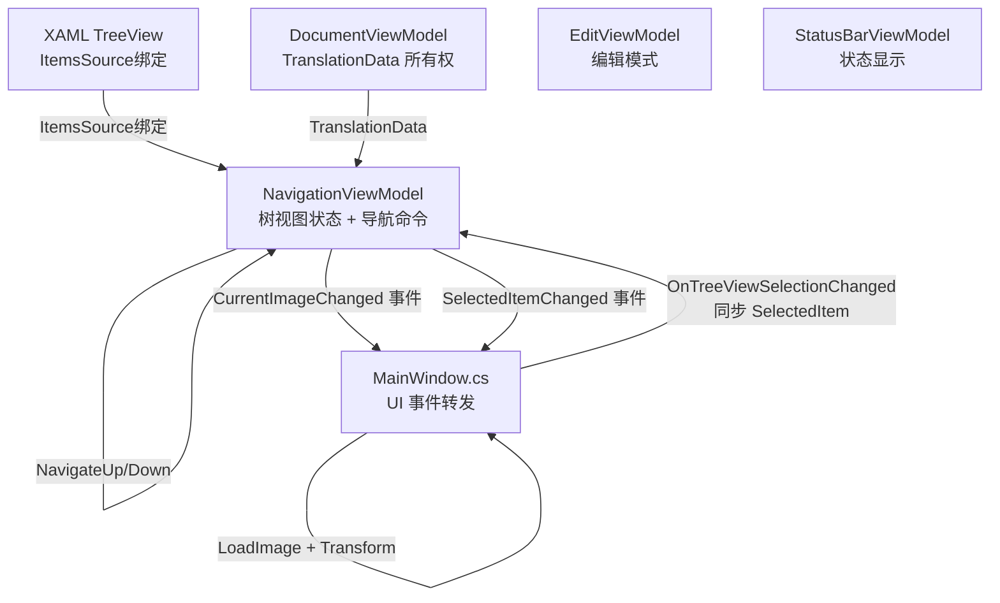
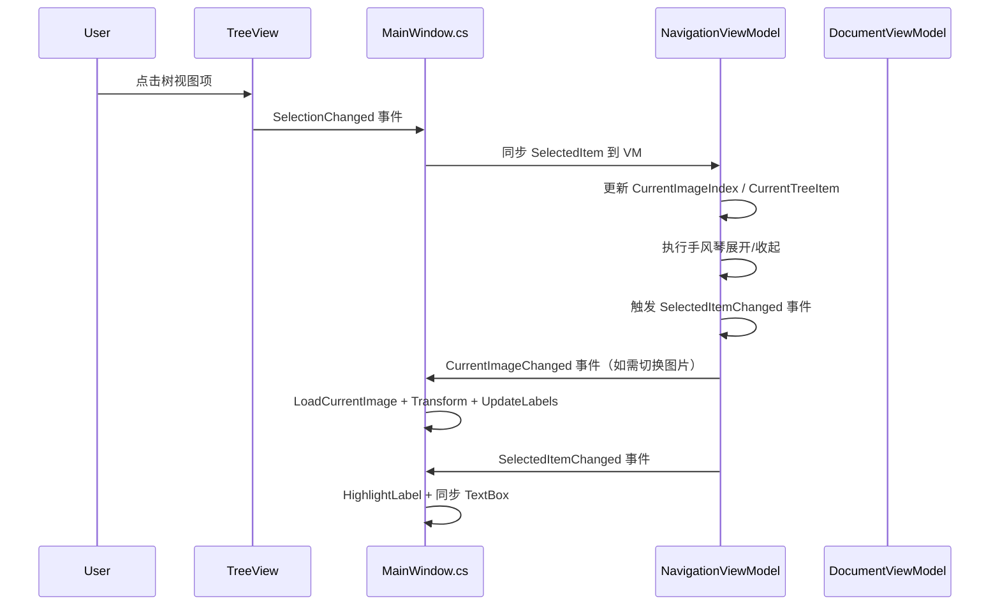
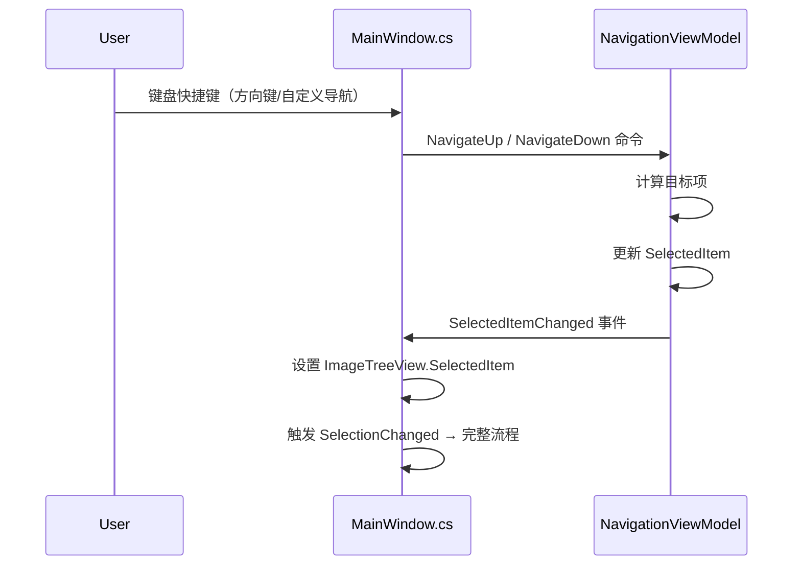

# Phase 4：NavigationViewModel 迁移方案

> 本文档为 Phase 4 的详细实施计划，遵循 Phase 1/2/3 建立的模式。

---

## 一、当前代码分析

MainWindow.axaml.cs 中与导航/树视图相关的代码分布：

### 1.1 导航状态字段

| 位置 | 行号 | 功能 | 依赖 |
|------|------|------|------|
| `_treeItems` 字段 | 44 | 树视图数据集合 | 无 |
| `_lastFocusedRootItem` 字段 | 47 | 上一次焦点的根节点 | 无 |
| `_currentTreeItem` 字段 | 50 | 当前图片对应的树视图项 | 无 |
| `_currentImageIndex` 字段 | 36 | 当前图片索引 | 无 |
| `_imageNames` 字段 | 37 | 图片文件名列表 | 无 |
| `_imageFolderPath` 字段 | 35 | 图片文件夹路径 | 无 |
| `_treeDragStartPoint` 字段 | 98 | 树拖拽起始点 | UI |
| `_isTreeItemDragging` 字段 | 99 | 树拖拽中标志 | 无 |
| `_draggedTreeItem` 字段 | 100 | 被拖拽的树项 | 无 |

### 1.2 树视图构建

| 位置 | 行号 | 功能 | 依赖 |
|------|------|------|------|
| `BuildTreeView` | 2204-2234 | 从 TranslationData 构建树视图 | _translationData |
| 构造函数中绑定 | 160-161 | ImageTreeView.ItemsSource = _treeItems | ImageTreeView |
| `RefreshTreeView` | 536-549 | 刷新树视图（重设 ItemsSource） | ImageTreeView |
| `FocusFirstTreeViewItem` | 448-472 | 聚焦第一个树视图项 | ImageTreeView |

### 1.3 树视图选择变更

| 位置 | 行号 | 功能 | 依赖 |
|------|------|------|------|
| `OnTreeViewSelectionChanged` | 2239-2368 | 选择变更核心处理 | ImageTreeView, _treeItems, _imageNames, _currentImageIndex, _translationTextBox, Edit, StatusBar |

`OnTreeViewSelectionChanged` 内部逻辑拆解：

| 子逻辑 | 行号 | 功能 | 迁移目标 |
|--------|------|------|---------|
| 图片切换判断 | 2253-2297 | 根据选中项切换图片 | NavigationVM 状态 + 事件通知 |
| 手风琴展开/收起 | 2300-2310 | 展开/收起根节点 | NavigationVM 状态管理 |
| 高亮标签 | 2313-2325 | 高亮选中标签 + 居中 | 事件通知 → MainWindow |
| 文本框同步 | 2327-2354 | 选中项文本写入编辑框 | 事件通知 → MainWindow |
| 图片节点选中 | 2356-2367 | 禁用编辑框 | 事件通知 → MainWindow |

### 1.4 键盘/鼠标导航

| 位置 | 行号 | 功能 | 依赖 |
|------|------|------|------|
| `OnTreeViewKeyDown` | 2479-2658 | 键盘导航（复制/分组切换/上下导航/方向键） | ImageTreeView, _treeItems, _shortcutSettings, Edit |
| `OnMainWindowPointerPressed` | 2373-2461 | 鼠标侧键导航 | ImageTreeView, _treeItems, _shortcutSettings |

### 1.5 树视图拖拽排序

| 位置 | 行号 | 功能 | 依赖 |
|------|------|------|------|
| `OnTreeViewItemPointerPressed` | 2729-2751 | 拖拽开始 | UI PointerEventArgs |
| `OnTreeViewItemPointerMoved` | 2755-2787 | 拖拽移动 + DragDrop | UI, CommitCurrentEdit |
| `OnTreeViewItemPointerReleased` | 2789-2793 | 拖拽结束 | 无 |
| `OnTreeViewDragOver` | 2797-2833 | 拖拽悬停验证 | _treeItems |
| `OnTreeViewDrop` | 2835-2871 | 拖拽放下执行 | _treeItems, _translationData, Edit |
| `GetParentImageItem` | 2722-2725 | 查找父节点 | _treeItems |

### 1.6 辅助方法

| 位置 | 行号 | 功能 | 依赖 |
|------|------|------|------|
| `SelectLabelByIndex` | 1255-1272 | 按索引选中标签 | _currentTreeItem, ImageTreeView |
| `RebuildCurrentView` | 578-668 | 重建视图（Undo/Redo 后） | _translationData, _treeItems, ImageTreeView, Edit |
| `OnDocumentOpened` 中 | 366-379 | 文档打开后初始化导航 | _imageNames, _currentImageIndex |
| `OnDocumentClosed` 中 | 385-407 | 文档关闭后清理导航 | _treeItems, _imageNames |

---

## 二、核心难点分析

### 2.1 OnTreeViewSelectionChanged 职责过重

`OnTreeViewSelectionChanged` 是最复杂的方法（130 行），同时处理：
1. **导航状态**：图片索引切换、当前树项更新
2. **UI 展示**：手风琴展开/收起
3. **画布交互**：高亮标签、居中标签（Phase 5）
4. **编辑框同步**：文本写入 TextBox（UI 控件）

其中 (1)(2) 属于 NavigationViewModel，(3)(4) 必须留在 MainWindow code-behind。

### 2.2 TreeView 的 SelectedItem 双向绑定

Avalonia TreeView 的 `SelectedItem` 不是依赖属性，无法直接双向绑定到 ViewModel。当前通过 `ImageTreeView.SelectedItem` 命令式访问。

**解决方案**：NavigationViewModel 持有 `SelectedItem` 属性，MainWindow 在 `OnTreeViewSelectionChanged` 中同步到 VM。VM 也可通过方法设置选中项，MainWindow 监听 VM 事件后设置 `ImageTreeView.SelectedItem`。

### 2.3 图片切换的跨模块协调

选择树视图项触发图片切换，需要协调：
- NavigationViewModel：更新 `_currentImageIndex`、`_currentTreeItem`
- MainWindow：调用 `LoadCurrentImage()`、`CalculateFitTransform()`、`ApplyTransform()`、`UpdateLabels()`
- StatusBar：更新缩放文本和状态

**解决方案**：NavigationViewModel 触发 `CurrentImageChanged` 事件，MainWindow 订阅并执行 UI 操作。

### 2.4 树视图拖拽的 UI 依赖

拖拽操作直接使用 Avalonia `DragDrop.DoDragDrop` API 和 `PointerEventArgs`，这些无法移入 ViewModel。

**解决方案**：拖拽的 UI 交互（Pointer 事件、DragDrop）保留在 MainWindow code-behind。拖拽的数据验证逻辑（同图片判断）和业务执行（ReorderLabels）移入 NavigationViewModel。

### 2.5 _translationData 的共享访问

`BuildTreeView` 和 `OnTreeViewDrop` 都需要访问 `_translationData`。当前 `_translationData` 已迁入 `DocumentViewModel.TranslationData`。

**解决方案**：NavigationViewModel 通过 `DocumentViewModel.TranslationData` 访问数据，或由 MainWindow 在适当时机调用 `Navigation.BuildTreeView(translationData)`。

---

## 三、解决方案：状态迁移 + 事件通知 + 回调注入

### 3.1 架构设计



### 3.2 交互流程



### 3.3 键盘导航流程



---

## 四、NavigationViewModel 设计

```csharp
// ViewModels/NavigationViewModel.cs
using CommunityToolkit.Mvvm.ComponentModel;
using CommunityToolkit.Mvvm.Input;
using LabelAva.Models;
using System;
using System.Collections.Generic;
using System.Collections.ObjectModel;
using System.Linq;

namespace LabelAva.ViewModels;

public partial class NavigationViewModel : ObservableObject
{
    private readonly StatusBarViewModel _statusBar;

    // ========================
    // 状态属性
    // ========================

    /// <summary>树视图数据</summary>
    [ObservableProperty]
    private ObservableCollection<ImageTreeItem> _treeItems = new();

    /// <summary>当前选中的树视图项</summary>
    [ObservableProperty]
    private object? _selectedItem;

    /// <summary>当前图片索引</summary>
    [ObservableProperty]
    private int _currentImageIndex;

    /// <summary>图片文件名列表</summary>
    [ObservableProperty]
    private List<string> _imageNames = new();

    /// <summary>图片文件夹路径</summary>
    [ObservableProperty]
    private string? _imageFolderPath;

    /// <summary>当前图片对应的树视图项</summary>
    [ObservableProperty]
    private ImageTreeItem? _currentTreeItem;

    /// <summary>上一次焦点的根节点（手风琴效果）</summary>
    [ObservableProperty]
    private ImageTreeItem? _lastFocusedRootItem;

    /// <summary>是否有文档打开</summary>
    [ObservableProperty]
    private bool _hasDocument;

    // ========================
    // 派生属性
    // ========================

    /// <summary>当前图片名称</summary>
    public string CurrentImageName =>
        CurrentImageIndex >= 0 && CurrentImageIndex < ImageNames.Count
            ? ImageNames[CurrentImageIndex]
            : string.Empty;

    /// <summary>图片总数</summary>
    public int ImageCount => ImageNames.Count;

    /// <summary>导航是否可用</summary>
    public bool CanNavigate => HasDocument && ImageNames.Count > 0;

    // ========================
    // 命令
    // ========================

    [RelayCommand(CanExecute = nameof(CanNavigateUp))]
    private void NavigateUp()
    {
        var visibleItems = GetVisibleItems();
        if (visibleItems.Count == 0 || SelectedItem == null) return;

        int currentIndex = visibleItems.IndexOf(SelectedItem);
        if (currentIndex > 0)
        {
            SelectedItem = visibleItems[currentIndex - 1];
            OnSelectedItemChangedFromVM();
        }
    }

    [RelayCommand(CanExecute = nameof(CanNavigateDown))]
    private void NavigateDown()
    {
        var visibleItems = GetVisibleItems();
        if (visibleItems.Count == 0 || SelectedItem == null) return;

        int currentIndex = visibleItems.IndexOf(SelectedItem);
        if (currentIndex >= 0 && currentIndex < visibleItems.Count - 1)
        {
            SelectedItem = visibleItems[currentIndex + 1];
            OnSelectedItemChangedFromVM();
        }
    }

    // ========================
    // 公开方法
    // ========================

    /// <summary>从 TranslationData 构建树视图</summary>
    public void BuildTreeView(TranslationData translationData)
    {
        TreeItems.Clear();

        if (translationData == null) return;

        bool isFirstItem = true;
        foreach (var kvp in translationData.ImageLabels)
        {
            var imageItem = new ImageTreeItem
            {
                ImageName = kvp.Key,
                IsExpanded = isFirstItem
            };
            isFirstItem = false;

            foreach (var label in kvp.Value)
            {
                imageItem.Translations.Add(new TranslationTreeItem
                {
                    Index = label.TextIndex,
                    Text = label.Text,
                    GroupIndex = label.GroupIndex
                });
            }

            TreeItems.Add(imageItem);
        }
    }

    /// <summary>初始化导航状态（文档打开后调用）</summary>
    public void InitializeNavigation(string imageFolderPath, List<string> imageNames)
    {
        ImageFolderPath = imageFolderPath;
        ImageNames = imageNames;
        CurrentImageIndex = 0;
        HasDocument = true;
    }

    /// <summary>清除导航状态（文档关闭后调用）</summary>
    public void ClearNavigation()
    {
        TreeItems.Clear();
        ImageNames.Clear();
        ImageFolderPath = null;
        CurrentImageIndex = 0;
        CurrentTreeItem = null;
        LastFocusedRootItem = null;
        SelectedItem = null;
        HasDocument = false;
    }

    /// <summary>根据图片名切换到指定图片</summary>
    public bool TrySwitchToImage(string imageName)
    {
        var index = ImageNames.IndexOf(imageName);
        if (index >= 0 && CurrentImageIndex != index)
        {
            CurrentImageIndex = index;
            UpdateCurrentTreeItem();
            return true;
        }
        return false;
    }

    /// <summary>更新 CurrentTreeItem（图片加载后调用）</summary>
    public void UpdateCurrentTreeItem()
    {
        if (CurrentImageIndex >= 0 && CurrentImageIndex < ImageNames.Count)
        {
            var imageName = ImageNames[CurrentImageIndex];
            CurrentTreeItem = TreeItems.FirstOrDefault(t => t.ImageName == imageName);
        }
        else
        {
            CurrentTreeItem = null;
        }
    }

    /// <summary>执行手风琴展开/收起</summary>
    public void ApplyAccordion(ImageTreeItem targetRootItem)
    {
        foreach (var item in TreeItems)
        {
            item.IsExpanded = (item == targetRootItem);
        }
        LastFocusedRootItem = targetRootItem;
    }

    /// <summary>查找子节点对应的父节点</summary>
    public ImageTreeItem? GetParentImageItem(TranslationTreeItem child)
    {
        return TreeItems.FirstOrDefault(root => root.Translations.Contains(child));
    }

    /// <summary>获取当前可见的树视图项列表（展开的节点包含子项）</summary>
    public List<object> GetVisibleItems()
    {
        var visibleItems = new List<object>();
        foreach (var root in TreeItems)
        {
            visibleItems.Add(root);
            if (root.IsExpanded)
            {
                foreach (var child in root.Translations)
                    visibleItems.Add(child);
            }
        }
        return visibleItems;
    }

    /// <summary>根据索引选中标签</summary>
    public void SelectLabelByIndex(int labelIndex)
    {
        if (CurrentTreeItem == null) return;

        var translationItem = CurrentTreeItem.Translations
            .FirstOrDefault(t => t.Index == labelIndex);

        if (translationItem != null)
        {
            SelectedItem = translationItem;
            CurrentTreeItem.IsExpanded = true;
            OnSelectedItemChangedFromVM();
        }
    }

    /// <summary>刷新树视图（通知 UI 重新绑定）</summary>
    public void RefreshTreeView()
    {
        // 触发 TreeItems 集合变更通知
        OnPropertyChanged(nameof(TreeItems));
    }

    // ========================
    // 内部方法
    // ========================

    private bool CanNavigateUp => CanNavigate;
    private bool CanNavigateDown => CanNavigate;

    /// <summary>
    /// 当 SelectedItem 由 VM 侧变更时（如键盘导航），触发事件通知 MainWindow 同步 UI
    /// </summary>
    private void OnSelectedItemChangedFromVM()
    {
        SelectedItemChanged?.Invoke(this, EventArgs.Empty);

        // 处理图片切换
        HandleImageSwitchFromSelection();

        // 处理手风琴效果
        HandleAccordionFromSelection();
    }

    /// <summary>根据选中项判断是否需要切换图片</summary>
    private void HandleImageSwitchFromSelection()
    {
        if (SelectedItem is ImageTreeItem rootItem)
        {
            TrySwitchToImage(rootItem.ImageName);
        }
        else if (SelectedItem is TranslationTreeItem childItem)
        {
            var parent = GetParentImageItem(childItem);
            if (parent != null)
            {
                TrySwitchToImage(parent.ImageName);
            }
        }
    }

    /// <summary>根据选中项执行手风琴效果</summary>
    private void HandleAccordionFromSelection()
    {
        ImageTreeItem? targetRoot = null;

        if (SelectedItem is ImageTreeItem rootItem)
        {
            targetRoot = rootItem;
        }
        else if (SelectedItem is TranslationTreeItem childItem)
        {
            targetRoot = GetParentImageItem(childItem);
        }

        if (targetRoot != null)
        {
            ApplyAccordion(targetRoot);
        }
    }

    partial void OnCurrentImageIndexChanged(int value)
    {
        OnPropertyChanged(nameof(CurrentImageName));
        CurrentImageChanged?.Invoke(this, EventArgs.Empty);
    }

    partial void OnHasDocumentChanged(bool value)
    {
        NavigateUpCommand.NotifyCanExecuteChanged();
        NavigateDownCommand.NotifyCanExecuteChanged();
    }

    // ========================
    // 事件
    // ========================

    /// <summary>当前图片变更事件（通知 MainWindow 加载图片、更新画布）</summary>
    public event EventHandler? CurrentImageChanged;

    /// <summary>选中项变更事件（由 VM 侧发起，通知 MainWindow 同步 TreeView.SelectedItem + 高亮 + TextBox）</summary>
    public event EventHandler? SelectedItemChanged;

    // ========================
    // 构造函数
    // ========================

    public NavigationViewModel(StatusBarViewModel statusBar)
    {
        _statusBar = statusBar;
    }
}
```

---

## 五、迁移步骤

### 步骤 1：创建 NavigationViewModel 基础结构

- 创建 `ViewModels/NavigationViewModel.cs`
- 实现上述设计中的状态属性、派生属性、构造函数
- 暂不实现命令和事件

### 步骤 2：将 NavigationViewModel 集成到 MainWindowViewModel

- 在 `MainWindowViewModel.cs` 中添加 `[ObservableProperty] private NavigationViewModel _navigation = null!;`
- 在 MainWindow 构造函数中初始化 NavigationViewModel 并注入

### 步骤 3：迁移树视图数据状态

- 将 `_treeItems`、`_currentTreeItem`、`_lastFocusedRootItem`、`_currentImageIndex`、`_imageNames`、`_imageFolderPath` 从 MainWindow 迁移到 NavigationViewModel
- MainWindow 中保留过渡期引用（通过 `Navigation` 属性访问）
- 修改 `OnDocumentOpened` 中初始化逻辑 → 调用 `Navigation.InitializeNavigation()` + `Navigation.BuildTreeView()`
- 修改 `OnDocumentClosed` 中清理逻辑 → 调用 `Navigation.ClearNavigation()`

### 步骤 4：XAML 绑定 TreeView ItemsSource

- 将 `ImageTreeView.ItemsSource = _treeItems` 改为 XAML 绑定：`ItemsSource="{Binding Navigation.TreeItems}"`
- 移除构造函数中的 `ImageTreeView.ItemsSource = _treeItems`
- 移除 `OnDocumentClosed` 中的 `ImageTreeView.ItemsSource = null`

### 步骤 5：迁移 BuildTreeView 逻辑

- 将 `BuildTreeView()` 方法从 MainWindow 移入 NavigationViewModel
- MainWindow 中所有 `BuildTreeView()` 调用改为 `Navigation.BuildTreeView(Document.TranslationData!)`

### 步骤 6：迁移 OnTreeViewSelectionChanged 中的导航状态逻辑

- 将图片切换判断逻辑移入 NavigationViewModel
- 将手风琴展开/收起逻辑移入 NavigationViewModel
- MainWindow 的 `OnTreeViewSelectionChanged` 简化为：
  1. 同步 `Navigation.SelectedItem`
  2. 调用 `Navigation` 的选中处理方法
  3. 监听 `Navigation.CurrentImageChanged` 事件执行 `LoadCurrentImage()` + 变换 + 更新标签
  4. 保留 UI 操作（高亮、TextBox 同步）

### 步骤 7：迁移键盘/鼠标导航命令

- 将 `NavigateUp` / `NavigateDown` 命令移入 NavigationViewModel
- MainWindow 的 `OnTreeViewKeyDown` 和 `OnMainWindowPointerPressed` 中的导航逻辑改为调用 `Navigation.NavigateUpCommand / NavigateDownCommand`
- 监听 `Navigation.SelectedItemChanged` 事件同步 `ImageTreeView.SelectedItem`

### 步骤 8：迁移辅助方法

- 将 `GetParentImageItem` 移入 NavigationViewModel
- 将 `SelectLabelByIndex` 移入 NavigationViewModel
- 将 `GetVisibleItems` 移入 NavigationViewModel
- 将 `RefreshTreeView` 逻辑简化

### 步骤 9：迁移树视图拖拽的数据验证逻辑

- 将 `OnTreeViewDragOver` 中的同图片判断逻辑移入 NavigationViewModel（`CanDropItem` 方法）
- 将 `OnTreeViewDrop` 中的业务执行逻辑通过 NavigationViewModel 中转
- 拖拽的 UI 交互（Pointer 事件、DragDrop）保留在 MainWindow

### 步骤 10：清理 MainWindow 中的过渡期引用

- 移除 `_treeItems`、`_currentTreeItem`、`_lastFocusedRootItem`、`_currentImageIndex`、`_imageNames`、`_imageFolderPath` 字段
- 所有引用改为通过 `Navigation` 属性访问
- 更新 `RebuildCurrentView` 中的引用

---

## 六、MainWindow 事件订阅设计

```csharp
// MainWindow 构造函数中
Navigation.CurrentImageChanged += OnNavigationCurrentImageChanged;
Navigation.SelectedItemChanged += OnNavigationSelectedItemChanged;

// 图片切换 → 加载图片 + 变换 + 更新标签
private void OnNavigationCurrentImageChanged(object? sender, EventArgs e)
{
    LoadCurrentImage();
    CalculateFitTransform();
    ApplyTransform();
    StatusBar.UpdateZoom(GetZoomText());
    UpdateLabels();
}

// 选中项变更（由 VM 侧发起）→ 同步 TreeView UI
private void OnNavigationSelectedItemChanged(object? sender, EventArgs e)
{
    if (Navigation.SelectedItem != null && ImageTreeView.SelectedItem != Navigation.SelectedItem)
    {
        ImageTreeView.SelectedItem = Navigation.SelectedItem;
    }
}
```

---

## 七、XAML 变更

### 7.1 TreeView ItemsSource 绑定

```xml
<!-- 之前 -->
<TreeView x:Name="ImageTreeView"
          SelectionChanged="OnTreeViewSelectionChanged"
          KeyDown="OnTreeViewKeyDown"
          ...>

<!-- 之后 -->
<TreeView x:Name="ImageTreeView"
          ItemsSource="{Binding Navigation.TreeItems}"
          SelectedItem="{Binding Navigation.SelectedItem, Mode=TwoWay}"
          SelectionChanged="OnTreeViewSelectionChanged"
          KeyDown="OnTreeViewKeyDown"
          ...>
```

> **注意**：Avalonia TreeView 的 `SelectedItem` 不是依赖属性，双向绑定可能不生效。如果绑定不工作，保留 code-behind 中手动同步的方式。

---

## 八、风险与注意事项

### 8.1 TreeView SelectedItem 绑定限制

Avalonia TreeView 的 `SelectedItem` 属性不支持标准的双向绑定（非依赖属性）。如果 XAML 绑定不生效，需要保留 code-behind 中手动同步 `ImageTreeView.SelectedItem` 和 `Navigation.SelectedItem` 的方式。

### 8.2 OnTreeViewSelectionChanged 的递归风险

当 VM 侧设置 `Navigation.SelectedItem` 触发 `ImageTreeView.SelectedItem` 变更时，会再次触发 `OnTreeViewSelectionChanged`。需要添加防重入逻辑（如 `_isUpdatingSelection` 标志）。

### 8.3 RebuildCurrentView 的复杂依赖

`RebuildCurrentView` 同时操作树视图和画布，迁移时需确保 NavigationViewModel 的 `BuildTreeView` 调用后，MainWindow 仍能正确恢复选中状态和高亮。

### 8.4 与 Phase 5 的边界

图片加载（`LoadCurrentImage`）、变换矩阵（`CalculateFitTransform`/`ApplyTransform`）、画布标签（`UpdateLabels`/`HighlightLabel`/`CenterOnLabel`）属于 Phase 5（ImageViewportViewModel），本阶段不迁移。NavigationViewModel 通过事件通知 MainWindow 执行这些操作。

---

## 九、验证清单

- [ ] 文档打开后树视图正确构建并显示
- [ ] 点击树视图项能正确切换图片
- [ ] 手风琴展开/收起效果正常
- [ ] 键盘方向键导航正常
- [ ] 自定义导航快捷键正常
- [ ] 鼠标侧键导航正常
- [ ] 树视图拖拽排序正常
- [ ] Undo/Redo 后树视图正确重建
- [ ] 添加标签后自动选中新标签
- [ ] 文档关闭后树视图正确清理
- [ ] 状态栏图片信息正确显示
