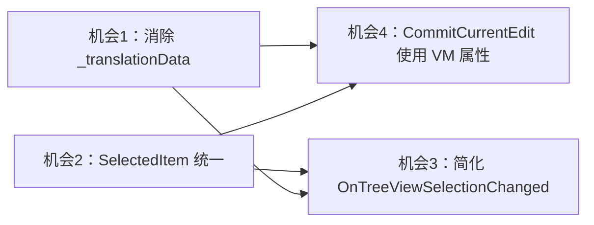

# Phase 4.1：Phase 1-4 耦合清理方案

> Phase 4 完成后，MainWindow.axaml.cs 中仍存在 Phase 1-3 遗留的过渡期代码，与 NavigationViewModel 形成冗余。本文档规划 4 项耦合清理任务。

---

## 一、机会 1：消除 `_translationData` 过渡期重复 ⭐ 高优先级

### 现状

[`MainWindow.axaml.cs:34`](MainWindow.axaml.cs:34) 保留了 `_translationData` 字段，而 [`DocumentViewModel.TranslationData`](ViewModels/DocumentViewModel.cs:66) 已拥有相同数据。MainWindow 中有 **25 处**引用 `_translationData`。

### 问题

- 双源状态：`_translationData` 和 `Document.TranslationData` 指向同一对象，但需手动同步
- `OnDocumentOpened` 中 `_translationData = e.TranslationData` 是手动同步
- `OnDocumentClosed` 中 `_translationData = null` 是手动同步
- 如果忘记同步，会导致空引用或数据不一致

### 方案

将所有 `_translationData` 替换为 `Document.TranslationData`，然后移除 `_translationData` 字段。

### 影响范围

| 位置 | 当前代码 | 替换为 |
|------|---------|--------|
| 字段声明 L34 | `private TranslationData? _translationData;` | 移除 |
| OnWindowClosing L269 | `_translationData = null;` | 移除（Document.CloseDocumentInternal 已清理） |
| OnDocumentOpened L360 | `_translationData = e.TranslationData;` | 移除 |
| OnDocumentClosed L391 | `_translationData = null;` | 移除 |
| RebuildCurrentView L592 | `if (_translationData == null)` | `if (Document.TranslationData == null)` |
| RebuildCurrentView L609 | `Navigation.BuildTreeView(_translationData)` | `Navigation.BuildTreeView(Document.TranslationData)` |
| CommitCurrentEdit L956 | `_translationData == null` | `Document.TranslationData == null` |
| CommitCurrentEdit L963 | `_translationData.ImageLabels` | `Document.TranslationData.ImageLabels` |
| OnLabelMarkerPointerPressed L1127 | `_translationData != null` | `Document.TranslationData != null` |
| OnLabelMarkerPointerPressed L1130 | `_translationData.ImageLabels` | `Document.TranslationData.ImageLabels` |
| UpdateDraggedLabelData L1245 | `_translationData == null` | `Document.TranslationData == null` |
| UpdateDraggedLabelData L1249 | `_translationData.ImageLabels` | `Document.TranslationData.ImageLabels` |
| AddNewLabel L1294 | `_translationData == null` | `Document.TranslationData == null` |
| AddNewLabel L1300 | `_translationData.ImageLabels` | `Document.TranslationData.ImageLabels` |
| AddNewLabel L1303 | `_translationData.ImageLabels[imageName]` | `Document.TranslationData.ImageLabels[imageName]` |
| FindLabelAtPosition L1502 | `_translationData == null` | `Document.TranslationData == null` |
| FindLabelAtPosition L1506 | `_translationData.ImageLabels` | `Document.TranslationData.ImageLabels` |
| UpdateLabels L1754 | `_translationData == null` | `Document.TranslationData == null` |
| UpdateLabels L1759 | `_translationData.ImageLabels` | `Document.TranslationData.ImageLabels` |
| OnToggleGroup L2159 | `_translationData == null` | `Document.TranslationData == null` |
| OnToggleGroup L2164 | `_translationData.ImageLabels` | `Document.TranslationData.ImageLabels` |
| OnDeleteSelectedLabel L2192 | `_translationData == null` | `Document.TranslationData == null` |
| OnDeleteSelectedLabel L2198 | `_translationData.ImageLabels` | `Document.TranslationData.ImageLabels` |
| CenterOnLabel L2621 | `_translationData == null` | `Document.TranslationData == null` |
| CenterOnLabel L2626 | `_translationData.ImageLabels` | `Document.TranslationData.ImageLabels` |
| OnTreeViewDrop L2808 | `_translationData != null` | `Document.TranslationData != null` |
| OnTreeViewDrop L2811 | `_translationData.ImageLabels` | `Document.TranslationData.ImageLabels` |

### 风险

- 低风险：`Document.TranslationData` 和 `_translationData` 始终指向同一对象，替换是等价的
- 需确保 `Document.TranslationData` 在文档关闭时已被清理（已确认 `CloseDocumentInternal` 会设为 null）

---

## 二、机会 2：`ImageTreeView.SelectedItem` → `Navigation.SelectedItem` 统一 ⭐ 高优先级

### 现状

MainWindow 中有 **24 处**直接访问 `ImageTreeView.SelectedItem`，而 NavigationViewModel 已有 `SelectedItem` 属性。

### 问题

- 选中状态存在双源：`ImageTreeView.SelectedItem`（UI）和 `Navigation.SelectedItem`（VM）
- `OnTreeViewSelectionChanged` 从 UI 侧读取 `ImageTreeView.SelectedItem`，而非从 VM 读取
- `SelectLabelByIndex` 直接设置 `ImageTreeView.SelectedItem`，绕过 VM

### 方案

**读取侧**：将 `ImageTreeView.SelectedItem` 的读取替换为 `Navigation.SelectedItem`

**写入侧**：通过 `Navigation.SelectedItem` 设置，由 `OnNavigationSelectedItemChanged` 事件自动同步到 `ImageTreeView.SelectedItem`

### 影响范围

| 位置 | 当前代码 | 替换为 |
|------|---------|--------|
| OnTreeViewSelectionChanged L2220 | `var selectedItem = ImageTreeView.SelectedItem;` | `var selectedItem = Navigation.SelectedItem;` |
| OnHistoryStateChanged L536 | `ImageTreeView.SelectedItem is TranslationTreeItem` | `Navigation.SelectedItem is TranslationTreeItem` |
| RefreshTreeView L551 | `var currentSelectedItem = ImageTreeView.SelectedItem;` | `var currentSelectedItem = Navigation.SelectedItem;` |
| RefreshTreeView L560 | `ImageTreeView.SelectedItem = currentSelectedItem;` | `Navigation.SelectedItem = currentSelectedItem;` |
| RebuildCurrentView L597 | `ImageTreeView.SelectedItem is TranslationTreeItem` | `Navigation.SelectedItem is TranslationTreeItem` |
| RebuildCurrentView L648/652/657 | `ImageTreeView.SelectedItem = ...` | `Navigation.SelectedItem = ...` |
| OnTranslationTextChanged L931 | `ImageTreeView.SelectedItem is TranslationTreeItem` | `Navigation.SelectedItem is TranslationTreeItem` |
| CommitCurrentEdit L960 | `ImageTreeView.SelectedItem is TranslationTreeItem` | `Navigation.SelectedItem is TranslationTreeItem` |
| SelectLabelByIndex L1277 | `ImageTreeView.SelectedItem = translationItem;` | `Navigation.SelectedItem = translationItem;` |
| UpdateLabels L1812 | `ImageTreeView.SelectedItem is TranslationTreeItem` | `Navigation.SelectedItem is TranslationTreeItem` |
| OnCopySelectedText L2131 | `var selectedItem = ImageTreeView.SelectedItem;` | `var selectedItem = Navigation.SelectedItem;` |
| OnToggleGroup L2155 | `var selectedItem = ImageTreeView.SelectedItem;` | `var selectedItem = Navigation.SelectedItem;` |
| OnDeleteSelectedLabel L2188 | `var selectedItem = ImageTreeView.SelectedItem;` | `var selectedItem = Navigation.SelectedItem;` |
| OnMainWindowPointerPressed L2364 | `var selectedItem = ImageTreeView.SelectedItem;` | `var selectedItem = Navigation.SelectedItem;` |
| OnTreeViewKeyDown L2445 | `var selectedItem = ImageTreeView.SelectedItem;` | `var selectedItem = Navigation.SelectedItem;` |
| OnTreeViewKeyDown L2576 | `var newSelectedItem = ImageTreeView.SelectedItem;` | `var newSelectedItem = Navigation.SelectedItem;` |

**保留不替换的位置**（UI 交互必须直接操作控件）：

- `FocusFirstTreeViewItem` 中 `ImageTreeView.SelectedItem = Navigation.TreeItems[0]` — 需要同时设置 VM 和 UI，保留
- `OnTreeViewSelectionChanged` 入口处同步 `Navigation.SelectedItem` — 需要从 UI 事件同步到 VM
- 导航快捷键中 `ImageTreeView.SelectedItem = visibleItems[...]` — 改为 `Navigation.SelectedItem = ...`，由事件同步

### 风险

- 中风险：需要确保 `OnNavigationSelectedItemChanged` 事件处理器正确同步 `ImageTreeView.SelectedItem`
- 需要添加防重入逻辑，避免 `OnTreeViewSelectionChanged` ↔ `Navigation.SelectedItem` 循环触发

---

## 三、机会 3：简化 `OnTreeViewSelectionChanged` ⭐ 中优先级

### 现状

[`OnTreeViewSelectionChanged`](MainWindow.axaml.cs:2218) 仍有 ~80 行代码，其中图片索引切换和手风琴逻辑与 NavigationViewModel 重复。

### 方案

在 `OnTreeViewSelectionChanged` 中：

1. **同步 SelectedItem 到 VM**：`Navigation.SelectedItem = selectedItem`
2. **图片切换**：将 `Navigation.CurrentImageIndex = index` 改为调用 `Navigation.TrySwitchToImage(imageName)`，由 VM 内部判断是否需要切换
3. **手风琴**：已使用 `Navigation.ApplyAccordion(targetRootItem)` ✅
4. **查找父节点**：将 `foreach (var root in Navigation.TreeItems)` 改为 `Navigation.GetParentImageItem(childItem)`

### 简化后的 OnTreeViewSelectionChanged 伪代码

```csharp
private void OnTreeViewSelectionChanged(object? sender, SelectionChangedEventArgs e)
{
    var selectedItem = ImageTreeView.SelectedItem;
    
    // 同步到 VM
    Navigation.SelectedItem = selectedItem;
    
    if (selectedItem == null) return;
    
    // 查找目标根节点
    ImageTreeItem? targetRootItem = null;
    if (selectedItem is ImageTreeItem rootItem)
    {
        targetRootItem = rootItem;
    }
    else if (selectedItem is TranslationTreeItem childItem)
    {
        targetRootItem = Navigation.GetParentImageItem(childItem);
    }
    
    // 图片切换（委托给 VM 判断）
    if (targetRootItem != null && Navigation.TrySwitchToImage(targetRootItem.ImageName))
    {
        LoadCurrentImage();
        CalculateFitTransform();
        ApplyTransform();
        StatusBar.UpdateZoom(GetZoomText());
        UpdateLabels();
    }
    
    // 手风琴效果
    if (targetRootItem != null)
    {
        Navigation.ApplyAccordion(targetRootItem);
    }
    
    // 以下为纯 UI 操作，保留在 code-behind
    // ... 高亮标签、TextBox 同步等 ...
}
```

### 风险

- 低风险：逻辑等价替换，只是调用方式从直接操作改为通过 VM 方法

---

## 四、机会 4：`CommitCurrentEdit` 使用 VM 属性 ⭐ 中优先级

### 现状

[`CommitCurrentEdit`](MainWindow.axaml.cs:953) 仍使用 `_translationData` 和 `ImageTreeView.SelectedItem`。

### 方案

结合机会 1 和 2 的替换：

```csharp
private void CommitCurrentEdit()
{
    if (!Edit.IsEditMode || _translationTextBox == null || Document.TranslationData == null || string.IsNullOrEmpty(_currentImagePath))
        return;

    if (Navigation.SelectedItem is TranslationTreeItem currentTreeItem)
    {
        string imageName = Path.GetFileName(_currentImagePath);
        if (Document.TranslationData.ImageLabels.TryGetValue(imageName, out var labels))
        {
            // ... 其余逻辑不变 ...
        }
    }
}
```

### 风险

- 低风险：等价替换，依赖机会 1 和 2 先完成

---

## 五、执行顺序



**推荐执行顺序**：

1. **机会 1**：消除 `_translationData` → `Document.TranslationData`（25 处替换，机械性高）
2. **机会 2**：`ImageTreeView.SelectedItem` → `Navigation.SelectedItem`（~16 处替换，需添加防重入逻辑）
3. **机会 3**：简化 `OnTreeViewSelectionChanged`（依赖 1+2 完成）
4. **机会 4**：`CommitCurrentEdit` 使用 VM 属性（依赖 1+2 完成，实际在 1+2 中已自然完成）

---

## 六、验证清单

- [ ] 所有 `_translationData` 引用已替换为 `Document.TranslationData`
- [ ] `_translationData` 字段已移除
- [ ] `OnDocumentOpened` 不再手动同步 `_translationData`
- [ ] `OnDocumentClosed` 不再手动清理 `_translationData`
- [ ] `ImageTreeView.SelectedItem` 读取已替换为 `Navigation.SelectedItem`
- [ ] `ImageTreeView.SelectedItem` 写入通过 `Navigation.SelectedItem` + 事件同步
- [ ] 防重入逻辑已添加（避免 SelectionChanged 循环触发）
- [ ] `OnTreeViewSelectionChanged` 使用 `Navigation.TrySwitchToImage()` 和 `Navigation.GetParentImageItem()`
- [ ] `CommitCurrentEdit` 使用 `Document.TranslationData` 和 `Navigation.SelectedItem`
- [ ] 编译通过 0 错误
- [ ] 功能测试：文档打开/关闭/树视图导航/标签编辑/撤销重做
