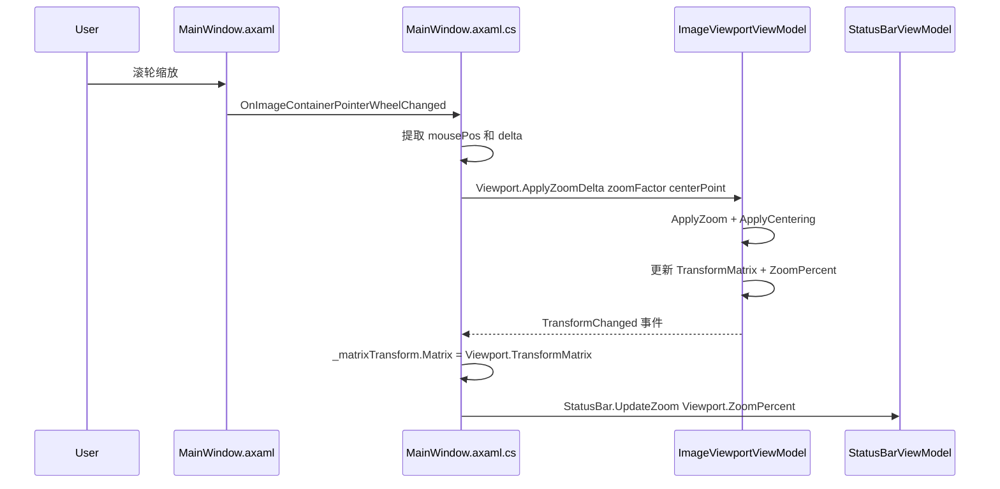

# Phase 5：ImageViewportViewModel 迁移方案

> 将缩放/平移/Fit 逻辑、变换矩阵管理、鼠标滚轮/拖拽交互逻辑从 `MainWindow.axaml.cs` 迁移到 `ImageViewportViewModel`。

---

## 一、当前代码分析

### 1.1 MainWindow.axaml.cs 中与视口相关的字段

| 字段 | 行号 | 用途 | 迁移目标 |
|------|------|------|---------|
| `_transformMatrix` | L36 | 变换矩阵状态 | ✅ → VM |
| `_matrixTransform` | L37 | UI 控件引用 | ❌ 留 code-behind |
| `_isPanning` | L40 | 平移状态标志 | ✅ → VM |
| `_lastPanPoint` | L41 | 上次平移位置 | ✅ → VM |
| `_currentImage` | L30 | Bitmap 引用 | ❌ 留 code-behind |
| `_currentImagePath` | L31 | 图片路径 | ❌ 留 code-behind |
| `_isFirstImageLoaded` | L52 | 首次加载标志 | ❌ 留 code-behind |

### 1.2 MainWindow.axaml.cs 中与视口相关的方法

| 方法 | 行号 | 功能 | 纯数学 | 迁移目标 |
|------|------|------|--------|---------|
| `ApplyTransform()` | L447 | 将矩阵写入 UI 控件 | ❌ | ❌ 留 code-behind |
| `ApplyZoom()` | L1597 | 以指定点为中心缩放 | ✅ | ✅ → VM |
| `ApplyCentering()` | L1611 | 边界限制+居中 | ✅ | ✅ → VM |
| `GetScaledImageSize()` | L1668 | 缩放后图片尺寸 | ✅ | ✅ → VM |
| `CalculateFitTransform()` | L1685 | Fit 自适应计算 | ✅ | ✅ → VM |
| `GetCurrentScale()` | L1747 | 当前缩放比例 | ✅ | ✅ → VM |
| `GetZoomText()` | L2059 | 缩放百分比文本 | ✅ | ✅ → VM |
| `SaveCurrentFitScale()` | L1726 | 保存 fit 比例到树节点 | ❌ | ❌ 留 code-behind（跨 VM 同步） |
| `CenterOnLabel()` | L2616 | 视野居中到标签 | ✅ | ✅ → VM（参数化） |

### 1.3 MainWindow.axaml.cs 中与视口相关的事件处理

| 事件处理 | 行号 | 功能 | 迁移目标 |
|---------|------|------|---------|
| `OnZoomIn` | L1391 | 菜单放大 | ✅ → VM Command |
| `OnZoomOut` | L1412 | 菜单缩小 | ✅ → VM Command |
| `OnResetZoom` | L1433 | 菜单重置缩放 | ✅ → VM Command |
| `OnImageContainerPointerPressed` | L1451 | 开始平移/添加标签 | ⚠️ 拆分：平移逻辑→VM，标签逻辑留 code-behind |
| `OnImageContainerPointerMoved` | L1540 | 平移移动 | ✅ → VM（平移部分） |
| `OnImageContainerPointerReleased` | L1560 | 结束平移 | ✅ → VM（平移部分） |
| `OnImageContainerPointerWheelChanged` | L1569 | 滚轮缩放 | ✅ → VM（缩放部分） |
| `OnImageContainerSizeChanged` | L433 | 容器尺寸变化 | ✅ → VM（通知容器尺寸更新） |

### 1.4 MainWindowViewModel 中的视口相关属性

| 属性 | 行号 | 迁移目标 |
|------|------|---------|
| `_canZoomIn` | L26 | ✅ → ImageViewportViewModel |
| `_canZoomOut` | L29 | ✅ → ImageViewportViewModel |
| `_canResetZoom` | L32 | ✅ → ImageViewportViewModel |

### 1.5 XAML 中的视口相关绑定

| 位置 | 当前 | 迁移后 |
|------|------|--------|
| L49 视图菜单-放大 | `Click="OnZoomIn"` | `Command="{Binding Viewport.ZoomInCommand}"` |
| L50 视图菜单-缩小 | `Click="OnZoomOut"` | `Command="{Binding Viewport.ZoomOutCommand}"` |
| L51 视图菜单-重置缩放 | `Click="OnResetZoom"` | `Command="{Binding Viewport.ResetZoomCommand}"` |

---

## 二、核心难点：UI 依赖注入

### 2.1 问题

变换矩阵的纯数学运算（缩放、平移、居中、Fit）不依赖 UI，但以下信息需要从 UI 层获取：

| 信息 | 来源 | 用途 |
|------|------|------|
| 容器尺寸 | `ImageContainer.Bounds` | Fit 计算、居中边界限制 |
| 图片尺寸 | `_currentImage.Size` | Fit 计算、缩放后尺寸 |
| 鼠标位置 | `PointerEventArgs.GetPosition()` | 滚轮缩放中心、平移起点 |
| MatrixTransform | `ImageWrapper.RenderTransform` | 应用矩阵到 UI |

### 2.2 解决方案：参数化 + 事件通知

采用与 `HistoryViewModel` 相同的模式——**ViewModel 持有状态和纯逻辑，code-behind 提取 UI 数据后传入**：



---

## 三、ImageViewportViewModel 设计

### 3.1 类定义

```csharp
// ViewModels/ImageViewportViewModel.cs
using Avalonia;
using CommunityToolkit.Mvvm.ComponentModel;
using CommunityToolkit.Mvvm.Input;

namespace LabelAva.ViewModels;

public partial class ImageViewportViewModel : ObservableObject
{
    // ========================
    // 状态属性
    // ========================

    /// <summary>变换矩阵</summary>
    [ObservableProperty]
    private Matrix _transformMatrix = Matrix.Identity;

    /// <summary>当前缩放百分比（如 100 表示 100%）</summary>
    [ObservableProperty]
    private double _zoomPercent = 100;

    /// <summary>当前 Fit 缩放比例（用于判断是否需要 CenterOnLabel）</summary>
    [ObservableProperty]
    private double _currentFitScale = 1.0;

    /// <summary>是否有图片加载</summary>
    [ObservableProperty]
    private bool _hasImage = false;

    // ========================
    // 内部状态
    // ========================

    // 容器尺寸（由 code-behind 通过 UpdateContainerSize 设置）
    private Size _containerSize;

    // 图片尺寸（由 code-behind 通过 UpdateImageSize 设置）
    private Size _imageSize;

    // 平移状态
    private bool _isPanning = false;
    private Point _lastPanPoint;

    // ========================
    // 命令
    // ========================

    [RelayCommand(CanExecute = nameof(HasImage))]
    private void ZoomIn()
    {
        if (_containerSize.Width <= 0 || _containerSize.Height <= 0) return;
        var centerPoint = new Point(_containerSize.Width / 2, _containerSize.Height / 2);
        ApplyZoomDelta(1.2, centerPoint);
    }

    [RelayCommand(CanExecute = nameof(HasImage))]
    private void ZoomOut()
    {
        if (_containerSize.Width <= 0 || _containerSize.Height <= 0) return;
        var centerPoint = new Point(_containerSize.Width / 2, _containerSize.Height / 2);
        ApplyZoomDelta(0.9, centerPoint);
    }

    [RelayCommand(CanExecute = nameof(HasImage))]
    private void ResetZoom()
    {
        CalculateFitTransform();
    }

    // ========================
    // 公开方法（由 code-behind 调用）
    // ========================

    /// <summary>更新容器尺寸（在 SizeChanged 和初始化时调用）</summary>
    public void UpdateContainerSize(Size size)
    {
        _containerSize = size;
    }

    /// <summary>更新图片尺寸（在图片加载后调用）</summary>
    public void UpdateImageSize(Size size)
    {
        _imageSize = size;
        HasImage = !size.IsEmpty && size.Width > 0 && size.Height > 0;
        ZoomInCommand.NotifyCanExecuteChanged();
        ZoomOutCommand.NotifyCanExecuteChanged();
        ResetZoomCommand.NotifyCanExecuteChanged();
    }

    /// <summary>应用缩放增量（滚轮/菜单调用）</summary>
    public void ApplyZoomDelta(double zoomFactor, Point centerPoint)
    {
        TransformMatrix = ApplyZoom(TransformMatrix, zoomFactor, centerPoint);
        TransformMatrix = ApplyCentering(TransformMatrix);
        UpdateZoomPercent();
        TransformChanged?.Invoke(this, EventArgs.Empty);
    }

    /// <summary>开始平移</summary>
    public void StartPan(Point position)
    {
        _isPanning = true;
        _lastPanPoint = position;
    }

    /// <summary>更新平移（鼠标移动时调用）</summary>
    public void UpdatePan(Point currentPosition)
    {
        if (!_isPanning) return;

        var delta = currentPosition - _lastPanPoint;
        TransformMatrix = new Matrix(
            TransformMatrix.M11, TransformMatrix.M12,
            TransformMatrix.M21, TransformMatrix.M22,
            TransformMatrix.M31 + delta.X, TransformMatrix.M32 + delta.Y);

        TransformMatrix = ApplyCentering(TransformMatrix);
        _lastPanPoint = currentPosition;

        UpdateZoomPercent();
        TransformChanged?.Invoke(this, EventArgs.Empty);
    }

    /// <summary>结束平移</summary>
    public void EndPan()
    {
        _isPanning = false;
    }

    /// <summary>是否正在平移中</summary>
    public bool IsPanning => _isPanning;

    /// <summary>计算 Fit 自适应变换</summary>
    public void CalculateFitTransform()
    {
        if (_imageSize.IsEmpty || _imageSize.Width <= 0 || _imageSize.Height <= 0) return;
        if (_containerSize.Width <= 0 || _containerSize.Height <= 0) return;

        double imageWidth = _imageSize.Width;
        double imageHeight = _imageSize.Height;
        double containerWidth = _containerSize.Width;
        double containerHeight = _containerSize.Height;

        double scale = Math.Min(containerWidth / imageWidth, containerHeight / imageHeight);

        double scaledWidth = imageWidth * scale;
        double scaledHeight = imageHeight * scale;
        double translateX = (containerWidth - scaledWidth) / 2;
        double translateY = (containerHeight - scaledHeight) / 2;

        TransformMatrix = Matrix.CreateScale(scale, scale) *
                        Matrix.CreateTranslation(translateX, translateY);

        CurrentFitScale = scale;
        UpdateZoomPercent();
        TransformChanged?.Invoke(this, EventArgs.Empty);
    }

    /// <summary>将视野居中到指定归一化坐标的标签</summary>
    public void CenterOnLabel(double normalizedX, double normalizedY)
    {
        if (_imageSize.IsEmpty) return;

        double labelX = normalizedX * _imageSize.Width;
        double labelY = normalizedY * _imageSize.Height;

        double centerX = _containerSize.Width / 2;
        double centerY = _containerSize.Height / 2;

        double currentScale = GetCurrentScale();
        double translateX = centerX - labelX * currentScale;
        double translateY = centerY - labelY * currentScale;

        TransformMatrix = new Matrix(
            TransformMatrix.M11, TransformMatrix.M12,
            TransformMatrix.M21, TransformMatrix.M22,
            translateX, translateY);

        TransformMatrix = ApplyCentering(TransformMatrix);
        UpdateZoomPercent();
        TransformChanged?.Invoke(this, EventArgs.Empty);
    }

    /// <summary>重置变换矩阵为 Identity</summary>
    public void ResetTransform()
    {
        TransformMatrix = Matrix.Identity;
        _isPanning = false;
        UpdateZoomPercent();
        TransformChanged?.Invoke(this, EventArgs.Empty);
    }

    /// <summary>容器尺寸变化时重新应用边界限制</summary>
    public void OnContainerSizeChanged()
    {
        if (_imageSize.IsEmpty) return;
        TransformMatrix = ApplyCentering(TransformMatrix);
        UpdateZoomPercent();
        TransformChanged?.Invoke(this, EventArgs.Empty);
    }

    // ========================
    // 事件
    // ========================

    /// <summary>变换矩阵变更事件（code-behind 监听以同步到 UI）</summary>
    public event EventHandler? TransformChanged;

    // ========================
    // 内部方法（纯数学）
    // ========================

    private Matrix ApplyZoom(Matrix matrix, double zoomFactor, Point centerPoint)
    {
        var zoomMatrix = Matrix.CreateTranslation(-centerPoint.X, -centerPoint.Y) *
                        Matrix.CreateScale(zoomFactor, zoomFactor) *
                        Matrix.CreateTranslation(centerPoint.X, centerPoint.Y);
        return matrix * zoomMatrix;
    }

    private Matrix ApplyCentering(Matrix matrix)
    {
        if (_imageSize.IsEmpty) return matrix;
        if (_containerSize.Width <= 0 || _containerSize.Height <= 0) return matrix;

        var scaledSize = GetScaledImageSize(matrix);
        double scaledWidth = scaledSize.Width;
        double scaledHeight = scaledSize.Height;

        double translateX = matrix.M31;
        double translateY = matrix.M32;

        double minX, maxX;
        if (scaledWidth < _containerSize.Width)
        {
            minX = 0;
            maxX = _containerSize.Width - scaledWidth;
        }
        else
        {
            minX = _containerSize.Width - scaledWidth;
            maxX = 0;
        }
        translateX = Math.Clamp(translateX, minX, maxX);

        double minY, maxY;
        if (scaledHeight < _containerSize.Height)
        {
            minY = 0;
            maxY = _containerSize.Height - scaledHeight;
        }
        else
        {
            minY = _containerSize.Height - scaledHeight;
            maxY = 0;
        }
        translateY = Math.Clamp(translateY, minY, maxY);

        return new Matrix(
            matrix.M11, matrix.M12,
            matrix.M21, matrix.M22,
            translateX, translateY);
    }

    private Size GetScaledImageSize(Matrix matrix)
    {
        if (_imageSize.IsEmpty) return new Size(0, 0);

        double scaleX = Math.Sqrt(matrix.M11 * matrix.M11 + matrix.M12 * matrix.M12);
        double scaleY = Math.Sqrt(matrix.M21 * matrix.M21 + matrix.M22 * matrix.M22);

        return new Size(
            _imageSize.Width * scaleX,
            _imageSize.Height * scaleY);
    }

    private double GetCurrentScale()
    {
        return Math.Sqrt(TransformMatrix.M11 * TransformMatrix.M11 + TransformMatrix.M12 * TransformMatrix.M12);
    }

    private void UpdateZoomPercent()
    {
        ZoomPercent = GetCurrentScale() * 100;
    }
}
```

### 3.2 MainWindowViewModel 变更

```csharp
public partial class MainWindowViewModel : ObservableObject
{
    [ObservableProperty]
    private ImageViewportViewModel _viewport = new();

    // 移除以下属性（已迁入 ImageViewportViewModel）：
    // - _canZoomIn, _canZoomOut, _canResetZoom
}
```

### 3.3 MainWindow.axaml.cs 变更

#### 新增便捷属性

```csharp
public ImageViewportViewModel Viewport => ViewModel.Viewport;
```

#### 构造函数中初始化

```csharp
// 订阅变换矩阵变更事件
Viewport.TransformChanged += OnViewportTransformChanged;
```

#### 事件处理简化

| 原方法 | 简化后 |
|--------|--------|
| `OnZoomIn` | 删除，由 `Viewport.ZoomInCommand` 替代 |
| `OnZoomOut` | 删除，由 `Viewport.ZoomOutCommand` 替代 |
| `OnResetZoom` | 删除，由 `Viewport.ResetZoomCommand` 替代 |
| `OnImageContainerPointerPressed` | 平移部分：`Viewport.StartPan(position)` |
| `OnImageContainerPointerMoved` | 平移部分：`Viewport.UpdatePan(position)` |
| `OnImageContainerPointerReleased` | 平移部分：`Viewport.EndPan()` |
| `OnImageContainerPointerWheelChanged` | `Viewport.ApplyZoomDelta(zoom, mousePos)` |
| `OnImageContainerSizeChanged` | `Viewport.UpdateContainerSize(...)` + `Viewport.OnContainerSizeChanged()` |
| `ApplyTransform()` | 保留，在 `OnViewportTransformChanged` 中调用 |
| `CalculateFitTransform()` | 删除，由 `Viewport.CalculateFitTransform()` 替代 |
| `GetZoomText()` | 删除，由 `Viewport.ZoomPercent` 替代 |
| `GetCurrentScale()` | 删除，由 VM 内部方法替代 |
| `ApplyZoom()` | 删除，迁入 VM |
| `ApplyCentering()` | 删除，迁入 VM |
| `GetScaledImageSize()` | 删除，迁入 VM |
| `SaveCurrentFitScale()` | 保留，在 `OnViewportTransformChanged` 中同步 |
| `CenterOnLabel()` | 简化为：提取归一化坐标 → `Viewport.CenterOnLabel(x, y)` |

#### 新增 TransformChanged 处理

```csharp
private void OnViewportTransformChanged(object? sender, EventArgs e)
{
    // 同步矩阵到 UI 控件
    ApplyTransform();
    // 同步缩放百分比到状态栏
    StatusBar.UpdateZoom(Viewport.ZoomPercent);
    // 同步 FitScale 到树视图项
    SaveCurrentFitScale(Viewport.CurrentFitScale);
}
```

#### 图片加载后通知 VM

```csharp
// 在 LoadImage() 中，设置图片源后：
Viewport.UpdateImageSize(_currentImage.Size);
```

#### 容器尺寸变化通知 VM

```csharp
private void OnImageContainerSizeChanged(object? sender, SizeChangedEventArgs e)
{
    if (_currentImage == null) return;
    Viewport.UpdateContainerSize(e.NewSize);
    Viewport.OnContainerSizeChanged();
}
```

#### 文档关闭时重置 VM

```csharp
// OnDocumentClosed 中：
Viewport.ResetTransform();
Viewport.UpdateImageSize(Size.Empty);
```

### 3.4 XAML 变更

```xml
<!-- 修改前 -->
<MenuItem Header="放大" Click="OnZoomIn"/>
<MenuItem Header="缩小" Click="OnZoomOut"/>
<MenuItem Header="重置缩放" Click="OnResetZoom"/>

<!-- 修改后 -->
<MenuItem Header="放大" Command="{Binding Viewport.ZoomInCommand}"/>
<MenuItem Header="缩小" Command="{Binding Viewport.ZoomOutCommand}"/>
<MenuItem Header="重置缩放" Command="{Binding Viewport.ResetZoomCommand}"/>
```

---

## 四、迁移步骤清单

- [ ] 创建 `ViewModels/ImageViewportViewModel.cs`，包含所有状态属性、命令、纯数学方法
- [ ] 在 `MainWindowViewModel` 中添加 `Viewport` 属性，移除 `_canZoomIn`/`_canZoomOut`/`_canResetZoom`
- [ ] 在 `MainWindow.axaml.cs` 中添加 `Viewport` 便捷属性
- [ ] 在构造函数中订阅 `Viewport.TransformChanged` 事件
- [ ] 迁移 `OnZoomIn`/`OnZoomOut`/`OnResetZoom` → 删除事件处理，改用 Command 绑定
- [ ] 更新 `MainWindow.axaml` 视图菜单：`Click` → `Command` 绑定
- [ ] 迁移 `OnImageContainerPointerWheelChanged` → 调用 `Viewport.ApplyZoomDelta()`
- [ ] 迁移 `OnImageContainerPointerPressed` 中平移部分 → 调用 `Viewport.StartPan()`
- [ ] 迁移 `OnImageContainerPointerMoved` 中平移部分 → 调用 `Viewport.UpdatePan()`
- [ ] 迁移 `OnImageContainerPointerReleased` 中平移部分 → 调用 `Viewport.EndPan()`
- [ ] 迁移 `OnImageContainerSizeChanged` → 调用 `Viewport.UpdateContainerSize()` + `OnContainerSizeChanged()`
- [ ] 迁移 `CalculateFitTransform` → 调用 `Viewport.CalculateFitTransform()`
- [ ] 迁移 `CenterOnLabel` → 提取归一化坐标后调用 `Viewport.CenterOnLabel(x, y)`
- [ ] 迁移 `OnClearCanvas`/`OnDocumentClosed` → 调用 `Viewport.ResetTransform()`
- [ ] 在 `LoadImage()` 中添加 `Viewport.UpdateImageSize()` 调用
- [ ] 添加 `OnViewportTransformChanged` 事件处理（同步矩阵到 UI + 状态栏 + FitScale）
- [ ] 移除 `_transformMatrix`/`_isPanning`/`_lastPanPoint` 字段
- [ ] 移除 `ApplyZoom`/`ApplyCentering`/`GetScaledImageSize`/`GetCurrentScale`/`GetZoomText` 方法
- [ ] 更新所有调用点：`_transformMatrix` → `Viewport.TransformMatrix`，`GetZoomText()` → `Viewport.ZoomPercent`

---

## 五、调用点影响分析

### 5.1 直接读取 `_transformMatrix` 的位置

| 位置 | 当前代码 | 替换为 |
|------|---------|--------|
| OnDocumentClosed L385 | `_transformMatrix = Matrix.Identity` | `Viewport.ResetTransform()` |
| OnClearCanvas L1382 | `_transformMatrix = Matrix.Identity` | `Viewport.ResetTransform()` |
| OnImageContainerPointerMoved L1547-1550 | 直接构造新矩阵 | `Viewport.UpdatePan(currentPoint)` |
| OnImageContainerPointerWheelChanged L1580 | `_transformMatrix = ApplyZoom(...)` | `Viewport.ApplyZoomDelta(zoom, mousePos)` |
| OnZoomIn L1405 | `_transformMatrix = ApplyZoom(...)` | 删除（Command 内部处理） |
| OnZoomOut L1426 | `_transformMatrix = ApplyZoom(...)` | 删除（Command 内部处理） |
| CenterOnLabel L2658 | 直接构造新矩阵 | `Viewport.CenterOnLabel(x, y)` |

### 5.2 调用 `CalculateFitTransform` 的位置

| 位置 | 替换为 |
|------|--------|
| OnNavigationCurrentImageChanged L403 | `Viewport.CalculateFitTransform()` |
| OnResetZoom L1438 | 删除（Command 内部处理） |
| LoadImage L2016 | `Viewport.CalculateFitTransform()` |
| OnTreeViewSelectionChanged L2262 | `Viewport.CalculateFitTransform()` |

### 5.3 调用 `ApplyTransform` 的位置

所有 `ApplyTransform()` 调用将移入 `OnViewportTransformChanged` 事件处理中，原调用点不再需要单独调用。

### 5.4 调用 `GetZoomText`/`StatusBar.UpdateZoom` 的位置

所有 `StatusBar.UpdateZoom(GetZoomText())` 调用将移入 `OnViewportTransformChanged` 事件处理中，原调用点不再需要单独调用。

---

## 六、风险与注意事项

1. **容器尺寸初始化时机**：`CalculateFitTransform` 在容器未布局完成时需要重试。当前通过 `Task.Delay(200)` + `Dispatcher.UIThread.Post` 实现。迁移后，code-behind 仍需负责在容器布局完成后调用 `Viewport.UpdateContainerSize()` + `Viewport.CalculateFitTransform()`。

2. **平移与编辑模式交互**：`OnImageContainerPointerPressed` 中编辑模式（添加标签）和浏览模式（平移）的逻辑交织。迁移时只将平移逻辑移入 VM，标签添加逻辑保留在 code-behind。

3. **TransformChanged 事件频率**：平移操作会高频触发 `TransformChanged`。当前实现中每次平移都直接修改 `_matrixTransform.Matrix`，性能无问题。迁移后通过事件通知，需确保事件处理足够轻量（仅赋值 + 更新状态栏文本）。

4. **FitScale 同步**：`CurrentFitScale` 需要在 `CalculateFitTransform` 后同步到 `ImageTreeItem.FitScale`，由 code-behind 在 `OnViewportTransformChanged` 中完成，避免 VM 间直接依赖。

5. **首次加载闪烁**：当前首次加载图片时先隐藏 `MainImage`，Fit 完成后再显示。此逻辑保留在 code-behind，不受迁移影响。
