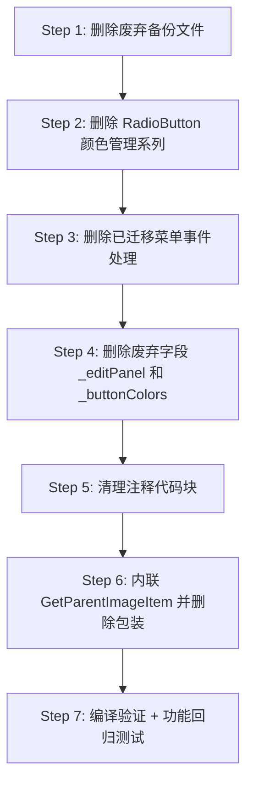

# Phase 6：MainWindow.axaml.cs 废弃代码清理方案

> 本文档基于对 `MainWindow.axaml.cs` 全部 2624 行的逐方法引用分析，标记所有无引用的废弃函数、字段、注释块及备份文件。

---

## 一、分析方法论

对 `MainWindow.axaml.cs` 中每个方法和字段，检查以下三类引用来源：

1. **XAML 事件绑定**：`Click="..."`、`PointerPressed="..."` 等
2. **C# 内部调用**：同一文件内其他方法的调用
3. **构造函数事件订阅**：`+=` 订阅、回调注入

若以上三类均无引用，则标记为 **DEAD**。

---

## 二、废弃方法清单（共 11 个）

### 2.1 RadioButton 手动颜色管理系列（6 个方法 + 1 个字段）

这组代码是早期手动管理 RadioButton 颜色的实现，后来被 `UpdateGroupButtonColors()` + Window Resources 方案完全替代，但旧代码未删除。

| # | 方法名 | 行号 | 废弃原因 |
|---|--------|------|----------|
| 1 | `ApplyRadioButtonColors()` | 825-841 | 无任何调用者 |
| 2 | `OnRadioButtonPointerEntered()` | 846-859 | 仅被废弃的 `ApplyRadioButtonColors` 订阅 |
| 3 | `OnRadioButtonPointerExited()` | 864-877 | 仅被废弃的 `ApplyRadioButtonColors` 订阅 |
| 4 | `OnRadioButtonPointerPressed()` | 882-888 | 仅被废弃的 `ApplyRadioButtonColors` 订阅 |
| 5 | `OnRadioButtonPointerReleased()` | 893-906 | 仅被废弃的 `ApplyRadioButtonColors` 订阅 |
| 6 | `ActivateRadioButton()` | 911-916 | 无任何调用者 |
| 7 | `DeactivateRadioButton()` | 921-926 | 无任何调用者 |

**关联废弃字段**：

| 字段名 | 行号 | 废弃原因 |
|--------|------|----------|
| `_buttonColors` | 820 | 仅被上述 7 个废弃方法读写 |

**删除行范围**：约 819-926（共 ~108 行）

### 2.2 已迁移但未删除的菜单事件处理（4 个方法）

这些方法的功能已迁移到对应 ViewModel 的 Command 绑定，XAML 中已改用 `Command="{Binding ...}"`，但旧 `Click` 事件处理函数残留未删。

| # | 方法名 | 行号 | 废弃原因 |
|---|--------|------|----------|
| 8 | `OnAddLabel()` | 1374-1377 | XAML 无绑定，C# 无调用 |
| 9 | `OnDeleteLabel()` | 1379-1382 | XAML 无绑定，C# 无调用 |
| 10 | `OnClearCanvas()` | 1384-1399 | XAML 无绑定，C# 无调用 |
| 11 | `OnResetZoom()` | 1403-1407 | XAML 已改用 `Command="{Binding Viewport.ResetZoomCommand}"`，C# 无调用。注释称"兼容过渡期"但过渡已完成 |

**删除行范围**：约 1374-1407（共 ~34 行）

---

## 三、废弃字段清单（共 1 个）

| 字段名 | 行号 | 废弃原因 |
|--------|------|----------|
| `_editPanel` | 66 | 构造函数中 `FindControl` 赋值（行 121），但之后从未读取 |

**清理方式**：删除字段声明（行 66）及构造函数中的赋值语句（行 121）

---

## 四、注释代码块清理（共 3 处）

| # | 位置 | 行号 | 内容 |
|---|------|------|------|
| 1 | 字段区 | 54-61 | 注释掉的 `_statusText`、`_statusBar`、`_zoomText`、`_currentStatusBarViewModel.StatusType`、`_statusMessageId` |
| 2 | 构造函数 | 129-139 | 注释掉的 status-bar 默认类添加和初始状态设置 |
| 3 | 辅助方法区 | 1893-1949 | 大段注释掉的 `StatusBar.UpdateStatus` 旧实现（约 57 行） |

**清理方式**：直接删除这些注释块

---

## 五、冗余包装方法（1 个）

| 方法名 | 行号 | 说明 |
|--------|------|------|
| `GetParentImageItem()` | 2474-2477 | 仅转发调用 `Navigation.GetParentImageItem()`，有 2 处调用点（`OnTreeViewDragOver`、`OnTreeViewDrop`） |

**清理方式**：在 2 处调用点直接使用 `Navigation.GetParentImageItem()`，删除包装方法

---

## 六、废弃备份文件（2 个）

| 文件 | 说明 |
|------|------|
| `MainWindow.axaml.cs.1` | 旧版 code-behind 备份（3775 行），已废弃 |
| `ViewModels/MenuBarViewModel copy.cs.bak` | MenuBarViewModel 备份，已合并到 MainWindowViewModel |

**清理方式**：直接删除文件

---

## 七、清理影响统计

| 类别 | 删除内容 | 预计减少行数 |
|------|----------|-------------|
| 废弃方法 | 11 个方法 | ~142 行 |
| 废弃字段 | 1 个字段 + 关联赋值 | ~2 行 |
| 废弃字段 | `_buttonColors` 字段 | ~1 行 |
| 注释代码块 | 3 处 | ~70 行 |
| 冗余包装 | 1 个方法 | ~4 行 |
| 备份文件 | 2 个文件 | ~3775+ 行 |
| **合计** | | **~1994 行（含备份文件）** |

清理后 `MainWindow.axaml.cs` 预计从 **2624 行 → ~2405 行**（减少约 219 行有效代码）。

---

## 八、执行步骤

### Step 1：删除废弃备份文件
- 删除 `MainWindow.axaml.cs.1`
- 删除 `ViewModels/MenuBarViewModel copy.cs.bak`

### Step 2：删除 RadioButton 手动颜色管理系列（行 819-926）
- 删除 `_buttonColors` 字段声明（行 820）
- 删除 `ApplyRadioButtonColors` 方法（行 825-841）
- 删除 `OnRadioButtonPointerEntered` 方法（行 846-859）
- 删除 `OnRadioButtonPointerExited` 方法（行 864-877）
- 删除 `OnRadioButtonPointerPressed` 方法（行 882-888）
- 删除 `OnRadioButtonPointerReleased` 方法（行 893-906）
- 删除 `ActivateRadioButton` 方法（行 911-916）
- 删除 `DeactivateRadioButton` 方法（行 921-926）

### Step 3：删除已迁移菜单事件处理（行 1374-1407）
- 删除 `OnAddLabel` 方法
- 删除 `OnDeleteLabel` 方法
- 删除 `OnClearCanvas` 方法
- 删除 `OnResetZoom` 方法

### Step 4：删除废弃字段
- 删除 `_editPanel` 字段声明（行 66）及构造函数赋值（行 121）
- （`_buttonColors` 已在 Step 2 中删除）

### Step 5：清理注释代码块
- 删除行 54-61 的注释字段声明
- 删除行 129-139 的注释构造函数代码
- 删除行 1893-1949 的大段注释代码

### Step 6：内联冗余包装方法
- 在 `OnTreeViewDragOver`（行 2574）和 `OnTreeViewDrop`（行 2599-2600）中将 `GetParentImageItem(x)` 替换为 `Navigation.GetParentImageItem(x)`
- 删除 `GetParentImageItem` 包装方法（行 2474-2477）

### Step 7：编译验证 + 功能回归测试
- `dotnet build` 确认无编译错误
- 手动验证：分组按钮颜色、右键菜单、树视图拖拽、快捷键

---

## 九、风险与注意事项

1. **`OnResetZoom`**：注释称"兼容 XAML Click 绑定过渡期"，但 XAML 已使用 `Command="{Binding Viewport.ResetZoomCommand}"`，确认安全删除
2. **`OnClearCanvas`**：虽然 XAML 中无绑定，但其内部逻辑（释放图片、重置变换、清除标注）可能在未来需要。删除后如需恢复可从 Git 历史找回
3. **`AdjustBrightness`**：虽然被废弃的 `ApplyRadioButtonColors` 和 `OnRadioButtonPointerEntered` 调用，但也被活跃的 `UpdateGroupButtonColors` 调用，**不可删除**
4. **备份文件删除不可逆**：建议先确认 Git 已提交当前状态，以便需要时恢复
