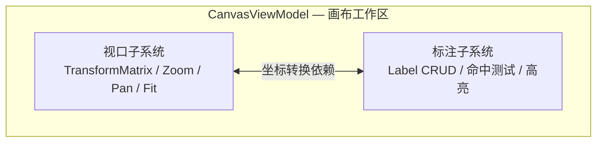
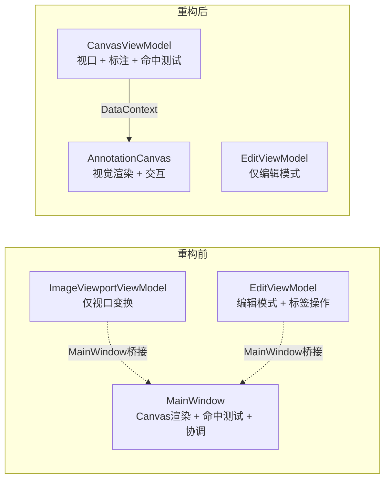
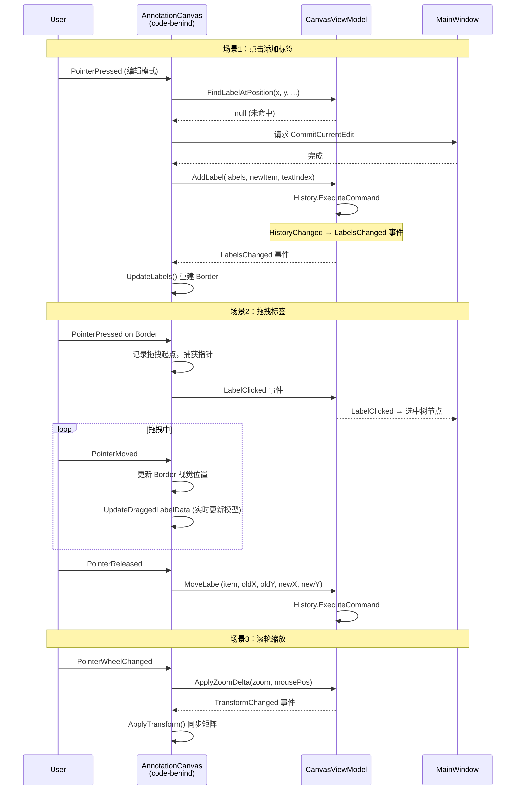

# Phase 7：CanvasViewModel 迁移方案

> 将 ImageViewportViewModel + EditViewModel 中的标签操作 + MainWindow 中的 Canvas 标注代码，
> 合并为语义内聚的 `CanvasViewModel` + `AnnotationCanvas` UserControl 配对。

---

## 一、动机与语义分析

### 1.1 当前问题

标注/标签（Annotation/Label）这一核心领域概念被撕裂到三个地方：

| 位置 | 职责 | 层次 |
|---|---|---|
| `TranslationData.ImageLabels` | 标签数据 | Model |
| `EditViewModel` 的方法 | 标签 CRUD 操作 | ViewModel |
| `MainWindow` 的 Canvas 代码 | 标签视觉渲染 + 交互 | View |

**没有一个 VM 代表"画布工作区"这一语义概念。** 视口变换和标注操作在数学上耦合（命中测试需要图片尺寸，居中需要归一化坐标），但在代码上分散在 `ImageViewportViewModel`、`EditViewModel`、`MainWindow` 三处。

### 1.2 目标语义边界

"画布工作区"是一个天然的语义单元——图像展示 + 标注 + 视口变换，都是"你在画布上看到和操作的东西"：



### 1.3 重构前后对比



---

## 二、CanvasViewModel 设计

### 2.1 完整 API

```csharp
public partial class CanvasViewModel : ObservableObject
{
    // === 依赖 ===
    private readonly HistoryViewModel _history;
    private readonly StatusBarViewModel _statusBar;
    private readonly Action _commitCurrentEdit;

    // ========================
    // 视口状态（原 ImageViewportViewModel）
    // ========================

    [ObservableProperty] private Matrix _transformMatrix = Matrix.Identity;
    [ObservableProperty] private double _zoomPercent = 100;
    [ObservableProperty] private double _currentFitScale = 1.0;
    [ObservableProperty] private bool _hasImage = false;

    // 容器/图片尺寸（由 UserControl code-behind 注入）
    private Size _containerSize;
    private Size _imageSize;

    // 平移状态
    private bool _isPanning;
    private Point _lastPanPoint;

    // 视口命令
    [RelayCommand(CanExecute = nameof(HasImage))] void ZoomIn();
    [RelayCommand(CanExecute = nameof(HasImage))] void ZoomOut();
    [RelayCommand(CanExecute = nameof(HasImage))] void ResetZoom();

    // 视口方法（由 UserControl code-behind 调用）
    void UpdateContainerSize(Size size);
    void UpdateImageSize(Size size);
    void ApplyZoomDelta(double zoomFactor, Point centerPoint);
    void StartPan(Point position);
    void UpdatePan(Point currentPosition);
    void EndPan();
    bool IsPanning { get; }
    void CalculateFitTransform();
    void CenterOnLabel(double normalizedX, double normalizedY);
    void ResetTransform();
    void OnContainerSizeChanged();

    // ========================
    // 标注状态（原 EditViewModel 标签部分 + MainWindow）
    // ========================

    /// <summary>当前高亮的标签索引（-1 表示无高亮）</summary>
    [ObservableProperty] private int _highlightedLabelIndex = -1;

    /// <summary>待选中的新标签索引（添加标签后自动选中）</summary>
    private int? _pendingNewLabelIndex;
    int? PendingNewLabelIndex { get; }
    void SetPendingNewLabelIndex(int? index);
    void ClearPendingNewLabelIndex();

    // ========================
    // 标签操作方法（原 EditViewModel）
    // ========================

    void AddLabel(List<LabelItem> labels, LabelItem newItem, int textIndex);
    void DeleteLabel(List<LabelItem> labels, LabelItem itemToDelete);
    void MoveLabel(LabelItem label, double oldX, double oldY, double newX, double newY);
    void ChangeGroup(LabelItem label, int oldGroupIndex, int newGroupIndex);
    void ReorderLabels(List<LabelItem> labels, LabelItem draggedItem, int targetIndex, int pendingIndex);

    // ========================
    // 命中测试（原 MainWindow.FindLabelAtPosition）
    // ========================

    int? FindLabelAtPosition(
        double pixelX, double pixelY,
        double imageWidth, double imageHeight,
        Dictionary<string, List<LabelItem>> imageLabels,
        string currentImageName);

    // ========================
    // 事件
    // ========================

    /// <summary>变换矩阵变更（UserControl 监听以同步 UI）</summary>
    event EventHandler? TransformChanged;

    /// <summary>标签被点击（MainWindow 监听以同步树视图选中）</summary>
    event EventHandler<int>? LabelClicked;

    /// <summary>标注数据变更（UserControl 监听以重建 Border）</summary>
    event EventHandler? LabelsChanged;
}
```

### 2.2 构造函数

```csharp
public CanvasViewModel(
    HistoryViewModel history,
    StatusBarViewModel statusBar,
    Action commitCurrentEdit)
{
    _history = history;
    _statusBar = statusBar;
    _commitCurrentEdit = commitCurrentEdit;
}
```

### 2.3 职责划分总览

| 关注点 | 归属 | 理由 |
|---|---|---|
| 变换矩阵计算 | **CanvasViewModel** | 纯数学，无 UI 依赖 |
| 缩放/平移/Fit 命令 | **CanvasViewModel** | 业务行为 |
| Label 数据 CRUD | **CanvasViewModel** | 业务逻辑 |
| 命中测试 | **CanvasViewModel** | 纯坐标计算 |
| 选中/高亮索引状态 | **CanvasViewModel** | 状态属性 |
| Border 控件创建 | **UserControl code-behind** | 纯 UI 渲染 |
| 颜色/样式 | **UserControl code-behind** | 纯视觉关注点 |
| 高亮视觉更新 | **UserControl code-behind** | 响应 VM 的 HighlightedLabelIndex 变更 |
| Pointer 事件捕获 | **UserControl code-behind** | Avalonia 控件交互 |
| 拖拽视觉反馈 | **UserControl code-behind** | UI 坐标操作 |
| 拖拽数据提交 | **CanvasViewModel** | 业务操作 |

---

## 三、AnnotationCanvas UserControl 设计

### 3.1 XAML 结构

```xml
<!-- Views/AnnotationCanvas.axaml -->
<UserControl xmlns="https://github.com/avaloniaui"
             x:Class="LabelAva.Views.AnnotationCanvas"
             x:DataType="vm:CanvasViewModel">

    <Border Name="ImageContainer"
            ClipToBounds="True"
            Background="Transparent"
            PointerPressed="OnImageContainerPointerPressed"
            PointerMoved="OnImageContainerPointerMoved"
            PointerReleased="OnImageContainerPointerReleased"
            PointerWheelChanged="OnImageContainerPointerWheelChanged">
        <Canvas Name="ImageCanvas">
            <Canvas Name="ImageWrapper" RenderTransformOrigin="0,0">
                <Image Name="MainImage"
                       Stretch="None"
                       HorizontalAlignment="Left"
                       VerticalAlignment="Top"
                       RenderOptions.BitmapInterpolationMode="HighQuality" />
            </Canvas>
        </Canvas>
    </Border>
</UserControl>
```

### 3.2 Code-behind 职责

```csharp
public partial class AnnotationCanvas : UserControl
{
    // === 状态字段 ===
    private Bitmap? _currentImage;
    private string? _currentImagePath;
    private List<Control> _labelControls = new();
    private bool _isDraggingLabel;
    private Border? _draggedLabel;
    private Point _labelDragLastPoint;
    private double _dragStartNormX, _dragStartNormY;
    private LabelItem? _draggingLabelItem;
    private bool _isFirstImageLoaded;

    // === 公开方法（供 MainWindow 调用）===
    void LoadImage(string imagePath);           // 加载图片 + 通知 VM 图片尺寸
    void ClearCanvas();                         // 清空图片 + 标注
    void UpdateLabels();                        // 重建 Border 控件
    void HighlightLabel(int labelIndex);        // 视觉高亮
    void ApplyTransform();                      // 同步 VM.TransformMatrix 到 UI

    // === 事件处理（从 MainWindow 搬入）===
    void OnImageContainerPointerPressed(...);
    void OnImageContainerPointerMoved(...);
    void OnImageContainerPointerReleased(...);
    void OnImageContainerPointerWheelChanged(...);
    void OnLabelMarkerPointerPressed(...);
    void OnLabelMarkerPointerMoved(...);
    void OnLabelMarkerPointerReleased(...);

    // === 私有辅助 ===
    void ClearLabelControls();
    IBrush GetGroupBrush(int groupIndex);
    IBrush GetSelectedHighlightBrush();
    void UpdateDraggedLabelData(Border labelBorder, double left, double top);
}
```

### 3.3 与 CanvasViewModel 的交互模式



---

## 四、EditViewModel 瘦身

### 4.1 迁出项

| 迁出项 | 去向 | 说明 |
|---|---|---|
| `AddLabel()` | CanvasViewModel | 标签操作 |
| `DeleteLabel()` | CanvasViewModel | 标签操作 |
| `MoveLabel()` | CanvasViewModel | 标签操作 |
| `ChangeGroup()` | CanvasViewModel | 标签操作 |
| `ReorderLabels()` | CanvasViewModel | 标签操作 |
| `PendingNewLabelIndex` | CanvasViewModel | 标签操作附属状态 |
| `_commitCurrentEdit` 字段 | CanvasViewModel | 标签操作前提交 |
| `_history` 字段 | CanvasViewModel | 标签操作需要历史栈 |

### 4.2 瘦身后的 EditViewModel

```csharp
public partial class EditViewModel : ObservableObject
{
    private readonly StatusBarViewModel _statusBar;

    [ObservableProperty] private bool _isEditMode;
    [ObservableProperty] private bool _canToggleEditMode;
    [ObservableProperty] private int _currentGroupIndex;

    // 派生属性
    bool IsEditPanelVisible { get; }
    string EditModeButtonText { get; }
    bool AreGroupButtonsVisible { get; }

    // 命令
    [RelayCommand(CanExecute = nameof(CanToggleEditMode))]
    void ToggleEditMode();

    [RelayCommand]
    void SwitchGroup(int groupIndex);

    // 事件
    event EventHandler? EditModeChanged;
    event EventHandler? GroupChanged;
}
```

**关键变化**：EditViewModel 不再依赖 `HistoryViewModel` 和 `_commitCurrentEdit` 回调，仅保留编辑模式 UI 状态。

---

## 五、MainWindowViewModel 变更

### 5.1 属性变更

```csharp
public partial class MainWindowViewModel : ObservableObject
{
    [ObservableProperty] private StatusBarViewModel _statusBar = new();
    [ObservableProperty] private HistoryViewModel _history = null!;
    [ObservableProperty] private EditViewModel _edit = null!;
    [ObservableProperty] private DocumentViewModel _document = null!;
    [ObservableProperty] private NavigationViewModel _navigation = null!;
    [ObservableProperty] private CanvasViewModel _canvas = null!;  // 替代 ImageViewportViewModel
    // 移除：ImageViewportViewModel _viewport
}
```

### 5.2 绑定路径变更

| 旧路径 | 新路径 | 说明 |
|---|---|---|
| `Viewport.TransformMatrix` | `Canvas.TransformMatrix` | 变换矩阵 |
| `Viewport.ZoomPercent` | `Canvas.ZoomPercent` | 缩放百分比 |
| `Viewport.ZoomInCommand` | `Canvas.ZoomInCommand` | 菜单绑定 |
| `Viewport.ZoomOutCommand` | `Canvas.ZoomOutCommand` | 菜单绑定 |
| `Viewport.ResetZoomCommand` | `Canvas.ResetZoomCommand` | 菜单绑定 |
| `Edit.AddLabel` | `Canvas.AddLabel` | 标签操作 |
| `Edit.PendingNewLabelIndex` | `Canvas.PendingNewLabelIndex` | 待选中索引 |

---

## 六、MainWindow 变更

### 6.1 移除的代码（约 375 行）

| 方法/字段 | 行数(估) | 去向 |
|---|---|---|
| `_labelControls` / `_isDraggingLabel` / `_draggedLabel` / `_labelDragLastPoint` | ~8 | → AnnotationCanvas |
| `_dragStartNormX` / `_dragStartNormY` / `_draggingLabelItem` | ~4 | → AnnotationCanvas |
| `_currentImage` / `_currentImagePath` | ~4 | → AnnotationCanvas |
| `_isFirstImageLoaded` | ~2 | → AnnotationCanvas |
| `ClearLabelControls()` | ~15 | → AnnotationCanvas |
| `OnLabelMarkerPointerPressed/Moved/Released` | ~90 | → AnnotationCanvas |
| `OnImageContainerPointerPressed/Moved/Released` | ~60 | → AnnotationCanvas |
| `OnImageContainerPointerWheelChanged` | ~15 | → AnnotationCanvas |
| `FindLabelAtPosition` | ~25 | → CanvasViewModel |
| `UpdateLabels` + Border 创建 | ~80 | → AnnotationCanvas |
| `GetGroupBrush` / `GetSelectedHighlightBrush` | ~60 | → AnnotationCanvas |
| `HighlightLabel` | ~30 | → AnnotationCanvas |
| `UpdateDraggedLabelData` | ~20 | → AnnotationCanvas |
| `AddNewLabel` | ~35 | → AnnotationCanvas (调用 CanvasViewModel) |
| `SelectLabelByIndex` | ~20 | → 保留在 MainWindow (协调逻辑) |
| `CalculateFitTransform` | ~20 | → AnnotationCanvas (调用 CanvasViewModel) |
| `LoadCurrentImage` / `LoadImage` | ~80 | → AnnotationCanvas |
| `ApplyTransform` | ~10 | → AnnotationCanvas |

### 6.2 保留在 MainWindow 的代码

| 方法 | 理由 |
|---|---|
| `CommitCurrentEdit()` | 需要 `_translationTextBox` 访问（右侧面板控件） |
| `RebuildCurrentView()` | 跨 VM 协调（Navigation + Canvas + Edit） |
| `OnTreeViewSelectionChanged()` | 跨 VM 协调（Navigation + Canvas + Edit + TextBox） |
| `SelectLabelByIndex()` | 协调 Navigation 选中 + StatusBar + 焦点 |
| `OnHistoryStateChanged()` | 协调 Document.SetDirty + RebuildCurrentView |
| 快捷键处理 | 全局键盘拦截 |
| 树视图拖拽 | 右侧面板关注点 |

### 6.3 MainWindow 与 AnnotationCanvas 的交互

MainWindow 通过公开方法/属性与 AnnotationCanvas 交互：

```csharp
// MainWindow.axaml.cs 中的引用方式
public AnnotationCanvas CanvasControl => this.FindControl<AnnotationCanvas>("AnnotationCanvasControl");
public CanvasViewModel Canvas => ViewModel.Canvas;

// 调用示例
CanvasControl.LoadImage(imagePath);
CanvasControl.UpdateLabels();
CanvasControl.HighlightLabel(index);
```

### 6.4 XAML 变更

```xml
<!-- 修改前 -->
<Border Grid.Column="0" Background="#F5F5F5">
    <Border Name="ImageContainer" ...>
        <Canvas x:Name="ImageCanvas">
            <Canvas x:Name="ImageWrapper" ...>
                <Image x:Name="MainImage" ... />
            </Canvas>
        </Canvas>
    </Border>
</Border>

<!-- 修改后 -->
<Border Grid.Column="0" Background="#F5F5F5">
    <local:AnnotationCanvas x:Name="AnnotationCanvasControl"
                            DataContext="{Binding Canvas}" />
</Border>
```

菜单绑定同步更新：

```xml
<!-- 修改前 -->
<MenuItem Header="放大" Command="{Binding Viewport.ZoomInCommand}"/>
<MenuItem Header="缩小" Command="{Binding Viewport.ZoomOutCommand}"/>
<MenuItem Header="重置缩放" Command="{Binding Viewport.ResetZoomCommand}"/>

<!-- 修改后 -->
<MenuItem Header="放大" Command="{Binding Canvas.ZoomInCommand}"/>
<MenuItem Header="缩小" Command="{Binding Canvas.ZoomOutCommand}"/>
<MenuItem Header="重置缩放" Command="{Binding Canvas.ResetZoomCommand}"/>
```

---

## 七、迁移步骤清单

### Step 1：创建 CanvasViewModel（可编译、可运行）

- [ ] 创建 `ViewModels/CanvasViewModel.cs`
- [ ] 将 `ImageViewportViewModel.cs` 的全部内容复制到 CanvasViewModel（类名改为 CanvasViewModel）
- [ ] 将 `EditViewModel` 中的标签操作方法（AddLabel/DeleteLabel/MoveLabel/ChangeGroup/ReorderLabels）迁入 CanvasViewModel
- [ ] 将 `EditViewModel` 中的 `_pendingNewLabelIndex` / `PendingNewLabelIndex` / `SetPendingNewLabelIndex` / `ClearPendingNewLabelIndex` 迁入 CanvasViewModel
- [ ] 将 `MainWindow.FindLabelAtPosition` 迁入 CanvasViewModel（参数调整为接收必要数据）
- [ ] 添加 `HighlightedLabelIndex` 属性到 CanvasViewModel
- [ ] 添加 `LabelClicked` / `LabelsChanged` 事件到 CanvasViewModel
- [ ] CanvasViewModel 构造函数接收 `HistoryViewModel` + `StatusBarViewModel` + `Action commitCurrentEdit`
- [ ] 在 `MainWindowViewModel` 中添加 `CanvasViewModel Canvas` 属性，移除 `ImageViewportViewModel Viewport` 属性
- [ ] 在 `MainWindow.axaml.cs` 构造函数中创建 CanvasViewModel 实例并注入
- [ ] 全局替换 `Viewport` → `Canvas`（MainWindow.axaml.cs 中的所有引用）
- [ ] 全局替换 `Viewport` → `Canvas`（MainWindow.axaml 中的绑定路径）
- [ ] 更新 `EditViewModel` 构造：移除 `HistoryViewModel` 和 `_commitCurrentEdit` 参数
- [ ] 更新 `EditViewModel` 创建处（MainWindow 构造函数）
- [ ] 编译通过 + 运行验证

### Step 2：创建 AnnotationCanvas UserControl（可编译、可运行）

- [ ] 创建 `Views/AnnotationCanvas.axaml` + `Views/AnnotationCanvas.axaml.cs`
- [ ] 将 MainWindow XAML 中的 ImageContainer > ImageCanvas > ImageWrapper > MainImage 结构移入 AnnotationCanvas.axaml
- [ ] 将 MainWindow.axaml.cs 中的以下代码迁入 AnnotationCanvas.axaml.cs：
  - [ ] 字段：`_currentImage` / `_currentImagePath` / `_labelControls` / `_isDraggingLabel` / `_draggedLabel` / `_labelDragLastPoint` / `_dragStartNormX` / `_dragStartNormY` / `_draggingLabelItem` / `_isFirstImageLoaded` / `_matrixTransform`
  - [ ] 方法：`ClearLabelControls` / `OnLabelMarkerPointerPressed/Moved/Released` / `OnImageContainerPointerPressed/Moved/Released/WheelChanged` / `UpdateLabels` / `HighlightLabel` / `GetGroupBrush` / `GetSelectedHighlightBrush` / `UpdateDraggedLabelData` / `AddNewLabel` / `LoadCurrentImage` / `LoadImage` / `CalculateFitTransform` / `ApplyTransform`
- [ ] AnnotationCanvas 通过 `DataContext as CanvasViewModel` 访问 VM
- [ ] AnnotationCanvas 订阅 CanvasViewModel 的 `TransformChanged` / `LabelsChanged` 事件
- [ ] 在 MainWindow.axaml 中用 `<local:AnnotationCanvas>` 替换原有 Canvas 结构
- [ ] 更新 MainWindow.axaml.cs 中所有对已移除控件的引用（如 `MainImage` / `ImageWrapper` / `ImageContainer`）→ 通过 `AnnotationCanvasControl` 访问
- [ ] 编译通过 + 运行验证

### Step 3：清理与瘦身

- [ ] 删除 `ViewModels/ImageViewportViewModel.cs`（已被 CanvasViewModel 完全替代）
- [ ] 瘦身 `EditViewModel`：移除已迁出的标签操作方法和 `_history` / `_commitCurrentEdit` 字段
- [ ] 移除 MainWindow.axaml.cs 中已迁入 AnnotationCanvas 的废弃字段和方法
- [ ] 移除 MainWindow.axaml.cs 中对 `ImageViewportViewModel` 的 `Viewport` 属性快捷访问
- [ ] 添加 `Canvas` 属性快捷访问：`public CanvasViewModel Canvas => ViewModel.Canvas;`
- [ ] 更新 `RebuildCurrentView` 中的 `Edit.PendingNewLabelIndex` → `Canvas.PendingNewLabelIndex`
- [ ] 更新 `OnTreeViewSelectionChanged` 中的 `HighlightLabel` 调用 → `AnnotationCanvasControl.HighlightLabel`
- [ ] 更新 `OnTreeViewSelectionChanged` 中的 `Viewport.ZoomPercent` → `Canvas.ZoomPercent`
- [ ] 更新 `OnTreeViewSelectionChanged` 中的 `CenterOnLabel` 调用 → `Canvas.CenterOnLabel`
- [ ] 更新 `OnSettingsChanged` 中的 `HighlightLabel` 调用
- [ ] 更新 `plans/MVVM重构路线.md` 添加 Phase 7 完成记录
- [ ] 编译通过 + 完整功能验证

---

## 八、风险与注意事项

### 8.1 CommitCurrentEdit 回调链

`CommitCurrentEdit` 需要访问 `_translationTextBox`（右侧面板控件），无法迁入 CanvasViewModel 或 AnnotationCanvas。保持现有回调注入模式：

```
MainWindow.CommitCurrentEdit → 注入到 HistoryViewModel / CanvasViewModel
```

CanvasViewModel 中的 `DeleteLabel` / `ChangeGroup` 在执行前调用 `_commitCurrentEdit()`，与当前 EditViewModel 行为一致。

### 8.2 RebuildCurrentView 协调

`RebuildCurrentView` 是跨 VM 协调方法，暂时保留在 MainWindow。它需要同时操作：
- `Navigation.BuildTreeView()` — 重建树视图
- `AnnotationCanvasControl.UpdateLabels()` — 重建标注
- `Canvas.PendingNewLabelIndex` — 待选中索引
- `Navigation.SelectedItem` — 恢复选中状态

### 8.3 OnTreeViewSelectionChanged 协调

此方法横跨 5 个语义域，暂时保留在 MainWindow。需要更新的调用点：
- `HighlightLabel(index)` → `AnnotationCanvasControl.HighlightLabel(index)`
- `Viewport.ZoomPercent` → `Canvas.ZoomPercent`
- `CenterOnLabel(index)` → `Canvas.CenterOnLabel(normX, normY)`（需要从 TranslationTreeItem 获取归一化坐标）

### 8.4 AnnotationCanvas 对 Document 数据的访问

AnnotationCanvas 需要访问 `Document.TranslationData` 来获取标签数据。两种方式：
- **方式 A**：通过父级 DataContext 遍历（`((MainWindowViewModel)TopLevel.GetTopLevel(this)!.DataContext!).Document`）
- **方式 B**：CanvasViewModel 持有 DocumentViewModel 引用

**推荐方式 A**（初始阶段），因为 AnnotationCanvas 的 DataContext 是 CanvasViewModel，不应让它依赖 DocumentViewModel。后续如果需要更正式的解耦，可引入事件/消息机制。

### 8.5 拖拽中的标签保护

当前 `RebuildCurrentView` 中有特殊逻辑：拖拽进行中时跳过 `UpdateLabels()` 以保护正在捕获鼠标的控件。此逻辑需随 `UpdateLabels` 一起迁入 AnnotationCanvas，并在 `RebuildCurrentView` 中改为：

```csharp
if (!AnnotationCanvasControl.IsDraggingLabel)
    AnnotationCanvasControl.UpdateLabels();
```

### 8.6 ImageViewportViewModel 删除时机

`ImageViewportViewModel.cs` 在 Step 1 中被 CanvasViewModel 替代后，文件仍保留直到 Step 3 确认无引用后再删除。全局搜索 `ImageViewportViewModel` 确认零引用后删除。

---

## 九、验证清单

- [ ] 编译零错误零警告
- [ ] 打开翻译文件 → 图片正常加载 + Fit 自适应
- [ ] 滚轮缩放 / 菜单缩放 / 平移 → 正常工作
- [ ] 编辑模式切换 → 状态栏提示 + 分组按钮显隐
- [ ] 点击图片添加标签 → Border 出现 + 树视图自动选中
- [ ] 拖拽标签移动 → 视觉反馈 + 释放后历史记录
- [ ] 撤销/重做 → 标注位置/文本正确恢复
- [ ] 树视图选中标签 → Canvas 高亮 + 视野居中
- [ ] 删除标签 / 切换分组 → 正常工作
- [ ] 右键菜单操作 → 正常工作
- [ ] 快捷键（Ctrl+Z/Y/S/Enter）→ 正常工作
- [ ] 窗口缩放 → Fit 变换自动更新
