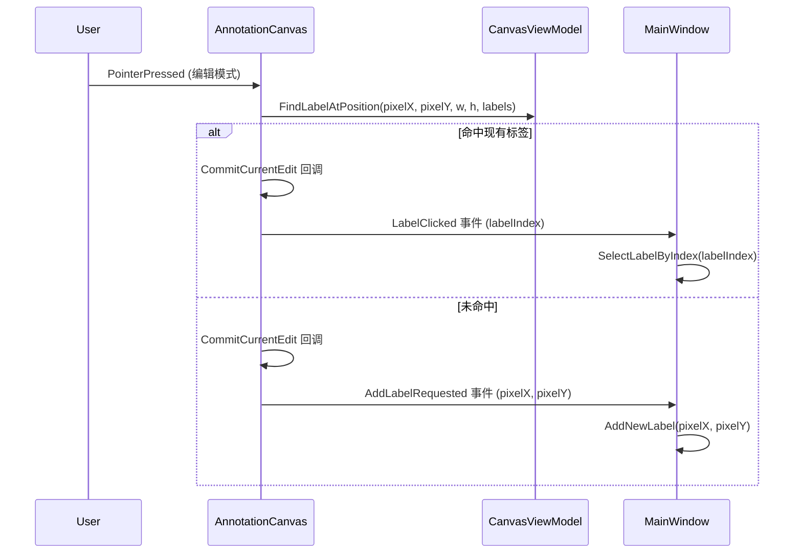
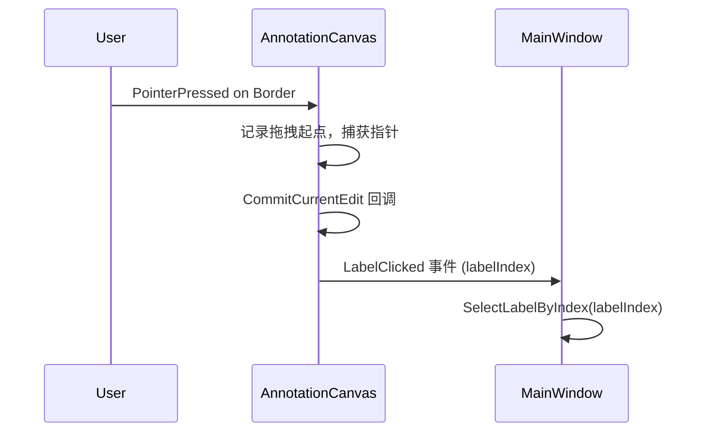
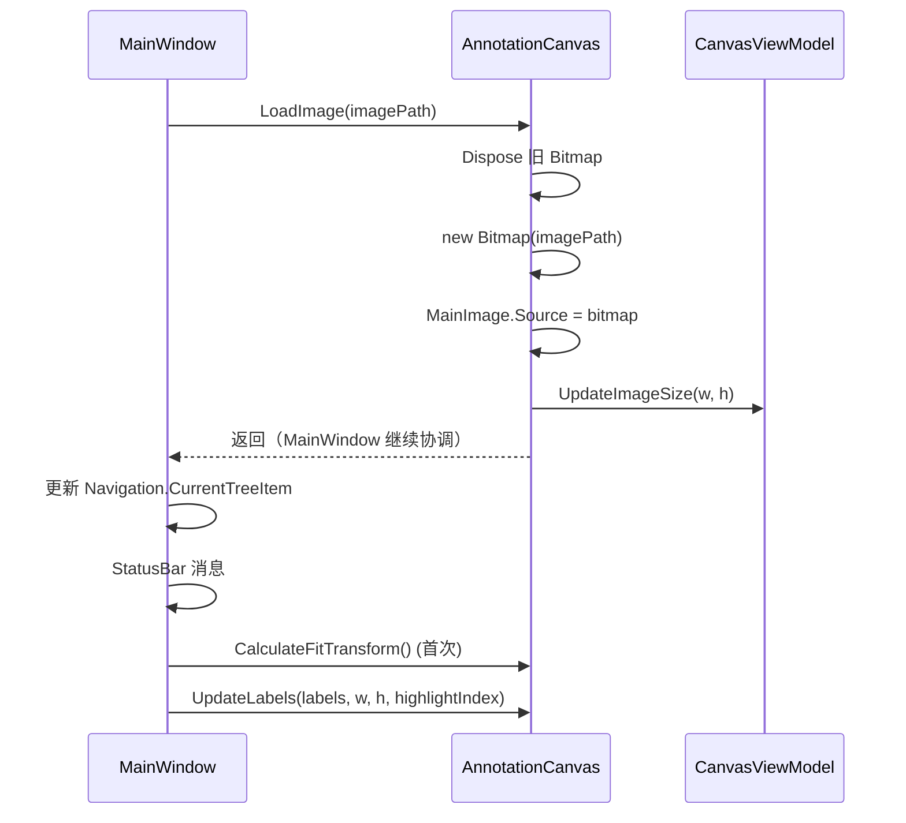

# Phase 7 Step 2：AnnotationCanvas UserControl 迁移方案

## 一、设计原则

AnnotationCanvas 是 CanvasViewModel 的 View，封装画布区域的视觉渲染和交互逻辑。
采用**回调+事件**模式处理跨 VM 协调，避免 UserControl 直接依赖其他 VM。

### 核心原则

1. **DataContext = CanvasViewModel**（视口变换、标签操作、命中测试）
2. **回调注入**处理跨 VM 操作（CommitCurrentEdit、SelectLabelByIndex）
3. **事件通知**处理业务动作（LabelClicked、AddLabelRequested）
4. **数据参数化**：UpdateLabels/LoadImage 等方法接收数据参数，不直接访问 Document/Navigation

---

## 二、AnnotationCanvas 公开 API

```csharp
public partial class AnnotationCanvas : UserControl
{
    // ========================
    // 回调属性（由 MainWindow 注入）
    // ========================
    
    /// <summary>提交当前文本编辑（需要访问 _translationTextBox）</summary>
    public Func<bool>? CommitCurrentEdit { get; set; }
    
    /// <summary>选中指定索引的标签（需要协调 Navigation + StatusBar + 焦点）</summary>
    public Action<int>? SelectLabelByIndex { get; set; }
    
    // ========================
    // 事件（MainWindow 订阅）
    // ========================
    
    /// <summary>标签标记被点击（用户想选中它）</summary>
    public event EventHandler<int>? LabelClicked;
    
    /// <summary>用户在编辑模式下点击了空白位置，请求添加新标签</summary>
    /// <remarks>参数为 (pixelX, pixelY) 相对于原图的像素坐标</remarks>
    public event EventHandler<(double pixelX, double pixelY)>? AddLabelRequested;
    
    // ========================
    // 公开方法（由 MainWindow 调用）
    // ========================
    
    /// <summary>加载图片（仅处理 Bitmap 加载 + CanvasVM 尺寸通知）</summary>
    void LoadImage(string imagePath);
    
    /// <summary>重建标注 Border 控件</summary>
    void UpdateLabels(List<LabelItem> labels, double imageWidth, double imageHeight, int? highlightIndex);
    
    /// <summary>高亮指定标签（-1 取消高亮）</summary>
    void HighlightLabel(int labelIndex);
    
    /// <summary>同步 CanvasVM.TransformMatrix 到 UI</summary>
    void ApplyTransform();
    
    /// <summary>计算 Fit 变换（委托给 CanvasVM）</summary>
    void CalculateFitTransform();
    
    /// <summary>清空画布（图片 + 标注）</summary>
    void ClearCanvas();
    
    // ========================
    // 公开状态属性
    // ========================
    
    /// <summary>是否正在拖拽标签（RebuildCurrentView 需要检查）</summary>
    bool IsDraggingLabel => _isDraggingLabel;
    
    /// <summary>当前图片路径</summary>
    string? CurrentImagePath => _currentImagePath;
    
    /// <summary>当前图片 Bitmap</summary>
    Bitmap? CurrentImage => _currentImage;
    
    /// <summary>是否首次加载</summary>
    bool IsFirstImageLoaded => _isFirstImageLoaded;
    
    /// <summary>标记首次加载已完成（MainWindow 在首次 FitTransform 后调用）</summary>
    void MarkFirstImageLoaded();
}
```

---

## 三、迁入 AnnotationCanvas 的代码清单

### 3.1 字段

| 字段 | 当前位置 | 说明 |
|---|---|---|
| `_currentImage` | MainWindow:30 | 当前 Bitmap |
| `_currentImagePath` | MainWindow:31 | 当前图片路径 |
| `_matrixTransform` | MainWindow:36 | 矩阵变换 UI 对象 |
| `_isDraggingLabel` | MainWindow:41 | 拖拽状态 |
| `_draggedLabel` | MainWindow:42 | 被拖拽的 Border |
| `_labelDragLastPoint` | MainWindow:43 | 拖拽上次位置 |
| `_isFirstImageLoaded` | MainWindow:49 | 首次加载标志 |
| `_labelControls` | MainWindow:52 | 标注控件列表 |
| `_dragStartNormX` / `_dragStartNormY` | MainWindow:76-77 | 拖拽起始归一化坐标 |
| `_draggingLabelItem` | MainWindow:78 | 被拖拽的 LabelItem |

### 3.2 方法

| 方法 | 当前行号(估) | 说明 | 变更 |
|---|---|---|---|
| `ClearLabelControls()` | ~1101 | 清除标注控件 | 直接迁入 |
| `OnLabelMarkerPointerPressed` | ~1121 | 标签按下 | 迁入，CommitCurrentEdit/SelectLabelByIndex 改用回调 |
| `OnLabelMarkerPointerMoved` | ~1178 | 标签移动 | 直接迁入 |
| `OnLabelMarkerPointerReleased` | ~1222 | 标签释放 | 迁入，MoveLabelCommand 改用 CanvasVM |
| `UpdateDraggedLabelData` | ~1270 | 更新拖拽数据 | 直接迁入 |
| `OnImageContainerPointerPressed` | ~1420 | 容器点击 | 迁入，编辑模式逻辑改用事件 |
| `FindLabelAtPosition` | ~1476 | 命中测试 | **删除**（已迁入 CanvasViewModel） |
| `OnImageContainerPointerMoved` | ~1507 | 容器移动 | 直接迁入 |
| `OnImageContainerPointerReleased` | ~1515 | 容器释放 | 直接迁入 |
| `OnImageContainerPointerWheelChanged` | ~1524 | 滚轮缩放 | 直接迁入 |
| `CalculateFitTransform` | ~1545 | Fit 变换 | 迁入，容器尺寸从内部获取 |
| `UpdateLabels` | ~1595 | 重建标注 | 迁入，参数化（接收 labels/imageWidth/imageHeight/highlightIndex） |
| `GetGroupBrush` | ~1668 | 分组颜色 | 直接迁入 |
| `GetSelectedHighlightBrush` | ~1713 | 高亮颜色 | 直接迁入 |
| `HighlightLabel` | ~1758 | 高亮标注 | 直接迁入 |
| `LoadImage` | ~1809 | 加载图片 | 迁入，简化为仅 Bitmap + CanvasVM 通知 |
| `ApplyTransform` | ~461 | 同步矩阵 | 直接迁入 |

### 3.3 不迁入的方法（保留在 MainWindow）

| 方法 | 理由 |
|---|---|
| `LoadCurrentImage()` | 需要 Navigation.ImageNames/ImageFolderPath/CurrentImageIndex |
| `SaveCurrentFitScale()` | 需要 Navigation.TreeItems/CurrentTreeItem |
| `AddNewLabel()` | 需要 Edit.CurrentGroupIndex + Document.TranslationData + CanvasVM.AddLabel |
| `SelectLabelByIndex()` | 需要 Navigation.CurrentTreeItem + StatusBar + 焦点管理 |
| `CommitCurrentEdit()` | 需要 _translationTextBox + Navigation.SelectedItem + Document |
| `RebuildCurrentView()` | 跨 VM 协调 |
| `OnTreeViewSelectionChanged()` | 跨 VM 协调 |

---

## 四、交互流程变更

### 4.1 OnImageContainerPointerPressed（编辑模式点击）



### 4.2 OnLabelMarkerPointerPressed（标签标记点击）



### 4.3 LoadImage 简化



---

## 五、MainWindow 变更

### 5.1 XAML 变更

```xml
<!-- 修改前 -->
<Border Grid.Column="0" Background="#F5F5F5">
    <Border Name="ImageContainer" ...>
        <Canvas x:Name="ImageCanvas">
            <Canvas x:Name="ImageWrapper" ...>
                <Image x:Name="MainImage" ... />
            </Canvas>
        </Canvas>
    </Border>
</Border>

<!-- 修改后 -->
<Border Grid.Column="0" Background="#F5F5F5">
    <local:AnnotationCanvas x:Name="AnnotationCanvasControl" />
</Border>
```

### 5.2 MainWindow.axaml.cs 变更

#### 移除的字段

```csharp
// 移除（已迁入 AnnotationCanvas）：
private Bitmap? _currentImage;
private string? _currentImagePath;
private MatrixTransform? _matrixTransform;
private bool _isDraggingLabel = false;
private Border? _draggedLabel;
private Point _labelDragLastPoint;
private bool _isFirstImageLoaded = false;
private List<Control> _labelControls = new();
private double _dragStartNormX = 0;
private double _dragStartNormY = 0;
private LabelItem? _draggingLabelItem;
```

#### 新增的便捷属性

```csharp
public AnnotationCanvas CanvasControl => this.FindControl<AnnotationCanvas>("AnnotationCanvasControl");
```

#### 构造函数变更

```csharp
// 在 CanvasVM 初始化后：
AnnotationCanvasControl.CommitCurrentEdit = CommitCurrentEdit;
AnnotationCanvasControl.SelectLabelByIndex = SelectLabelByIndex;
AnnotationCanvasControl.LabelClicked += OnCanvasLabelClicked;
AnnotationCanvasControl.AddLabelRequested += OnCanvasAddLabelRequested;
```

#### 事件处理器

```csharp
private void OnCanvasLabelClicked(object? sender, int labelIndex)
{
    SelectLabelByIndex(labelIndex);
}

private void OnCanvasAddLabelRequested(object? sender, (double pixelX, double pixelY) coords)
{
    AddNewLabel(coords.pixelX, coords.pixelY);
}
```

#### 方法更新

| 方法 | 变更 |
|---|---|
| `LoadCurrentImage()` | 改用 `CanvasControl.LoadImage(path)` + 协调逻辑 |
| `LoadImage(path)` | 拆分：视觉部分 → `CanvasControl.LoadImage()`，协调部分保留 |
| `UpdateLabels()` | 改用 `CanvasControl.UpdateLabels(labels, w, h, highlightIndex)` |
| `HighlightLabel(i)` | 改用 `CanvasControl.HighlightLabel(i)` |
| `ApplyTransform()` | 改用 `CanvasControl.ApplyTransform()` |
| `CalculateFitTransform()` | 改用 `CanvasControl.CalculateFitTransform()` |
| `RebuildCurrentView()` | `!_isDraggingLabel` → `!CanvasControl.IsDraggingLabel` |
| `OnCanvasTransformChanged` | `ApplyTransform()` → `CanvasControl.ApplyTransform()` |
| `OnSettingsChanged` | `HighlightLabel()` → `CanvasControl.HighlightLabel()` |
| `OnTreeViewSelectionChanged` | `HighlightLabel()` / `CenterOnLabel()` → 通过 CanvasControl |
| `OnDocumentClosed` | 改用 `CanvasControl.ClearCanvas()` |
| `OnNavigationCurrentImageChanged` | 改用 `CanvasControl.LoadImage()` + 协调 |

---

## 六、迁移步骤清单

### Step 2.1：创建 AnnotationCanvas 基础结构

- [ ] 创建 `Views/AnnotationCanvas.axaml`（XAML 视觉树）
- [ ] 创建 `Views/AnnotationCanvas.axaml.cs`（code-behind 骨架 + 公开 API）
- [ ] 编译验证（空 UserControl，可运行）

### Step 2.2：迁入视觉渲染代码

- [ ] 迁入字段：`_currentImage` / `_currentImagePath` / `_matrixTransform` / `_isFirstImageLoaded` / `_labelControls`
- [ ] 迁入方法：`ClearLabelControls` / `UpdateLabels`（参数化） / `GetGroupBrush` / `GetSelectedHighlightBrush` / `HighlightLabel` / `ApplyTransform`
- [ ] 迁入 `LoadImage`（简化版：仅 Bitmap + CanvasVM 通知）
- [ ] 迁入 `CalculateFitTransform`（从内部获取容器尺寸）
- [ ] 添加 `ClearCanvas` / `MarkFirstImageLoaded` 方法
- [ ] 编译验证

### Step 2.3：迁入交互代码

- [ ] 迁入拖拽字段：`_isDraggingLabel` / `_draggedLabel` / `_labelDragLastPoint` / `_dragStartNormX` / `_dragStartNormY` / `_draggingLabelItem`
- [ ] 迁入 `OnImageContainerPointerPressed`（编辑模式改用事件，浏览模式改用 CanvasVM）
- [ ] 迁入 `OnImageContainerPointerMoved` / `OnImageContainerPointerReleased` / `OnImageContainerPointerWheelChanged`
- [ ] 迁入 `OnLabelMarkerPointerPressed`（CommitCurrentEdit/SelectLabelByIndex 改用回调+事件）
- [ ] 迁入 `OnLabelMarkerPointerMoved` / `OnLabelMarkerPointerReleased`
- [ ] 迁入 `UpdateDraggedLabelData`
- [ ] 编译验证

### Step 2.4：更新 MainWindow 使用 AnnotationCanvas

- [ ] 更新 `MainWindow.axaml`：替换 Canvas 结构为 `<local:AnnotationCanvas>`
- [ ] 更新 `MainWindow.axaml.cs` 构造函数：注入回调和订阅事件
- [ ] 更新 `MainWindow.axaml.cs`：移除已迁入的字段和方法
- [ ] 更新所有对已移除控件的引用（MainImage / ImageWrapper / ImageContainer）→ 通过 CanvasControl
- [ ] 更新 `RebuildCurrentView`：`!_isDraggingLabel` → `!CanvasControl.IsDraggingLabel`
- [ ] 更新 `OnCanvasTransformChanged`：`ApplyTransform()` → `CanvasControl.ApplyTransform()`
- [ ] 更新 `LoadCurrentImage` / `LoadImage`：视觉部分委托给 CanvasControl
- [ ] 更新 `UpdateLabels` 调用：传入参数化数据
- [ ] 更新 `OnTreeViewSelectionChanged`：HighlightLabel / CenterOnLabel 通过 CanvasControl
- [ ] 更新 `OnSettingsChanged`：HighlightLabel 通过 CanvasControl
- [ ] 更新 `OnDocumentClosed`：CanvasControl.ClearCanvas()
- [ ] 编译验证

### Step 2.5：清理

- [ ] 移除 MainWindow.axaml.cs 中所有已迁入的废弃字段和方法
- [ ] 移除 `FindLabelAtPosition` 方法（已迁入 CanvasViewModel，MainWindow 中的包装器不再需要）
- [ ] 移除对 `ImageContainer` / `ImageWrapper` / `MainImage` / `ImageCanvas` 的 x:Name 引用
- [ ] 完整功能验证

---

## 七、风险与注意事项

### 7.1 OnImageContainerPointerPressed 中的编辑模式分支

当前代码在编辑模式下调用 `CommitCurrentEdit()` + `SelectLabelByIndex()` 或 `AddNewLabel()`。
迁入 AnnotationCanvas 后：
- `CommitCurrentEdit` → 回调属性
- `SelectLabelByIndex` → 回调属性
- `AddNewLabel` → `AddLabelRequested` 事件（MainWindow 处理）

### 7.2 LoadImage 拆分

`LoadImage` 当前混合了视觉和协调逻辑。拆分后：
- **AnnotationCanvas.LoadImage(path)**：Bitmap 加载 + CanvasVM.UpdateImageSize
- **MainWindow**：在调用 CanvasControl.LoadImage 后，继续处理 Navigation/StatusBar 协调

首次加载的延迟逻辑（CalculateFitTransform + UpdateLabels）需要 MainWindow 在适当时机调用。

### 7.3 UpdateLabels 参数化

当前 `UpdateLabels()` 直接访问 `Document.TranslationData` 和 `_currentImage`。
参数化后：`UpdateLabels(List<LabelItem> labels, double imageWidth, double imageHeight, int? highlightIndex)`。
MainWindow 负责准备这些参数。

### 7.4 _matrixTransform 初始化

当前在 MainWindow 构造函数中：
```csharp
_matrixTransform = ImageWrapper.RenderTransform as MatrixTransform;
if (_matrixTransform == null)
{
    _matrixTransform = new MatrixTransform();
    ImageWrapper.RenderTransform = _matrixTransform;
}
```
这需要迁入 AnnotationCanvas 的 InitializeComponent 后逻辑。

### 7.5 ImageContainer.SizeChanged 事件

当前 MainWindow 订阅 `ImageContainer.SizeChanged += OnImageContainerSizeChanged`。
迁入后，AnnotationCanvas 内部订阅自己的 SizeChanged 事件。

### 7.6 Canvas.GetLeft/SetLeft 命名冲突

AnnotationCanvas 内部使用 `Avalonia.Controls.Canvas.GetLeft()` 等静态方法。
由于 UserControl 不叫 Canvas，不存在命名冲突问题。
