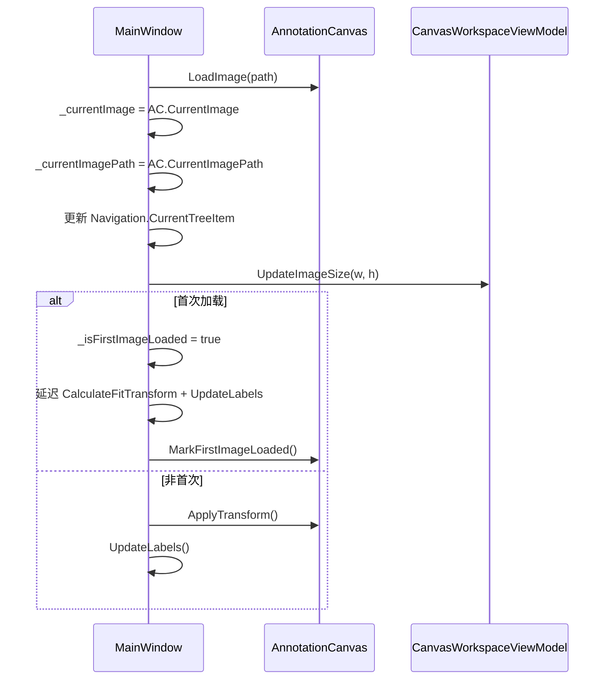
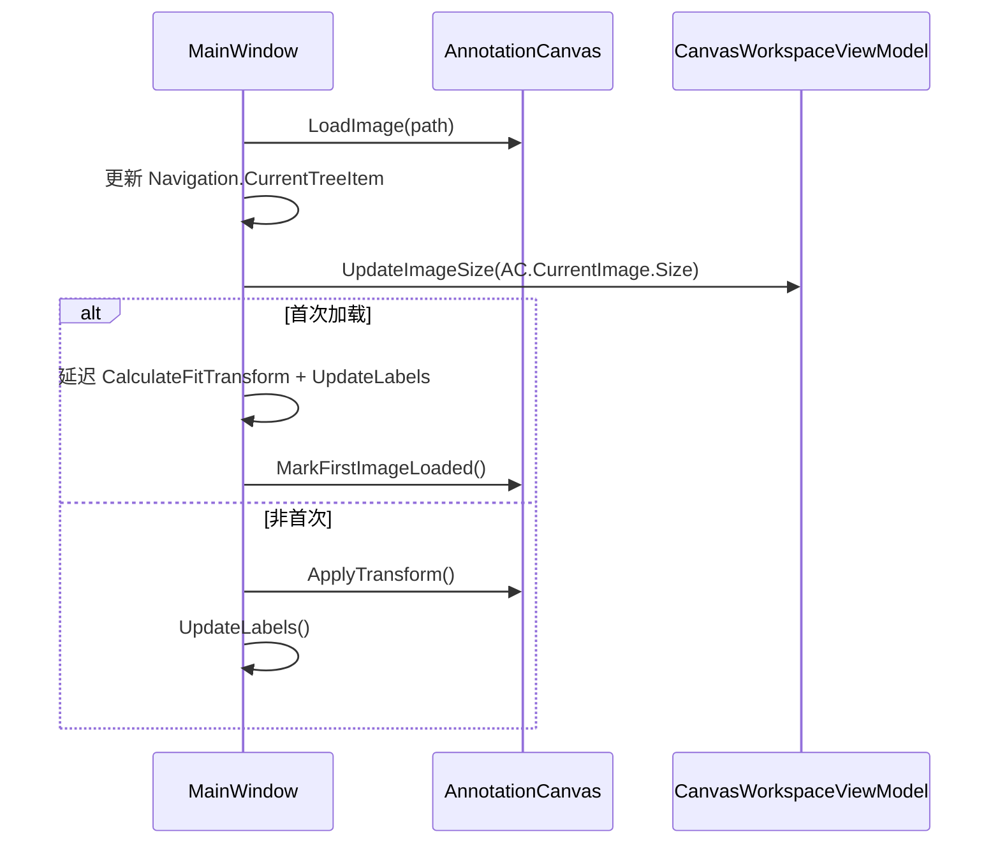

# Phase 7 Step 3：清理与瘦身迁移方案

## 一、背景与目标

Step 1（CanvasViewModel 创建）和 Step 2（AnnotationCanvas UserControl 迁移）已完成。当前代码可编译可运行，但 MainWindow.axaml.cs 中残留大量**重复字段、空壳方法、孤立代码和注释块**，需要清理以达到 Phase 7 的最终目标。

### 当前状态总结

| 组件 | 状态 | 说明 |
|------|------|------|
| `CanvasViewModel.cs` | ✅ 已完成 → 🔄 待重命名 | 视口 + 标签操作 + 命中测试，将重命名为 `CanvasWorkspaceViewModel` |
| `EditViewModel.cs` | ✅ 已瘦身 | 仅编辑模式 UI 状态 |
| `AnnotationCanvas.axaml/cs` | ✅ 已完成 | 视觉渲染 + 交互 |
| `ImageViewportViewModel.cs` | ✅ 已删除 | 文件不存在 |
| `MainWindow.axaml.cs` | ❌ 需清理 | 重复字段 + 空壳方法 + 注释块 |
| `MainWindowViewModel.cs` | 🔄 待重命名 | `CanvasVM` → `CanvasWorkspace` |

---

## 二、问题清单

### 2.1 重复字段（MainWindow 与 AnnotationCanvas 双份存储）

MainWindow 中的以下字段与 `AnnotationCanvas` 内部字段指向**同一对象**，造成双源状态和双重释放风险：

| 字段 | MainWindow 位置 | AnnotationCanvas 对应 | 风险 |
|------|----------------|----------------------|------|
| `_currentImage` | L30 | `_currentImage` | 双重 Dispose 导致异常 |
| `_currentImagePath` | L31 | `_currentImagePath` | 状态不一致 |
| `_isFirstImageLoaded` | L37 | `_isFirstImageLoaded` | 状态不一致 |

**关键 Bug**：[`OnWindowClosing()`](MainWindow.axaml.cs:215) 先 `_currentImage.Dispose()`，再调用 [`CanvasControl.ClearCanvas()`](MainWindow.axaml.cs:222) 再次 Dispose 同一 Bitmap 对象。

### 2.2 空壳方法（逻辑已迁入 AnnotationCanvas，仅留空实现）

| 方法 | 位置 | 说明 |
|------|------|------|
| `OnImageContainerPointerPressed` | L1205-1209 | 空实现，注释"已迁移" |
| `OnImageContainerPointerMoved` | L1211-1214 | 空实现 |
| `OnImageContainerPointerReleased` | L1216-1219 | 空实现 |
| `OnImageContainerPointerWheelChanged` | L1221-1224 | 空实现 |

这些方法不再被 XAML 或代码订阅（事件已由 AnnotationCanvas 内部处理），属于死代码。

### 2.3 孤立方法（不再被任何事件/代码引用）

| 方法 | 位置 | 说明 |
|------|------|------|
| `OnImageContainerSizeChanged` | L386-393 | 旧 ImageContainer.SizeChanged 处理器，AnnotationCanvas 已内部处理 |
| `OnResetZoom` | L1153-1157 | 过渡期 Click 处理器，XAML 已改用 Command 绑定 |
| `OnAddLabel` | L1125-1128 | 无 XAML 引用 |
| `OnDeleteLabel` | L1130-1133 | 无 XAML 引用 |

### 2.4 注释块（大段废弃代码）

| 位置 | 说明 |
|------|------|
| L1379-1433 | 约 55 行注释掉的旧 StatusBar.UpdateStatus 实现 |

### 2.5 错误/过时注释

| 位置 | 当前内容 | 应改为 |
|------|---------|--------|
| L1282 | `/// 获取指定分组的背景颜色` | `/// 加载当前图片` |
| L1151 | `// OnZoomIn/OnZoomOut/OnResetZoom 已迁入...` | 删除 |
| L1255 | `// GetCurrentScale 已迁入...` | 删除 |
| L1377 | `// GetZoomText 已迁入...` | 删除 |
| L1531 | `// BuildTreeView 已迁移到...` | 删除 |

### 2.6 XAML 调试残留

[`MainWindow.axaml`](MainWindow.axaml:87) L87：`Background="#88FF0000"`（半透明红色），疑似调试用。

### 2.7 AnnotationCanvas.ClearCanvas 遗漏

[`ClearCanvas()`](Views/AnnotationCanvas.axaml.cs:262) 未重置 `_isFirstImageLoaded = false`，导致关闭文档后重新打开时首次加载逻辑不会触发。

### 2.8 命名决策：CanvasViewModel → CanvasWorkspaceViewModel

当前类名 `CanvasViewModel` 与 Avalonia 控件 `Avalonia.Controls.Canvas` 存在潜在命名冲突（详见下方分析）。Phase 7 总体方案的核心语义是"画布工作区"，`CanvasWorkspaceViewModel` 更准确地表达了设计意图，同时彻底消除歧义。

**重命名范围**：

| 变更项 | 当前 | 目标 |
|--------|------|------|
| 类名 | `CanvasViewModel` | `CanvasWorkspaceViewModel` |
| 文件名 | `ViewModels/CanvasViewModel.cs` | `ViewModels/CanvasWorkspaceViewModel.cs` |
| MainWindowViewModel 字段 | `_canvasVM` | `_canvasWorkspace` |
| MainWindowViewModel 属性 | `CanvasVM` | `CanvasWorkspace` |
| MainWindow.axaml.cs 快捷属性 | `CanvasVM` | `CanvasWorkspace` |
| MainWindow.axaml 绑定路径 | `{Binding CanvasVM.` | `{Binding CanvasWorkspace.` |
| AnnotationCanvas.axaml.cs 类型转换 | `is CanvasViewModel` | `is CanvasWorkspaceViewModel` |
| 注释引用 | `CanvasViewModel` / `CanvasVM` | `CanvasWorkspaceViewModel` / `CanvasWorkspace` |

**影响约 44 处**，全部为机械性重命名，无逻辑变更，IDE Rename Refactor 可一键完成。

**命名冲突分析**：

Avalonia 的 `Avalonia.Controls.Canvas` 提供静态附加属性方法 `Canvas.SetLeft()`/`Canvas.GetLeft()` 等，在 [`AnnotationCanvas.axaml.cs`](Views/AnnotationCanvas.axaml.cs:182) 中被 6 处使用。如果属性命名为 `Canvas`，则 `Canvas.SetLeft(...)` 会被解析为 `CanvasViewModel` 的实例成员（编译错误），而非 `Avalonia.Controls.Canvas` 的静态方法。`CanvasWorkspace` 彻底消除此歧义。

---

## 三、迁移步骤

### Step 3.0：重命名 CanvasViewModel → CanvasWorkspaceViewModel

纯机械性重命名，无逻辑变更。使用 IDE Rename Refactor 一次完成。

- [ ] 重命名类 `CanvasViewModel` → `CanvasWorkspaceViewModel`（[`ViewModels/CanvasViewModel.cs`](ViewModels/CanvasViewModel.cs:14)）
- [ ] 重命名文件 `ViewModels/CanvasViewModel.cs` → `ViewModels/CanvasWorkspaceViewModel.cs`
- [ ] 重命名字段 `_canvasVM` → `_canvasWorkspace`（[`ViewModels/MainWindowViewModel.cs`](ViewModels/MainWindowViewModel.cs:21)）
- [ ] 更新 [`MainWindow.axaml.cs`](MainWindow.axaml.cs:62) 快捷属性：`CanvasVM` → `CanvasWorkspace`
- [ ] 更新 [`MainWindow.axaml`](MainWindow.axaml:49) 绑定路径：`{Binding CanvasVM.` → `{Binding CanvasWorkspace.`
- [ ] 更新 [`Views/AnnotationCanvas.axaml.cs`](Views/AnnotationCanvas.axaml.cs:232) 中所有 `is CanvasViewModel` → `is CanvasWorkspaceViewModel`
- [ ] 更新所有注释中的 `CanvasViewModel` / `CanvasVM` 引用
- [ ] 编译验证

### Step 3.1：修复 AnnotationCanvas.ClearCanvas 遗漏

- [ ] 在 [`ClearCanvas()`](Views/AnnotationCanvas.axaml.cs:262) 中添加 `_isFirstImageLoaded = false;`
- [ ] 编译验证

### Step 3.2：消除 MainWindow 重复字段

将 `_currentImage` / `_currentImagePath` / `_isFirstImageLoaded` 的所有引用替换为 `CanvasControl` 属性访问，然后删除字段声明。

#### 3.2.1 替换引用（共 22 处）

| 方法 | 行号 | 当前代码 | 替换为 |
|------|------|---------|--------|
| `OnWindowClosing` | L215-218 | `_currentImage?.Dispose(); _currentImage = null;` | 删除（`CanvasControl.ClearCanvas()` 已处理） |
| `OnDocumentClosed` | L338-339 | `_currentImage = null; _currentImagePath = null;` | 删除（L335 已调用 `CanvasControl.ClearCanvas()`） |
| `OnDocumentClosed` | L347 | `_isFirstImageLoaded = false;` | 删除（`ClearCanvas()` 已重置） |
| `OnWindowClosing` | L232 | `_isFirstImageLoaded = false;` | 删除（`ClearCanvas()` 已重置） |
| `RebuildCurrentView` | L589 | `!string.IsNullOrEmpty(_currentImagePath)` | `!string.IsNullOrEmpty(CanvasControl.CurrentImagePath)` |
| `CommitCurrentEdit` | L912 | `string.IsNullOrEmpty(_currentImagePath)` | `string.IsNullOrEmpty(CanvasControl.CurrentImagePath)` |
| `CommitCurrentEdit` | L918 | `Path.GetFileName(_currentImagePath)` | `Path.GetFileName(CanvasControl.CurrentImagePath)` |
| `AddNewLabel` | L1064 | `_currentImage == null \|\| ... \|\| string.IsNullOrEmpty(_currentImagePath)` | `CanvasControl.CurrentImage == null \|\| ... \|\| string.IsNullOrEmpty(CanvasControl.CurrentImagePath)` |
| `AddNewLabel` | L1067 | `Path.GetFileName(_currentImagePath)` | `Path.GetFileName(CanvasControl.CurrentImagePath)` |
| `AddNewLabel` | L1080 | `_currentImage.Size.Width` | `CanvasControl.CurrentImage!.Size.Width` |
| `AddNewLabel` | L1081 | `_currentImage.Size.Height` | `CanvasControl.CurrentImage!.Size.Height` |
| `OnClearCanvas` | L1141-1142 | `_currentImage = null; _currentImagePath = null;` | 删除（L1138 已调用 `CanvasControl.ClearCanvas()`） |
| `SaveCurrentFitScale` | L1239 | `_currentImagePath == null` | `CanvasControl.CurrentImagePath == null` |
| `SaveCurrentFitScale` | L1241 | `Path.GetFileName(_currentImagePath)` | `Path.GetFileName(CanvasControl.CurrentImagePath)` |
| `LoadImage` | L1313-1314 | `_currentImage = CanvasControl.CurrentImage; _currentImagePath = CanvasControl.CurrentImagePath;` | 删除 |
| `LoadImage` | L1328 | `_currentImage.Size.Width` | `CanvasControl.CurrentImage!.Size.Width`（或提取局部变量） |
| `LoadImage` | L1331 | `!_isFirstImageLoaded` | `!CanvasControl.IsFirstImageLoaded` |
| `LoadImage` | L1333 | `_isFirstImageLoaded = true;` | 删除（L1343 `CanvasControl.MarkFirstImageLoaded()` 已处理） |
| `OnToggleGroup` | L1479 | `string.IsNullOrEmpty(_currentImagePath)` | `string.IsNullOrEmpty(CanvasControl.CurrentImagePath)` |
| `OnToggleGroup` | L1482 | `Path.GetFileName(_currentImagePath)` | `Path.GetFileName(CanvasControl.CurrentImagePath)` |
| `DeleteSelectedLabel` | L1512 | `string.IsNullOrEmpty(_currentImagePath)` | `string.IsNullOrEmpty(CanvasControl.CurrentImagePath)` |
| `DeleteSelectedLabel` | L1515 | `Path.GetFileName(_currentImagePath)` | `Path.GetFileName(CanvasControl.CurrentImagePath)` |
| `CenterOnLabel` | L1928 | `_currentImage == null \|\| ... \|\| string.IsNullOrEmpty(_currentImagePath)` | `CanvasControl.CurrentImage == null \|\| ... \|\| string.IsNullOrEmpty(CanvasControl.CurrentImagePath)` |
| `CenterOnLabel` | L1932 | `Path.GetFileName(_currentImagePath)` | `Path.GetFileName(CanvasControl.CurrentImagePath)` |

#### 3.2.2 删除字段声明

```csharp
// 删除以下三行：
private Bitmap? _currentImage;          // L30
private string? _currentImagePath;      // L31
private bool _isFirstImageLoaded = false; // L37
```

#### 3.2.3 清理 using

- [ ] 检查 `using Avalonia.Media.Imaging;` 是否仍需保留（`Bitmap` 类型可能不再直接使用）
- [ ] 编译验证

### Step 3.3：移除空壳方法

- [ ] 删除 `OnImageContainerPointerPressed` 空实现（L1205-1209）
- [ ] 删除 `OnImageContainerPointerMoved` 空实现（L1211-1214）
- [ ] 删除 `OnImageContainerPointerReleased` 空实现（L1216-1219）
- [ ] 删除 `OnImageContainerPointerWheelChanged` 空实现（L1221-1224）
- [ ] 编译验证

### Step 3.4：移除孤立方法

- [ ] 删除 `OnImageContainerSizeChanged`（L386-393）— AnnotationCanvas 内部已处理
- [ ] 删除 `OnResetZoom`（L1153-1157）— XAML 已用 Command 绑定
- [ ] 删除 `OnAddLabel`（L1125-1128）— 无引用
- [ ] 删除 `OnDeleteLabel`（L1130-1133）— 无引用
- [ ] 编译验证

### Step 3.5：清理注释块和过时注释

- [ ] 删除 L1379-1433 的大段注释代码（旧 StatusBar 实现）
- [ ] 修正 L1282 错误注释：`/// 获取指定分组的背景颜色` → `/// 加载当前图片`
- [ ] 删除 L1151 过时注释（`// OnZoomIn/OnZoomOut/OnResetZoom 已迁入...`）
- [ ] 删除 L1255 过时注释（`// GetCurrentScale 已迁入...`）
- [ ] 删除 L1377 过时注释（`// GetZoomText 已迁入...`）
- [ ] 删除 L1531 过时注释（`// BuildTreeView 已迁移到...`）
- [ ] 编译验证

### Step 3.6：修复 XAML 调试残留

- [ ] [`MainWindow.axaml`](MainWindow.axaml:87) L87：`Background="#88FF0000"` → 删除或改为 `Background="Transparent"`
- [ ] 编译验证

### Step 3.7：更新 MVVM 重构路线

- [ ] 在 [`plans/MVVM重构路线.md`](plans/MVVM重构路线.md) 中添加 Phase 7 完成记录
- [ ] 更新架构图：`ImageViewportViewModel` → `CanvasWorkspaceViewModel`，`EditViewModel` 标注已迁出
- [ ] 更新子 VM 存在原则表格

### Step 3.8：完整功能验证

- [ ] 编译零错误零警告
- [ ] 打开翻译文件 → 图片正常加载 + Fit 自适应
- [ ] 滚轮缩放 / 菜单缩放 / 平移 → 正常工作
- [ ] 编辑模式切换 → 状态栏提示 + 分组按钮显隐
- [ ] 点击图片添加标签 → Border 出现 + 树视图自动选中
- [ ] 拖拽标签移动 → 视觉反馈 + 释放后历史记录
- [ ] 撤销/重做 → 标注位置/文本正确恢复
- [ ] 树视图选中标签 → Canvas 高亮 + 视野居中
- [ ] 删除标签 / 切换分组 → 正常工作
- [ ] 右键菜单操作 → 正常工作
- [ ] 快捷键（Ctrl+Z/Y/S/Enter）→ 正常工作
- [ ] 窗口缩放 → Fit 变换自动更新
- [ ] 关闭文档 → 资源正确释放，无双重 Dispose
- [ ] 重新打开文档 → 首次加载 Fit 正常触发

---

## 四、变更影响分析

### 4.1 文件变更汇总

| 文件 | 变更类型 | 预估行数变化 |
|------|---------|-------------|
| `ViewModels/CanvasViewModel.cs` → `CanvasWorkspaceViewModel.cs` | 类名重命名 + 文件重命名 | 0 |
| `ViewModels/MainWindowViewModel.cs` | 字段/属性重命名 | 0 |
| `MainWindow.axaml.cs` | 重命名引用 + 删除字段 + 替换引用 + 删除方法 + 清理注释 | -约 120 行 |
| `Views/AnnotationCanvas.axaml.cs` | 类型转换重命名 + 修复 ClearCanvas 遗漏 | +1 行 |
| `MainWindow.axaml` | 绑定路径重命名 + 修复调试背景色 | -1 行 |
| `plans/MVVM重构路线.md` | 添加 Phase 7 完成记录 | +约 20 行 |

### 4.2 风险评估

| 风险 | 等级 | 缓解措施 |
|------|------|---------|
| 重命名遗漏导致编译错误 | 低 | IDE Rename Refactor 自动处理所有引用 |
| `_currentImage` 替换后空引用 | 中 | `CanvasControl.CurrentImage` 在 LoadImage 后一定非空，但需检查调用时序 |
| `ClearCanvas()` 未重置 `_isFirstImageLoaded` | 高 | Step 3.1 优先修复 |
| 双重 Dispose 导致崩溃 | 高 | Step 3.2 消除重复字段后自动解决 |
| XAML 调试色删除影响布局 | 低 | 半透明红色本就不应存在 |

### 4.3 依赖关系


Step 3.0 优先执行（后续步骤引用新名称）。Step 3.1 必须在 Step 3.2 之前（依赖 `ClearCanvas()` 正确重置 `_isFirstImageLoaded`）。其余步骤按顺序执行，每步编译验证。

---

## 五、LoadImage 方法重构详解

[`LoadImage()`](MainWindow.axaml.cs:1305) 是变更最复杂的方法，当前逻辑：



重构后：



关键变化：
1. 不再维护 `_currentImage` / `_currentImagePath` 本地副本
2. 不再手动设置 `_isFirstImageLoaded`，改用 `CanvasControl.IsFirstImageLoaded` 检查
3. `UpdateImageSize` 改用 `CanvasControl.CurrentImage!.Size` 获取尺寸
