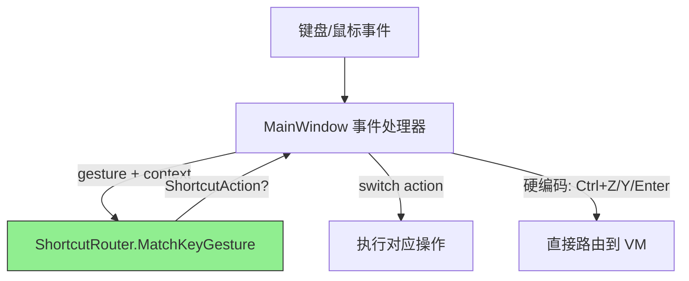

# Phase 8：ShortcutRouter 提取方案

> 将 MainWindow.axaml.cs 中分散在三处的快捷键匹配逻辑提取为 `ShortcutRouter` 服务，
> 实现匹配逻辑集中化、可测试，同时减少 MainWindow 约 200 行代码。

---

## 一、当前问题分析

### 1.1 快捷键匹配逻辑分散

MainWindow 中有三处独立的快捷键匹配逻辑，存在大量重复模式：

| 方法 | 行数 | 处理的快捷键 | 匹配模式 |
|------|------|-------------|---------|
| [`OnGlobalKeyDown`](MainWindow.axaml.cs:800) | ~70 | Ctrl+Z/Y, Ctrl+Enter, ToggleGroup0/1 | KeyGesture 比较 |
| [`OnTreeViewKeyDown`](MainWindow.axaml.cs:1474) | ~170 | CopyText, ToggleGroup0/1, NavigateUp/Down | KeyGesture 比较 |
| [`OnMainWindowPointerPressed`](MainWindow.axaml.cs:1374) | ~80 | CopyText, NavigateUp/Down | PointerUpdateKind→KeyGesture 转换后比较 |

### 1.2 重复的匹配模式

以下匹配逻辑出现 2-3 次：

```csharp
// NavigateUp 匹配 — 出现在 OnTreeViewKeyDown 和 OnMainWindowPointerPressed
if (_shortcutSettings.NavigateUp != null && currentGesture.Equals(_shortcutSettings.NavigateUp))
    isNavigateUp = true;
else if (_shortcutSettings.NavigateUpSecondary != null && 
         currentGesture.Equals(_shortcutSettings.NavigateUpSecondary))
    isNavigateUp = true;

// ToggleGroup 匹配 — 出现在 OnGlobalKeyDown 和 OnTreeViewKeyDown
if (_shortcutSettings.ToggleGroup0 != null && currentGesture.Equals(_shortcutSettings.ToggleGroup0))
    ...
else if (_shortcutSettings.ToggleGroup1 != null && currentGesture.Equals(_shortcutSettings.ToggleGroup1))
    ...

// CopyText 匹配 — 出现在 OnTreeViewKeyDown 和 OnMainWindowPointerPressed
if (_shortcutSettings.CopyText != null && currentGesture.Equals(_shortcutSettings.CopyText))
    ...
```

### 1.3 不可提取的硬编码快捷键

以下快捷键是硬编码的系统级拦截，不来自 `ShortcutSettings`，且与 UI 控件紧密耦合：

| 快捷键 | 位置 | 耦合原因 |
|--------|------|---------|
| Ctrl+Z / Ctrl+Shift+Z | `OnGlobalKeyDown` | 隧道拦截 TextBox 内置撤销，需 `e.Handled` |
| Ctrl+Y | `OnGlobalKeyDown` | 同上 |
| Ctrl+Enter | `OnGlobalKeyDown` | 需 `_translationTextBox.IsFocused` + `TopLevel.FocusManager` |

这些保留在 MainWindow 事件处理器中，不纳入 ShortcutRouter。

---

## 二、设计方案

### 2.1 ShortcutAction 枚举

```csharp
/// <summary>快捷键动作类型</summary>
public enum ShortcutAction
{
    NavigateUp,
    NavigateDown,
    CopyText,
    SwitchToGroup0,
    SwitchToGroup1,
}
```

### 2.2 ShortcutRouter 类

```csharp
/// <summary>
/// 快捷键路由服务：将输入手势匹配为 ShortcutAction。
/// 纯匹配逻辑，不执行任何副作用。
/// </summary>
public class ShortcutRouter
{
    private ShortcutSettings _settings;

    public ShortcutRouter(ShortcutSettings settings)
    {
        _settings = settings;
    }

    /// <summary>更新快捷键设置（设置变更时调用）</summary>
    public void UpdateSettings(ShortcutSettings settings) => _settings = settings;

    /// <summary>
    /// 从 KeyGesture 匹配快捷键动作
    /// </summary>
    /// <param name="gesture">当前按键手势</param>
    /// <param name="isTextBoxFocused">TextBox 是否有焦点（影响分组切换快捷键）</param>
    /// <returns>匹配到的动作，未匹配返回 null</returns>
    public ShortcutAction? MatchKeyGesture(KeyGesture gesture, bool isTextBoxFocused = false)
    {
        // 分组切换：TextBox 有焦点时不触发
        if (!isTextBoxFocused)
        {
            if (_settings.ToggleGroup0 != null && gesture.Equals(_settings.ToggleGroup0))
                return ShortcutAction.SwitchToGroup0;
            if (_settings.ToggleGroup1 != null && gesture.Equals(_settings.ToggleGroup1))
                return ShortcutAction.SwitchToGroup1;
        }

        // 导航
        if (MatchesNavigateUp(gesture))
            return ShortcutAction.NavigateUp;
        if (MatchesNavigateDown(gesture))
            return ShortcutAction.NavigateDown;

        // 复制
        if (_settings.CopyText != null && gesture.Equals(_settings.CopyText))
            return ShortcutAction.CopyText;

        return null;
    }

    /// <summary>
    /// 从鼠标侧键 PointerUpdateKind 匹配快捷键动作
    /// </summary>
    public ShortcutAction? MatchPointerUpdate(PointerUpdateKind updateKind)
    {
        var gesture = MouseButtonToKeyGesture(updateKind);
        if (gesture == null) return null;
        return MatchKeyGesture(gesture);
    }

    private bool MatchesNavigateUp(KeyGesture gesture)
    {
        return (_settings.NavigateUp != null && gesture.Equals(_settings.NavigateUp)) ||
               (_settings.NavigateUpSecondary != null && gesture.Equals(_settings.NavigateUpSecondary));
    }

    private bool MatchesNavigateDown(KeyGesture gesture)
    {
        return (_settings.NavigateDown != null && gesture.Equals(_settings.NavigateDown)) ||
               (_settings.NavigateDownSecondary != null && gesture.Equals(_settings.NavigateDownSecondary));
    }

    private static KeyGesture? MouseButtonToKeyGesture(PointerUpdateKind updateKind)
    {
        return updateKind switch
        {
            PointerUpdateKind.XButton1Pressed => new KeyGesture(Key.F13),
            PointerUpdateKind.XButton2Pressed => new KeyGesture(Key.F14),
            _ => null
        };
    }
}
```

### 2.3 架构变更



### 2.4 MainWindow 中的使用方式

```csharp
// 构造函数中初始化
private readonly ShortcutRouter _shortcutRouter;
// ...
_shortcutRouter = new ShortcutRouter(_shortcutSettings);

// OnShortcutSettingsChanged 中更新
_shortcutRouter.UpdateSettings(settings);

// OnGlobalKeyDown 中（硬编码部分保留，可配置部分使用 Router）
var currentGesture = new KeyGesture(e.Key, e.KeyModifiers);
bool isTextBoxFocused = _translationTextBox != null && _translationTextBox.IsFocused;
var action = _shortcutRouter.MatchKeyGesture(currentGesture, isTextBoxFocused);
if (action.HasValue)
{
    ExecuteShortcutAction(action.Value);
    e.Handled = true;
}

// OnTreeViewKeyDown 中
var currentGesture = new KeyGesture(e.Key, e.KeyModifiers);
var action = _shortcutRouter.MatchKeyGesture(currentGesture);
if (action.HasValue)
{
    ExecuteShortcutAction(action.Value);
    e.Handled = true;
    return;
}
// ... 方向键处理保留在 MainWindow ...

// OnMainWindowPointerPressed 中
var action = _shortcutRouter.MatchPointerUpdate(updateKind);
if (action.HasValue)
{
    ExecuteShortcutAction(action.Value);
    e.Handled = true;
}

// 统一的执行方法
private void ExecuteShortcutAction(ShortcutAction action)
{
    switch (action)
    {
        case ShortcutAction.NavigateUp:
            Navigation.NavigateUpCommand.Execute(null);
            break;
        case ShortcutAction.NavigateDown:
            Navigation.NavigateDownCommand.Execute(null);
            break;
        case ShortcutAction.CopyText:
            if (Navigation.SelectedItem is TranslationTreeItem item)
                CopyToClipboard(item.Text);
            break;
        case ShortcutAction.SwitchToGroup0:
            SwitchToGroup(0);
            break;
        case ShortcutAction.SwitchToGroup1:
            SwitchToGroup(1);
            break;
    }
}
```

---

## 三、变更范围

### 3.1 新增文件

| 文件 | 说明 |
|------|------|
| `Services/ShortcutRouter.cs` | 快捷键路由服务 |

### 3.2 修改文件

| 文件 | 变更 |
|------|------|
| `MainWindow.axaml.cs` | 注入 ShortcutRouter，重构三个事件处理器，新增 ExecuteShortcutAction |

### 3.3 预计行数变化

| 位置 | 当前 | 目标 | 变化 |
|------|------|------|------|
| `OnGlobalKeyDown` | ~70 | ~30 | ↓40 |
| `OnTreeViewKeyDown` | ~170 | ~50 | ↓120 |
| `OnMainWindowPointerPressed` | ~80 | ~20 | ↓60 |
| `ShortcutRouter.cs` | 0 | ~80 | +80 |
| `ExecuteShortcutAction` | 0 | ~20 | +20 |
| **净变化** | | | **↓120** |

---

## 四、执行步骤

### Step 1：创建 ShortcutRouter 服务

- 创建 `Services/ShortcutRouter.cs`
- 实现 `ShortcutAction` 枚举
- 实现 `MatchKeyGesture` / `MatchPointerUpdate` 方法
- 实现 `MatchesNavigateUp` / `MatchesNavigateDown` 私有辅助方法
- 移入 `MouseButtonToKeyGesture`（从 MainWindow 静态方法迁入）

### Step 2：重构 OnGlobalKeyDown

- 保留 Ctrl+Z/Y/Ctrl+Enter 硬编码逻辑
- 将 ToggleGroup0/1 匹配替换为 `_shortcutRouter.MatchKeyGesture()`
- 调用 `ExecuteShortcutAction()`

### Step 3：重构 OnTreeViewKeyDown

- 将 CopyText / ToggleGroup / NavigateUp/Down 匹配替换为 `_shortcutRouter.MatchKeyGesture()`
- 保留方向键展开/收起逻辑（非快捷键匹配，是 TreeView 行为）
- 调用 `ExecuteShortcutAction()`

### Step 4：重构 OnMainWindowPointerPressed

- 将 CopyText / NavigateUp/Down 匹配替换为 `_shortcutRouter.MatchPointerUpdate()`
- 删除 MainWindow 中的 `MouseButtonToKeyGesture` 静态方法（已迁入 ShortcutRouter）
- 调用 `ExecuteShortcutAction()`

### Step 5：编译验证

- `dotnet build` 确认无编译错误
- 手动验证：Ctrl+Z/Y 撤销重做、分组切换、树视图导航、鼠标侧键导航、复制文本

---

## 五、风险与注意事项

1. **NavigateUp/Down 执行方式变更**：当前 `OnTreeViewKeyDown` 和 `OnMainWindowPointerPressed` 中直接操作 `Navigation.SelectedItem`，重构后改为调用 `Navigation.NavigateUpCommand/DownCommand`。需确认 Command 的行为与直接设置 SelectedItem 等价（NavigationViewModel 的 NavigateUp/Down 命令内部也是设置 SelectedItem，等价）。

2. **方向键处理保留**：`OnTreeViewKeyDown` 中的方向键展开/收起逻辑不是快捷键匹配，而是 TreeView 的原生行为增强，保留在 MainWindow 中。

3. **CopyText 上下文差异**：`OnTreeViewKeyDown` 中 CopyText 对 `ImageTreeItem` 有注释掉的分支，`OnMainWindowPointerPressed` 中只处理 `TranslationTreeItem`。统一后以 `TranslationTreeItem` 为准（与当前实际行为一致）。

4. **ShortcutRouter 依赖 Avalonia.Input**：`KeyGesture` 和 `PointerUpdateKind` 来自 Avalonia，ShortcutRouter 仍依赖 Avalonia 类型。这是可接受的——这些是输入抽象而非 UI 控件。
