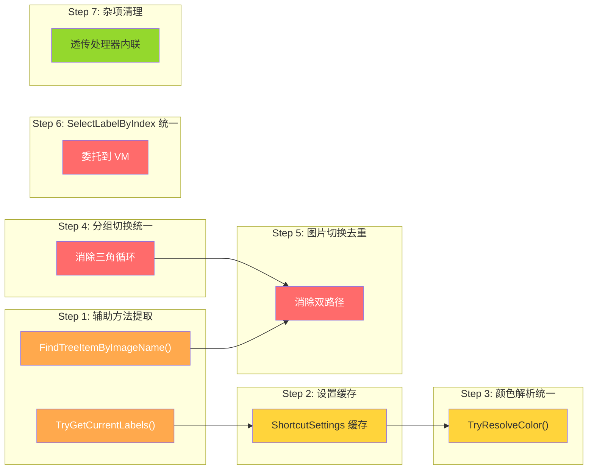
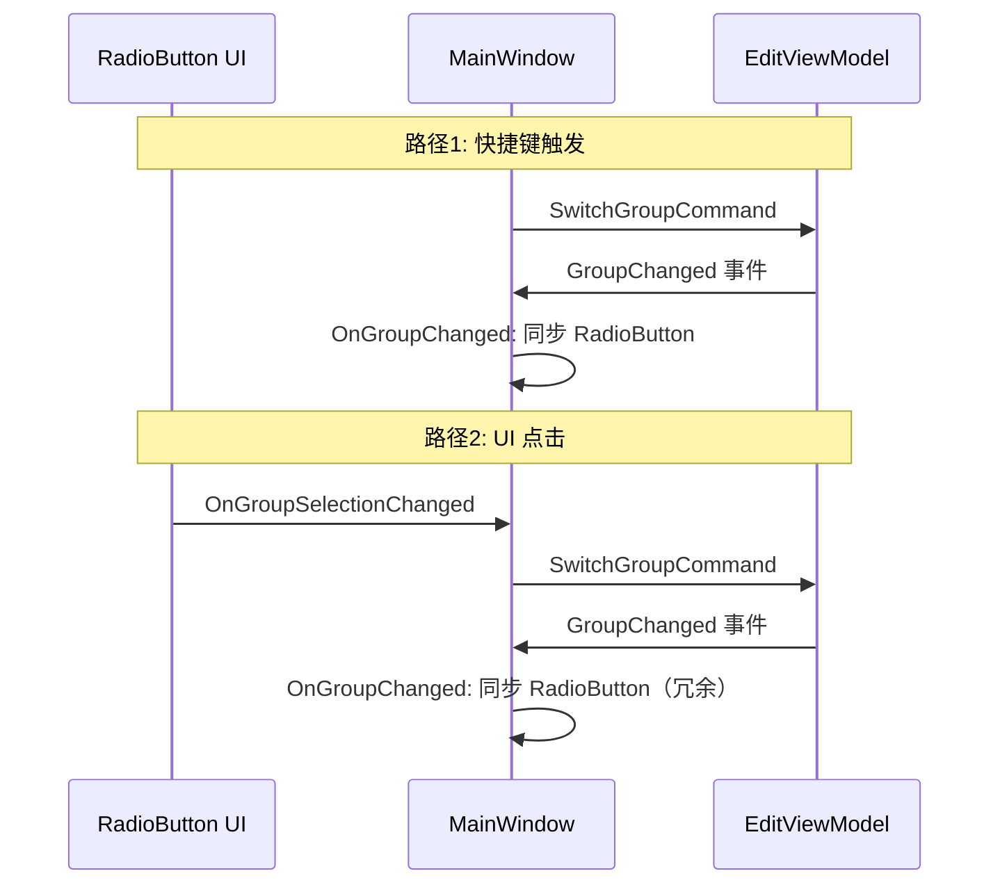
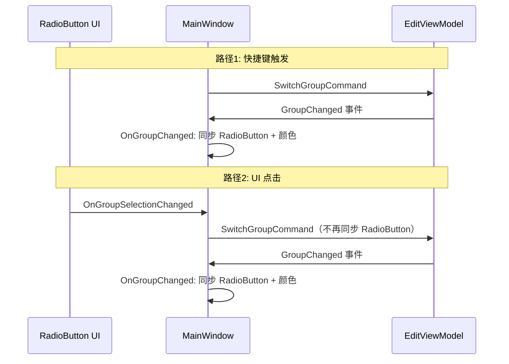
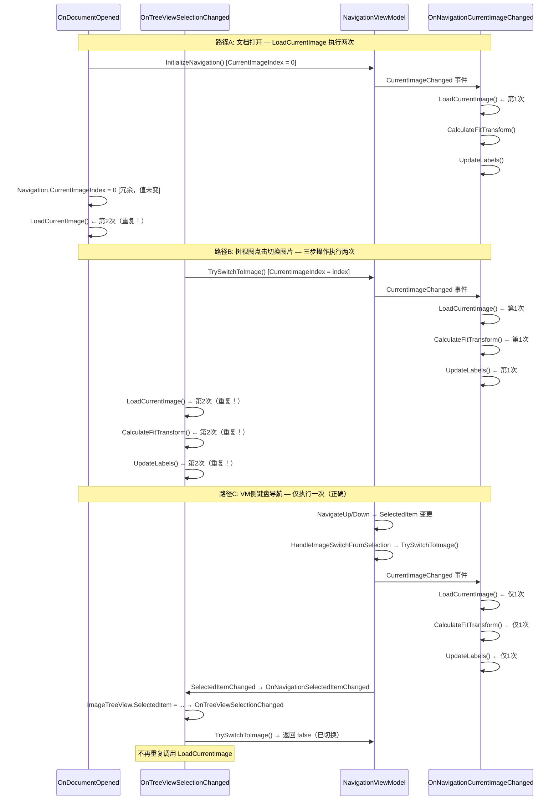

# Phase 9: 冗余代码清理方案

> 基于 [`plans/redundancy.md`](plans/redundancy.md) 的分析结果，按依赖关系和风险等级排序。

## 总览



---

## Step 1: 提取辅助方法（B + C）

**风险：低** | **影响：9+3 处调用点**

### 1a. 提取 `TryGetCurrentLabels()`

在 `MainWindow` 中添加：

```csharp
/// <summary>
/// 获取当前图片的标签列表（常用守卫+查找模式的封装）
/// </summary>
/// <returns>如果当前有文档且图片有效，返回标签列表；否则返回 null</returns>
private List<LabelItem>? TryGetCurrentLabels()
{
    if (Document.TranslationData == null 
        || string.IsNullOrEmpty(CanvasControl.CurrentImagePath))
        return null;

    string imageName = Path.GetFileName(CanvasControl.CurrentImagePath);
    if (!Document.TranslationData.ImageLabels.TryGetValue(imageName, out var labels))
        return null;

    return labels;
}
```

**替换 9 处调用点：**

| # | 函数 | 变更 |
|---|------|------|
| 1 | `CommitCurrentEdit()` | 守卫 → `if (TryGetCurrentLabels() is not { } labels) return;` |
| 2 | `AddNewLabel()` | 守卫 → `if (TryGetCurrentLabels() is not { } labels) return;` + 移除后续重复查找 |
| 3 | `OnCanvasAddLabelRequested()` | 守卫 → `if (TryGetCurrentLabels() is not { } labels) return;` |
| 4 | `OnCanvasLabelMoved()` | 守卫 → `if (TryGetCurrentLabels() is not { } labels) return;` |
| 5 | `UpdateLabels()` | 守卫 → `if (TryGetCurrentLabels() is not { } labels) return;` |
| 6 | `OnToggleGroup()` | 守卫 → `if (TryGetCurrentLabels() is not { } labels) return;` |
| 7 | `DeleteSelectedLabel()` | 守卫 → `if (TryGetCurrentLabels() is not { } labels) return;` |
| 8 | `CenterOnLabel()` | 守卫 → `if (TryGetCurrentLabels() is not { } labels) return;` |
| 9 | `PerformReorder()` | 守卫 → `if (TryGetCurrentLabels() is not { } labels) return;` |

> **注意**：`AddNewLabel()` 和 `OnCanvasAddLabelRequested()` 中有对 `labels` 为 null 时创建新列表的逻辑，需特殊处理——仅替换守卫部分，保留 `new List<LabelItem>()` 分支。

### 1b. 提取 `FindTreeItemByImageName()`

在 `NavigationViewModel` 中添加：

```csharp
/// <summary>根据图片名查找对应的 ImageTreeItem</summary>
public ImageTreeItem? FindTreeItemByImageName(string imageName)
{
    return TreeItems.FirstOrDefault(t => t.ImageName == imageName);
}
```

**替换 3 处调用点：**

| # | 函数 | 变更 |
|---|------|------|
| 1 | `LoadImage()` | foreach → `var item = Navigation.FindTreeItemByImageName(imageName);` |
| 2 | `SaveCurrentFitScale()` | foreach → `var item = Navigation.FindTreeItemByImageName(imageName);` |
| 3 | `RebuildCurrentView()` | 内联查找 → `Navigation.FindTreeItemByImageName(imageName)` |

---

## Step 2: 设置缓存机制（D）

**风险：低** | **影响：5 处调用点**

### 问题

`ShortcutSettingsService.Load()` 每次都从磁盘读取 JSON 文件。在 `GetGroupBrush()` 和 `GetSelectedHighlightBrush()` 中，每次渲染标签都会触发磁盘 I/O。

### 方案

1. **MainWindow 侧**：已有 `_shortcutSettings` 字段，`OnPreferencesChanged` 中已更新。`UpdateGroupButtonColors()` 应直接使用 `_shortcutSettings` 而非重新 Load。

2. **AnnotationCanvas 侧**：添加 `UpdateSettings(ShortcutSettings settings)` 公开方法，由 MainWindow 在 `OnPreferencesChanged` 中调用。内部缓存设置对象，`GetGroupBrush()` / `GetSelectedHighlightBrush()` 从缓存读取。

```csharp
// AnnotationCanvas 新增
private ShortcutSettings? _cachedSettings;

public void UpdateSettings(ShortcutSettings settings)
{
    _cachedSettings = settings;
}
```

3. **MainWindow.OnPreferencesChanged** 中追加：

```csharp
CanvasControl.UpdateSettings(settings);
```

4. **替换调用点**：

| # | 位置 | 变更 |
|---|------|------|
| 1 | `UpdateGroupButtonColors()` | `ShortcutSettingsService.Load()` → 使用 `_shortcutSettings` |
| 2 | `GetGroupBrush()` | `ShortcutSettingsService.Load()` → 使用 `_cachedSettings` |
| 3 | `GetSelectedHighlightBrush()` | `ShortcutSettingsService.Load()` → 使用 `_cachedSettings` |

> `PreferencesWindow.LoadSettings()` 保留原样——它是窗口初始化时加载，语义合理。

---

## Step 3: 颜色解析统一（E）

**风险：低** | **依赖：Step 2**

### 方案

在 `AnnotationCanvas` 中提取通用颜色解析方法：

```csharp
/// <summary>
/// 从缓存设置中解析颜色，带 fallback 链：自定义 → 默认 → white
/// </summary>
private IBrush TryResolveColor(string? customHex, string defaultHex, double opacity)
{
    // 优先使用自定义颜色
    if (!string.IsNullOrEmpty(customHex) && customHex.StartsWith("#"))
    {
        try
        {
            var color = Avalonia.Media.Color.Parse(customHex);
            return new SolidColorBrush(color, opacity);
        }
        catch { }
    }

    // fallback 到默认颜色
    try
    {
        var color = Avalonia.Media.Color.Parse(defaultHex);
        return new SolidColorBrush(color, opacity);
    }
    catch { }

    // 最终 fallback
    return new SolidColorBrush(Colors.White, opacity);
}
```

**替换 2 处：**

| # | 函数 | 变更 |
|---|------|------|
| 1 | `GetGroupBrush()` | 整个方法体 → `TryResolveColor(hex, defaultHex, 0.8)` |
| 2 | `GetSelectedHighlightBrush()` | 整个方法体 → `TryResolveColor(hex, defaultHex, 0.9)` |

---

## Step 4: 分组切换统一（A1）

**风险：中** | **需验证事件流**

### 当前三角循环



### 目标：单一入口



### 具体变更

1. **删除 `SwitchToGroup()`** — 快捷键路径直接调用 `Edit.SwitchGroupCommand.Execute(groupIndex)`，RadioButton 同步由 `OnGroupChanged` 统一处理。

2. **简化 `OnGroupSelectionChanged()`** — 仅执行 `Edit.SwitchGroupCommand.Execute()`，移除 RadioButton 同步和 `UpdateGroupButtonColors()` 调用（这些由 `OnGroupChanged` 统一处理）。

3. **增强 `OnGroupChanged()`** — 添加 `UpdateGroupButtonColors()` 调用（从 `OnGroupSelectionChanged` 迁入）。

**变更前后对比：**

```csharp
// ===== 变更前 =====

// 快捷键路径
private void SwitchToGroup(int groupIndex)
{
    Edit.SwitchGroupCommand.Execute(groupIndex);
    if (groupIndex == 0 && Group0RadioButton != null) Group0RadioButton.IsChecked = true;
    else if (groupIndex == 1 && Group1RadioButton != null) Group1RadioButton.IsChecked = true;
}

// UI 点击路径
private void OnGroupSelectionChanged(object? sender, RoutedEventArgs e)
{
    if (sender is RadioButton radioButton)
    {
        if (radioButton == Group0RadioButton) Edit.SwitchGroupCommand.Execute(0);
        else if (radioButton == Group1RadioButton) Edit.SwitchGroupCommand.Execute(1);
        UpdateGroupButtonColors();
    }
}

// VM 事件路径
private void OnGroupChanged(object? sender, EventArgs e)
{
    var groupIndex = Edit.CurrentGroupIndex;
    if (groupIndex == 0 && Group0RadioButton != null) Group0RadioButton.IsChecked = true;
    else if (groupIndex == 1 && Group1RadioButton != null) Group1RadioButton.IsChecked = true;
}

// ===== 变更后 =====

// 快捷键路径 — 直接调用命令，RadioButton 同步由 OnGroupChanged 统一处理
// SwitchToGroup() 已删除，ExecuteShortcutAction 中改为：
case ShortcutAction.SwitchToGroup0:
    Edit.SwitchGroupCommand.Execute(0);
    break;
case ShortcutAction.SwitchToGroup1:
    Edit.SwitchGroupCommand.Execute(1);
    break;

// UI 点击路径 — 仅执行命令
private void OnGroupSelectionChanged(object? sender, RoutedEventArgs e)
{
    if (sender is RadioButton radioButton)
    {
        if (radioButton == Group0RadioButton) Edit.SwitchGroupCommand.Execute(0);
        else if (radioButton == Group1RadioButton) Edit.SwitchGroupCommand.Execute(1);
    }
}

// VM 事件路径 — 统一处理 RadioButton 同步 + 颜色更新
private void OnGroupChanged(object? sender, EventArgs e)
{
    var groupIndex = Edit.CurrentGroupIndex;
    if (groupIndex == 0 && Group0RadioButton != null) Group0RadioButton.IsChecked = true;
    else if (groupIndex == 1 && Group1RadioButton != null) Group1RadioButton.IsChecked = true;
    UpdateGroupButtonColors();
}
```

---

## Step 5: 图片切换去重（A2）

**风险：中** | **潜在 Bug：操作执行两次**

### 完整触发路径分析

#### 所有修改 `CurrentImageIndex` 的位置

| # | 位置 | 值 | 触发事件？ |
|---|------|-----|-----------|
| 1 | [`NavigationViewModel.InitializeNavigation()`](ViewModels/NavigationViewModel.cs:139) | `0` 或 `-1` | ✅ 触发 `CurrentImageChanged` |
| 2 | [`NavigationViewModel.ClearNavigation()`](ViewModels/NavigationViewModel.cs:149) | `-1` | ✅ 触发 `CurrentImageChanged` |
| 3 | [`NavigationViewModel.TrySwitchToImage()`](ViewModels/NavigationViewModel.cs:162) | `index` | ✅ 触发 `CurrentImageChanged` |
| 4 | [`OnDocumentOpened`](MainWindow.axaml.cs:354) | `0`（冗余） | ❌ 值未变，不触发 |

#### 所有调用 `LoadCurrentImage()` 的位置

| # | 位置 | 触发场景 |
|---|------|----------|
| 1 | [`OnNavigationCurrentImageChanged`](MainWindow.axaml.cs:385) | `CurrentImageChanged` 事件 |
| 2 | [`OnDocumentOpened`](MainWindow.axaml.cs:355) | 文档打开后显式调用 |
| 3 | [`OnTreeViewSelectionChanged`](MainWindow.axaml.cs:1362) | 树视图点击切换图片后显式调用 |

#### 双重执行路径详解



### 方案：以事件为单一真相源

**原则**：`OnNavigationCurrentImageChanged` 是图片切换 UI 更新的唯一执行点，其他处理器不再重复调用。

#### 变更 1：简化 `OnDocumentOpened`

```csharp
// 变更前
private void OnDocumentOpened(object? sender, DocumentOpenedEventArgs e)
{
    Navigation.InitializeNavigation(e.ImageFolderPath, e.ImageNames);
    if (Navigation.ImageNames.Count > 0)
    {
        Navigation.CurrentImageIndex = 0;   // ← 冗余：InitializeNavigation 已设为 0
        LoadCurrentImage();                  // ← 冗余：CurrentImageChanged 事件已触发
        Navigation.BuildTreeView(Document.TranslationData);
        ShowMainContent();
        _ = SetFocusAfterDelayAsync();
    }
}

// 变更后
private void OnDocumentOpened(object? sender, DocumentOpenedEventArgs e)
{
    // InitializeNavigation 内部设置 CurrentImageIndex = 0，
    // 自动触发 CurrentImageChanged → OnNavigationCurrentImageChanged → LoadCurrentImage
    Navigation.InitializeNavigation(e.ImageFolderPath, e.ImageNames);

    if (Navigation.ImageNames.Count > 0)
    {
        Navigation.BuildTreeView(Document.TranslationData);
        ShowMainContent();
        _ = SetFocusAfterDelayAsync();
    }
}
```

> **安全性验证**：`InitializeNavigation` 设置 `CurrentImageIndex = 0` → 同步触发 `CurrentImageChanged` → `OnNavigationCurrentImageChanged` 调用 `LoadCurrentImage()`。此时 `Document.TranslationData` 已可用（事件在文档完全加载后触发），`CanvasControl.CurrentImagePath` 由 `LoadCurrentImage` 内部设置。`CalculateFitTransform()` 首次加载时容器可能未就绪，但已有延迟重试机制。`UpdateLabels()` 依赖的 `CurrentImage` 在 `LoadCurrentImage` 返回后已就绪。

#### 变更 2：简化 `OnTreeViewSelectionChanged` 图片切换分支

```csharp
// 变更前
// 2. 图片切换（委托给 NavigationViewModel 判断）
if (targetRootItem != null && Navigation.TrySwitchToImage(targetRootItem.ImageName))
{
    LoadCurrentImage();        // ← 冗余：TrySwitchToImage 已触发 CurrentImageChanged
    CalculateFitTransform();   // ← 冗余
    UpdateLabels();            // ← 冗余
}

// 变更后
// 2. 图片切换（委托给 NavigationViewModel 判断）
// TrySwitchToImage 内部修改 CurrentImageIndex → 触发 CurrentImageChanged
// → OnNavigationCurrentImageChanged 自动执行 LoadCurrentImage + CalculateFitTransform + UpdateLabels
if (targetRootItem != null && Navigation.TrySwitchToImage(targetRootItem.ImageName))
{
    // 图片切换的 UI 更新已由 CurrentImageChanged 事件处理，此处无需额外操作
}
```

> **安全性验证**：`TrySwitchToImage` 返回 `true` 时，`CurrentImageIndex` 已变更 → `CurrentImageChanged` 事件已触发 → `OnNavigationCurrentImageChanged` 已执行三步操作。后续 `OnTreeViewSelectionChanged` 中的 `HighlightLabel` 和 TextBox 更新仍然正确执行（它们在图片加载完成后覆盖高亮状态，逻辑无误）。

#### 变更 3：`OnNavigationCurrentImageChanged` 保持不变

```csharp
private void OnNavigationCurrentImageChanged(object? sender, EventArgs e)
{
    LoadCurrentImage();
    CalculateFitTransform();
    UpdateLabels();
}
```

此处理器现在是图片切换 UI 更新的**唯一执行点**，无需修改。

#### 边界情况验证

| 场景 | `CurrentImageChanged` 是否触发 | `LoadCurrentImage` 执行次数 | 安全性 |
|------|-------------------------------|---------------------------|--------|
| 文档打开（有图片） | ✅ `InitializeNavigation` 设 `CurrentImageIndex = 0` | 1（仅事件） | ✅ |
| 文档打开（无图片） | ✅ `InitializeNavigation` 设 `CurrentImageIndex = -1` | 1（早退） | ✅ |
| 文档关闭 | ✅ `ClearNavigation` 设 `CurrentImageIndex = -1` | 1（早退：`ImageNames.Count == 0`） | ✅ |
| 树视图点击切换图片 | ✅ `TrySwitchToImage` 修改 `CurrentImageIndex` | 1（仅事件） | ✅ |
| 树视图点击同图片不同标签 | ❌ `TrySwitchToImage` 返回 `false` | 0 | ✅ |
| VM 侧键盘导航切换图片 | ✅ `HandleImageSwitchFromSelection` → `TrySwitchToImage` | 1（仅事件） | ✅ |
| VM 侧键盘导航同图片 | ❌ `TrySwitchToImage` 返回 `false` | 0 | ✅ |

---

## Step 6: SelectLabelByIndex 统一（A3）

**风险：低**

### 方案

让 `MainWindow.SelectLabelByIndex()` 委托到 `NavigationViewModel.SelectLabelByIndex()`，避免重复实现：

```csharp
// 变更前
private void SelectLabelByIndex(int labelIndex)
{
    if (Navigation.CurrentTreeItem == null) return;
    var translationItem = Navigation.CurrentTreeItem.Translations
        .FirstOrDefault(t => t.Index == labelIndex);
    if (translationItem != null)
    {
        Navigation.SelectedItem = translationItem;
        Navigation.CurrentTreeItem.IsExpanded = true;
        ImageTreeView.Focus();
        StatusBar.UpdateStatus($"已选中标注 #{labelIndex}", StatusBarViewModel.StatusType.Info);
    }
}

// 变更后
private void SelectLabelByIndex(int labelIndex)
{
    Navigation.SelectLabelByIndex(labelIndex);
    
    // UI 层补充操作
    if (Navigation.SelectedItem != null)
    {
        ImageTreeView.Focus();
        StatusBar.UpdateStatus($"已选中标注 #{labelIndex}", StatusBarViewModel.StatusType.Info);
    }
}
```

---

## Step 7: 杂项清理

**风险：极低**

### 7a. 单行透传事件处理器内联

将仅做单行调用的方法替换为 lambda：

| # | 原方法 | 替换为 |
|---|--------|--------|
| 1 | `OnCanvasLabelClicked()` | `CanvasControl.LabelClicked += (_, idx) => SelectLabelByIndex(idx);` |
| 2 | `OnOpenTranslationRequested()` | 在 AXAML 或构造函数中用 lambda |
| 3 | `OnNewTranslationRequested()` | 在 AXAML 或构造函数中用 lambda |

> **注意**：`OnOpenTranslationRequested` 和 `OnNewTranslationRequested` 如果在 AXAML 中通过 `x:Name` + Click 绑定，则需改为构造函数中 lambda 订阅，或保留原方法。需检查 AXAML 绑定方式后决定。

---

## 执行顺序与验证

| Step | 内容 | 验证方式 |
|------|------|----------|
| 1 | 辅助方法提取 | `dotnet build` + 手动测试标签操作 |
| 2 | 设置缓存 | `dotnet build` + 修改首选项颜色后验证即时生效 |
| 3 | 颜色解析统一 | `dotnet build` + 验证标签颜色正确显示 |
| 4 | 分组切换统一 | `dotnet build` + 快捷键/UI 切换分组均正常 |
| 5 | 图片切换去重 | `dotnet build` + 切换图片时无闪烁/重复加载 |
| 6 | SelectLabelByIndex 统一 | `dotnet build` + 点击画布标签能正确选中 |
| 7 | 杂项清理 | `dotnet build` + 功能回归测试 |

每个 Step 完成后均应 `dotnet build` 确认零错误零警告。
