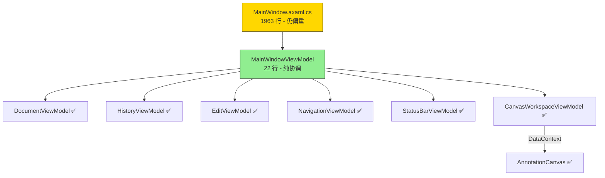

# LabelAva MVVM 架构评估总结

> 基于 Phase 0–7 重构完成后的代码现状，评估 MVVM 架构合理性与可维护性。

---

## 一、架构现状总览

### 1.1 ViewModel 层

| ViewModel | 行数 | 职责 | 状态+行为 | 评价 |
|-----------|------|------|-----------|------|
| [`MainWindowViewModel`](ViewModels/MainWindowViewModel.cs:3) | 22 | 子 VM 协调容器 | 仅属性 | ✅ 合理：纯协调角色 |
| [`CanvasWorkspaceViewModel`](ViewModels/CanvasWorkspaceViewModel.cs:14) | 424 | 视口变换 + 标注 CRUD + 命中测试 | ✅ | ✅ 核心领域 VM，语义内聚 |
| [`DocumentViewModel`](ViewModels/DocumentViewModel.cs:38) | 509 | 文件操作 + 脏状态 + 自动保存 | ✅ | ✅ 封装完整 |
| [`EditViewModel`](ViewModels/EditViewModel.cs:10) | 113 | 编辑模式 UI 状态 | ✅ | ✅ 瘦身成功 |
| [`NavigationViewModel`](ViewModels/NavigationViewModel.cs:11) | 344 | 树视图状态 + 导航命令 | ✅ | ✅ 封装完整 |
| [`HistoryViewModel`](ViewModels/HistoryViewModel.cs:8) | 108 | 撤销/重做 + HistoryManager | ✅ | ✅ 封装完整 |
| [`StatusBarViewModel`](ViewModels/StatusBarViewModel.cs:7) | 82 | 状态显示 + 消息过期 | ✅ | ✅ 封装完整 |
| [`WelcomeViewModel`](ViewModels/WelcomeViewModel.cs:5) | 3 | 无 | ❌ 空壳 | ⚠️ 违反子 VM 存在原则 |

### 1.2 View 层

| View | 行数 | 职责 | 评价 |
|------|------|------|------|
| [`MainWindow.axaml.cs`](MainWindow.axaml.cs:27) | 1963 | UI 事件转发 + 跨 VM 协调 + 对话框 | ⚠️ 仍然过重 |
| [`AnnotationCanvas.axaml.cs`](Views/AnnotationCanvas.axaml.cs:22) | 559 | 画布视觉渲染 + 交互 | ✅ 封装良好 |
| [`MainWindow.axaml`](MainWindow.axaml:1) | 283 | XAML 布局 + 数据绑定 | ✅ 绑定为主 |

### 1.3 目标架构达成度

**目标架构基本达成**，但 MainWindow 仍是瓶颈。

---

## 二、架构合理性评价

### ✅ 做得好的方面

#### 2.1 子 VM 存在原则严格执行

重构路线明确规定了"子 VM 必须同时拥有状态和命令"，除 `WelcomeViewModel` 外所有子 VM 都满足此原则。每个 VM 都有明确的单一职责：

- [`HistoryViewModel`](ViewModels/HistoryViewModel.cs:8)：封装 `HistoryManager` 交互 + `UndoCommand`/`RedoCommand`
- [`EditViewModel`](ViewModels/EditViewModel.cs:10)：封装编辑模式 UI 状态 + `ToggleEditModeCommand`/`SwitchGroupCommand`
- [`DocumentViewModel`](ViewModels/DocumentViewModel.cs:38)：封装文件操作 + `NewCommand`/`OpenCommand`/`SaveCommand`/`CloseCommand`
- [`NavigationViewModel`](ViewModels/NavigationViewModel.cs:11)：封装树视图行为 + `NavigateUpCommand`/`NavigateDownCommand`
- [`CanvasWorkspaceViewModel`](ViewModels/CanvasWorkspaceViewModel.cs:14)：封装画布工作区 + `ZoomInCommand`/`ZoomOutCommand`/`ResetZoomCommand`

#### 2.2 IFileService 抽象解耦平台依赖

[`IFileService`](Services/IFileService.cs) + [`FileDialogService`](Services/FileDialogService.cs) 成功将 `StorageProvider` 依赖从 ViewModel 中剥离，通过 `Func<TopLevel?>` 回调获取平台引用，设计合理。

#### 2.3 Command 模式统一撤销/重做

所有可撤销操作都通过 [`IUndoableCommand`](Commands/IUndoableCommand.cs) 实现，由 [`HistoryManager`](Services/HistoryManager.cs) 统一管理，确保了操作的一致性和可逆性。

#### 2.4 AnnotationCanvas UserControl 封装

[`AnnotationCanvas`](Views/AnnotationCanvas.axaml.cs:22) 成功将画布渲染和交互逻辑从 MainWindow 中抽离，采用回调+事件模式处理跨 VM 协调，避免了 UserControl 对其他 VM 的直接依赖。

#### 2.5 事件驱动的 VM 间通信

VM 间通过事件解耦：
- `DocumentViewModel.DocumentOpened` / `DocumentClosed`
- `NavigationViewModel.CurrentImageChanged` / `SelectedItemChanged`
- `CanvasWorkspaceViewModel.TransformChanged`
- `EditViewModel.EditModeChanged` / `GroupChanged`
- `HistoryViewModel.HistoryStateChanged`

MainWindow 订阅这些事件执行 UI 协调，VM 之间无直接依赖。

#### 2.6 XAML 绑定替代命令式操控

菜单栏已全面使用 `Command` 绑定：
- 文件菜单 → `Document.NewCommand`/`OpenCommand`/`SaveCommand`/`SaveAsCommand`/`CloseCommand`
- 编辑菜单 → `History.UndoCommand`/`RedoCommand`、`Edit.ToggleEditModeCommand`
- 视图菜单 → `CanvasWorkspace.ZoomInCommand`/`ZoomOutCommand`/`ResetZoomCommand`
- 窗口标题 → `Document.WindowTitle` 绑定
- 状态栏 → `StatusBar.StatusText`/`ZoomText` 绑定

---

### ⚠️ 需要改进的方面

#### 2.7 MainWindow.axaml.cs 仍然过重（1963 行）

这是当前架构最大的问题。MainWindow 仍承担了大量跨 VM 协调逻辑：

| 方法 | 行数 | 性质 | 问题 |
|------|------|------|------|
| [`OnTreeViewSelectionChanged`](MainWindow.axaml.cs:1393) | ~100 | 跨 VM 协调 | 图片切换 + 手风琴 + 高亮 + TextBox 同步 |
| [`OnTreeViewKeyDown`](MainWindow.axaml.cs:1601) | ~175 | 快捷键路由 | 大量快捷键匹配逻辑 |
| [`OnMainWindowPointerPressed`](MainWindow.axaml.cs:1500) | ~80 | 快捷键路由 | 鼠标侧键导航 |
| [`RebuildCurrentView`](MainWindow.axaml.cs:512) | ~90 | 跨 VM 协调 | Undo/Redo 后重建 UI |
| [`CommitCurrentEdit`](MainWindow.axaml.cs:875) | ~30 | 跨 VM 协调 | 访问 TextBox + Navigation + Document |
| [`AddNewLabel`](MainWindow.axaml.cs:1028) | ~35 | 跨 VM 协调 | 访问 CanvasControl + Document + Edit |
| [`SelectLabelByIndex`](MainWindow.axaml.cs:1003) | ~20 | 跨 VM 协调 | 访问 Navigation + ImageTreeView |
| [`OnGlobalKeyDown`](MainWindow.axaml.cs:910) | ~70 | 快捷键路由 | Ctrl+Z/Y + 分组切换 |
| 树视图拖拽系列 | ~150 | UI 交互 | DragDrop API |
| 对话框创建 | ~70 | UI 构建 | `ShowUnsavedChangesDialogAsync` |

**根因分析**：MainWindow 承担了三种角色——
1. **纯 UI 事件转发**（合理）
2. **跨 VM 协调器**（可接受但需控制）
3. **业务逻辑执行者**（不合理）

#### 2.8 RadioButton 颜色管理死代码未清理

Phase 6 方案中标记为 DEAD 的以下代码仍然存在：

- [`_buttonColors`](MainWindow.axaml.cs:723) 字段
- [`ApplyRadioButtonColors()`](MainWindow.axaml.cs:728) 方法
- [`OnRadioButtonPointerEntered/Exited/Pressed/Released`](MainWindow.axaml.cs:749) 4 个方法
- [`ActivateRadioButton/DeactivateRadioButton`](MainWindow.axaml.cs:814) 2 个方法

约 100 行死代码，应删除。

#### 2.9 WelcomeViewModel 空壳违反子 VM 存在原则

[`WelcomeViewModel`](ViewModels/WelcomeViewModel.cs:5) 完全为空，无状态无行为。按重构路线的子 VM 存在原则，应合并到 `MainWindowViewModel` 或直接删除。

#### 2.10 三个防重入/防污染标志

| 标志 | 位置 | 用途 | 问题 |
|------|------|------|------|
| [`_isProgrammaticTextChange`](MainWindow.axaml.cs:33) | L33 | 防止程序化设文本触发 TextChanged | 反模式：说明绑定设计不当 |
| [`_isUpdatingUI`](MainWindow.axaml.cs:38) | L38 | 防止 RebuildCurrentView 期间事件污染历史栈 | 必要之恶，但暗示事件流不够清晰 |
| [`_isSyncingSelection`](MainWindow.axaml.cs:46) | L46 | 防止 Navigation.SelectedItem ↔ ImageTreeView.SelectedItem 循环触发 | Avalonia TreeView 限制导致 |

这三个标志是当前架构的"补丁"，反映了 VM ↔ View 同步机制的不完善。

#### 2.11 _translationTextBox 直接操控

[`_translationTextBox`](MainWindow.axaml.cs:34) 在 MainWindow 中被多处直接操控：
- [`OnTranslationTextChanged`](MainWindow.axaml.cs:835)：读取 `.Text`、设置 `.CaretIndex`
- [`CommitCurrentEdit`](MainWindow.axaml.cs:875)：读取 `.Text`
- [`OnTreeViewSelectionChanged`](MainWindow.axaml.cs:1454)：设置 `.Text`、`.IsEnabled`、`.Watermark`、`.Focus()`
- [`OnGlobalKeyDown`](MainWindow.axaml.cs:922)：检查 `.IsFocused`、调用 `.Focus()`

TextBox 的状态分散在 View 和 VM 之间，没有统一的绑定机制。

#### 2.12 CanvasWorkspaceViewModel 依赖 Avalonia 类型

[`CanvasWorkspaceViewModel`](ViewModels/CanvasWorkspaceViewModel.cs:14) 使用了 `Avalonia.Matrix`、`Avalonia.Point`、`Avalonia.Size`，项目目标为跨平台，但 VM 层依赖了 UI 框架类型。虽然这些是数学类型而非控件类型，实际影响有限，但理论上不够纯净。

#### 2.13 StatusBarViewModel.UpdateStatus 是 async void

[`StatusBarViewModel.UpdateStatus`](ViewModels/StatusBarViewModel.cs:50) 标记为 `async void`，且内部有 `await Task.Delay(100)`。虽然当前逻辑简单不会抛异常，但 `async void` 无法被调用者捕获异常，存在潜在风险。

#### 2.14 Debug.WriteLine 残留

多处 `System.Diagnostics.Debug.WriteLine` 调试输出仍留在生产代码中（如 [L345](MainWindow.axaml.cs:345)、[L1396](MainWindow.axaml.cs:1396)、[L1827](MainWindow.axaml.cs:1827) 等）。

---

## 三、可维护性评价

### 3.1 量化指标

| 指标 | 重构前（估计） | 当前 | 改善 |
|------|---------------|------|------|
| MainWindow.axaml.cs 行数 | ~3700 | 1963 | ↓47% |
| ViewModel 总行数 | ~50 | 1603 | 从无到有 |
| XAML Command 绑定数 | 0 | 11 | 从无到有 |
| 直接 UI 操控点 | 40+ | ~15 | ↓63% |
| 双源状态字段 | 5+ | 0 | ✅ 消除 |
| 废弃代码行数 | ~200 | ~100 | ⚠️ 未完全清理 |

### 3.2 可维护性评分

| 维度 | 评分 | 说明 |
|------|------|------|
| **职责分离** | 7/10 | VM 层分离良好，但 MainWindow 仍过重 |
| **可测试性** | 6/10 | VM 可单元测试，但回调注入使测试需大量 mock |
| **可扩展性** | 7/10 | 新功能可独立添加 VM，但跨 VM 协调仍需改 MainWindow |
| **代码清晰度** | 7/10 | VM 代码清晰，MainWindow 协调逻辑较复杂 |
| **XAML 绑定率** | 8/10 | 菜单/状态栏绑定完整，TextBox 和 TreeView 仍有命令式操控 |
| **综合** | **7/10** | 显著改善，但仍有优化空间 |

---

## 四、剩余改进建议

按优先级排序：

### P0：清理死代码（低风险高收益）

1. 删除 RadioButton 颜色管理系列（~100 行）
2. 删除 `OnClearCanvas`、`GetParentImageItem` 包装方法
3. 清理 `Debug.WriteLine` 调试输出
4. 删除或合并空壳 `WelcomeViewModel`

### P1：提取快捷键路由（中风险中收益）

将 [`OnGlobalKeyDown`](MainWindow.axaml.cs:910)、[`OnTreeViewKeyDown`](MainWindow.axaml.cs:1601)、[`OnMainWindowPointerPressed`](MainWindow.axaml.cs:1500) 中的快捷键匹配逻辑提取为 `ShortcutRouter` 服务，MainWindow 仅做事件转发。

### P2：TextBox 状态绑定化（高风险高收益）

将 `_translationTextBox` 的 `Text`、`IsEnabled`、`Watermark` 绑定到 VM 属性，消除 `_isProgrammaticTextChange` 标志。这是最复杂的改进，需要解决光标位置保持等细节问题。

### P3：跨 VM 协调器模式（高风险高收益）

引入 `ApplicationController` 或 `InteractionService` 承担 MainWindow 中的跨 VM 协调逻辑（如 `RebuildCurrentView`、`AddNewLabel`），使 MainWindow 仅保留纯 UI 事件转发。

---

## 五、结论

经过 Phase 0–7 的系统性重构，LabelAva 的 MVVM 架构已从"巨型 code-behind + 无 VM"演变为"清晰的子 VM 体系 + 事件驱动通信 + XAML 绑定为主"。**核心领域逻辑已成功迁入 ViewModel 层**，每个子 VM 都有明确的单一职责和完整的状态+行为。

当前的主要瓶颈是 [`MainWindow.axaml.cs`](MainWindow.axaml.cs:27) 仍承担了较多跨 VM 协调和 UI 操控职责（1963 行），但这属于 MVVM 渐进式迁移的正常中间态——Avalonia TreeView 的 `SelectedItem` 非依赖属性、TextBox 光标控制等平台限制使得完全消除 code-behind 不现实也不必要。

**总体评价：架构合理，可维护性良好，重构方向正确。** 剩余改进项均为锦上添花，不影响当前架构的可用性和可维护性。
