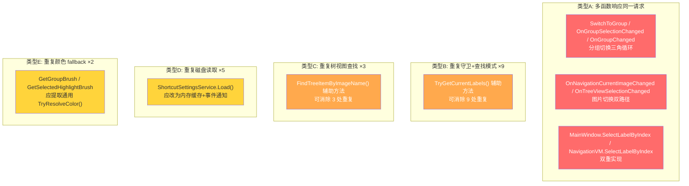

经过对整个项目的系统性审查，发现以下几类冗余模式：

---

## 一、多函数响应同一请求（同类型冗余）

### 1. 分组切换的三重逻辑重叠

[`SwitchToGroup()`](MainWindow.axaml.cs:901)、[`OnGroupSelectionChanged()`](MainWindow.axaml.cs:684)、[`OnGroupChanged()`](MainWindow.axaml.cs:658) 三者都涉及 RadioButton 同步 + 分组切换，职责边界模糊：

| 函数 | 触发源 | 执行内容 |
|------|--------|----------|
| `SwitchToGroup()` | 快捷键 | `SwitchGroupCommand` + RadioButton 同步 |
| `OnGroupSelectionChanged()` | UI RadioButton 点击 | `SwitchGroupCommand` + RadioButton 同步 + `UpdateGroupButtonColors()` |
| `OnGroupChanged()` | VM `GroupChanged` 事件 | RadioButton 同步 |

`SwitchToGroup` 和 `OnGroupSelectionChanged` 做了几乎相同的事（执行命令 + 同步 RadioButton），而 `OnGroupChanged` 又从 VM 侧反向同步 RadioButton——形成了一个**三角循环**。

### 2. 图片切换的双路径触发

[`OnNavigationCurrentImageChanged()`](MainWindow.axaml.cs:394) 和 [`OnTreeViewSelectionChanged()`](MainWindow.axaml.cs:1344) 中的图片切换分支，都执行完全相同的序列：

```csharp
LoadCurrentImage();
CalculateFitTransform();
UpdateLabels();
```

当用户在树视图中点击切换图片时，`Navigation.CurrentImageIndex` 变更 → 触发 `CurrentImageChanged` → `OnNavigationCurrentImageChanged`，**同时** `OnTreeViewSelectionChanged` 也会执行同样的三步操作。这导致**同一操作被执行两次**。

### 3. `SelectLabelByIndex` 双重实现

- [`MainWindow.SelectLabelByIndex()`](MainWindow.axaml.cs:947)：查找 → 设置 `Navigation.SelectedItem` → 展开节点 → 聚焦 → 更新状态栏
- [`NavigationViewModel.SelectLabelByIndex()`](ViewModels/NavigationViewModel.cs:216)：查找 → 设置 `SelectedItem` → 展开节点

MainWindow 版本包含了 NavigationViewModel 版本的全部核心逻辑，再加上额外 UI 操作。本质上是同一功能的重复实现。

---

## 二、重复的守卫+查找模式（最严重的冗余）

以下 9 处代码几乎逐字重复：

```csharp
if (Document.TranslationData == null || string.IsNullOrEmpty(CanvasControl.CurrentImagePath))
    return;
string imageName = Path.GetFileName(CanvasControl.CurrentImagePath);
if (!Document.TranslationData.ImageLabels.TryGetValue(imageName, out var labels))
    return;
```

出现位置：

| # | 函数 | 行号 |
|---|------|------|
| 1 | [`CommitCurrentEdit()`](MainWindow.axaml.cs:807) | 807-814 |
| 2 | [`AddNewLabel()`](MainWindow.axaml.cs:974) | 974-984 |
| 3 | [`OnCanvasAddLabelRequested()`](MainWindow.axaml.cs:1054) | 1054-1058 |
| 4 | [`OnCanvasLabelMoved()`](MainWindow.axaml.cs:1086) | 1086-1091 |
| 5 | [`UpdateLabels()`](MainWindow.axaml.cs:1137) | 1137-1143 |
| 6 | [`OnToggleGroup()`](MainWindow.axaml.cs:1287) | 1287-1293 |
| 7 | [`DeleteSelectedLabel()`](MainWindow.axaml.cs:1320) | 1320-1327 |
| 8 | [`CenterOnLabel()`](MainWindow.axaml.cs:1547) | 1547-1553 |
| 9 | [`PerformReorder()`](MainWindow.axaml.cs:1696) | 1696-1699 |

可提取为 `TryGetCurrentLabels(out var labels)` 辅助方法，将 9×5 行缩减为 9×1 行。

---

## 三、重复的树视图项查找

以下 3 处都执行"按 ImageName 线性搜索 TreeItems"：

```csharp
foreach (var item in Navigation.TreeItems)
{
    if (item.ImageName == imageName) { ... break; }
}
```

| # | 函数 | 行号 |
|---|------|------|
| 1 | [`LoadImage()`](MainWindow.axaml.cs:1186) | 1186-1193 |
| 2 | [`SaveCurrentFitScale()`](MainWindow.axaml.cs:1118) | 1118-1126 |
| 3 | [`RebuildCurrentView()`](MainWindow.axaml.cs:596) | 596 |

可提取为 `Navigation.FindTreeItemByImageName(string imageName)` 或直接使用 NavigationViewModel 中已有的 `UpdateCurrentTreeItem()` 模式。

---

## 四、重复的 `ShortcutSettingsService.Load()` 调用

每次需要颜色/设置时都从磁盘重新加载：

| # | 位置 | 用途 |
|---|------|------|
| 1 | [`MainWindow` 构造函数](MainWindow.axaml.cs:72) | 初始化 |
| 2 | [`UpdateGroupButtonColors()`](MainWindow.axaml.cs:710) | 获取分组颜色 |
| 3 | [`GetGroupBrush()`](Views/AnnotationCanvas.axaml.cs:310) | 获取分组画刷 |
| 4 | [`GetSelectedHighlightBrush()`](Views/AnnotationCanvas.axaml.cs:353) | 获取高亮画刷 |
| 5 | [`PreferencesWindow.LoadSettings()`](Views/PreferencesWindow.axaml.cs:44) | 加载设置 |

应将设置缓存在内存中（已有 `_shortcutSettings` 字段），通过事件通知变更，而非反复读磁盘。

---

## 五、重复的颜色解析 fallback 模式

[`GetGroupBrush()`](Views/AnnotationCanvas.axaml.cs:306) 和 [`GetSelectedHighlightBrush()`](Views/AnnotationCanvas.axaml.cs:349) 有几乎相同的 try → Load → Parse → fallback to defaults → fallback to white 的嵌套 try-catch 结构。可提取为通用的 `TryResolveColor(string? hex, string defaultHex, double opacity)` 方法。

---

## 六、其他杂项冗余

| 类型 | 位置 | 说明 |
|------|------|------|
| 单行透传事件处理器 | [`OnCanvasLabelClicked`](MainWindow.axaml.cs:1042) | 仅调用 `SelectLabelByIndex(labelIndex)`，可用 lambda 替代 |
| 单行透传事件处理器 | [`OnOpenTranslationRequested`](MainWindow.axaml.cs:476) | 仅调用 `Document.OpenCommand.ExecuteAsync(null)` |
| 单行透传事件处理器 | [`OnNewTranslationRequested`](MainWindow.axaml.cs:484) | 仅调用 `Document.NewCommand.ExecuteAsync(null)` |

---

## 冗余关系总览



**优先级建议**：类型B（守卫+查找 ×9）影响面最广、收益最高，建议优先提取 `TryGetCurrentLabels()` 辅助方法。类型A中的图片切换双路径（A2）可能导致实际 bug（操作执行两次），应其次处理。