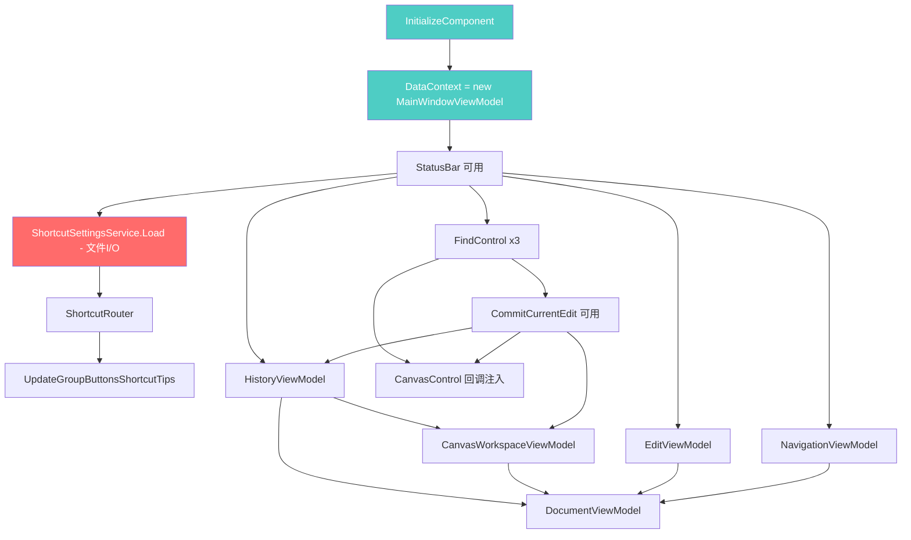
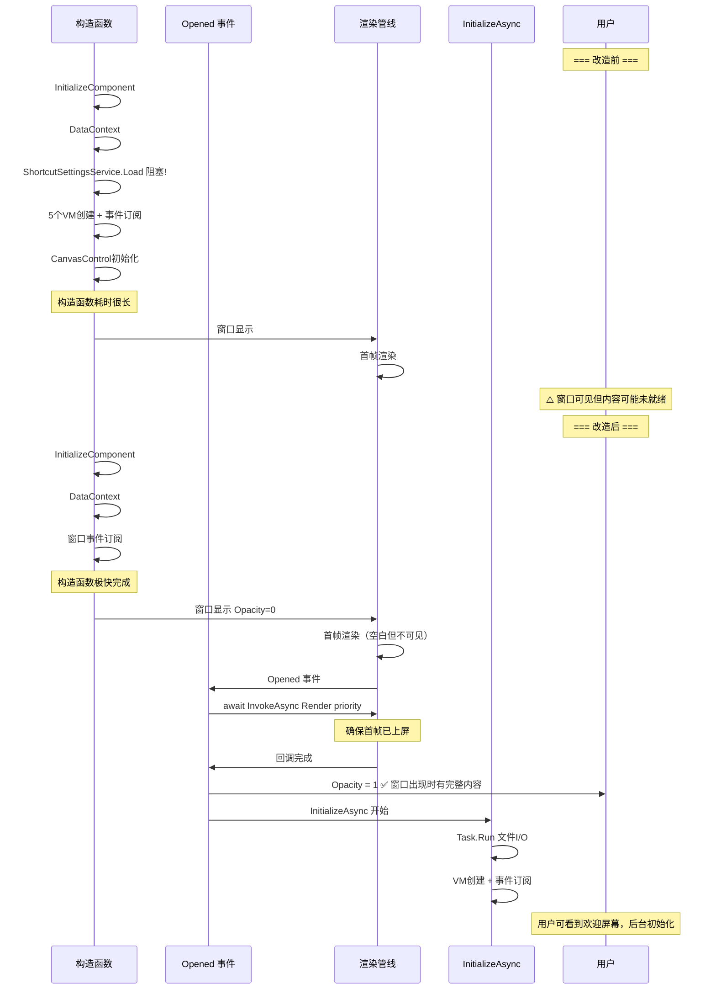

# 主窗口异步初始化方案

## 问题

主窗口首次渲染时出现透明→内容的闪烁。已做 P0（Background）+ P1（TransparencyLevelHint）+ Opacity 延迟显示，但主窗口仍闪烁。

**根因**：[`MainWindow()`](MainWindow.axaml.cs:66) 构造函数执行了约 80 行同步初始化代码，阻塞 UI 线程，导致首帧渲染被推迟。窗口在 `Opacity=0` 状态下虽然不可见，但 `Opened` 事件中 `DispatcherPriority.Background` 恢复 `Opacity=1` 时，首帧内容可能尚未完成上屏。

## 依赖分析

当前构造函数各步骤的依赖关系：



- 🟢 青色 = 必须在构造函数中完成
- 🔴 红色 = 唯一的文件 I/O 阻塞点

## 方案设计

### 核心思路

1. 构造函数只做最轻量的初始化
2. `Opened` 事件中用 `DispatcherPriority.Render` 等待首帧上屏后再恢复 `Opacity=1`
3. 重工作异步执行，文件 I/O 移到后台线程

### 时序对比



### 代码改动

#### 1. 精简构造函数

```csharp
public MainWindow()
{
    InitializeComponent();
    DataContext = new MainWindowViewModel();

    // 仅保留窗口级事件订阅（不依赖任何 VM）
    this.Closing += OnWindowClosing;
    this.PointerPressed += OnMainWindowPointerPressed;
    this.AddHandler(InputElement.KeyDownEvent, OnGlobalKeyDown, RoutingStrategies.Tunnel);

    // 异步初始化入口
    this.Opened += OnWindowFirstOpened;
}
```

#### 2. Opened 事件：等待首帧后显示

```csharp
private async void OnWindowFirstOpened(object? sender, EventArgs e)
{
    this.Opened -= OnWindowFirstOpened;

    // 等待首帧渲染完成（比 DispatcherPriority.Background 更可靠）
    await Dispatcher.UIThread.InvokeAsync(() => { }, DispatcherPriority.Render);

    // 首帧已上屏，安全地显示窗口
    this.Opacity = 1;

    // 异步执行重工作
    await InitializeAsync();
}
```

#### 3. 异步初始化方法

```csharp
private async Task InitializeAsync()
{
    // ---- Phase 1: 文件 I/O 移到后台线程 ----
    _shortcutSettings = await Task.Run(() => ShortcutSettingsService.Load());
    _shortcutRouter = new ShortcutRouter(_shortcutSettings);

    // ---- Phase 2: UI 线程上的轻量操作 ----
    UpdateGroupButtonsShortcutTips();
    PreferencesWindow.SettingsChanged += OnPreferencesChanged;

    StatusBar.UpdateStatus("就绪", StatusBarViewModel.StatusType.Success);
    StatusBar.UpdateZoom(100);

    _translationTextBox = this.FindControl<TextBox>("TranslationTextBox");
    _editPanel = this.FindControl<Border>("EditPanel");
    if (_translationTextBox != null)
        _translationTextBox.LostFocus += OnTranslationTextBoxLostFocus;

    _imageTreeView = this.FindControl<TreeView>("ImageTreeView")!;

    // ---- Phase 3: VM 创建（有依赖顺序） ----
    var historyManager = new HistoryManager();
    ViewModel.History = new HistoryViewModel(historyManager, CommitCurrentEdit, StatusBar);
    ViewModel.History.HistoryStateChanged += OnHistoryStateChanged;

    ViewModel.CanvasWorkspace = new CanvasWorkspaceViewModel(ViewModel.History, StatusBar, CommitCurrentEdit);
    ViewModel.CanvasWorkspace.TransformChanged += OnCanvasTransformChanged;

    ViewModel.Edit = new EditViewModel(StatusBar);
    ViewModel.Edit.EditModeChanged += OnEditModeChanged;
    ViewModel.Edit.GroupChanged += OnGroupChanged;

    ViewModel.Navigation = new NavigationViewModel(StatusBar);
    ViewModel.Navigation.CurrentImageChanged += OnNavigationCurrentImageChanged;
    ViewModel.Navigation.SelectedItemChanged += OnNavigationSelectedItemChanged;

    var fileService = new FileDialogService(() => GetTopLevel(this));
    ViewModel.Document = new DocumentViewModel(
        fileService, ViewModel.History, StatusBar,
        ShowUnsavedChangesDialogAsync, ShowImageSelectionDialogAsync
    );
    ViewModel.Document.DocumentOpened += OnDocumentOpened;
    ViewModel.Document.DocumentClosed += OnDocumentClosed;

    // ---- Phase 4: Canvas 初始化 ----
    CanvasControl.CommitCurrentEdit = CommitCurrentEdit;
    CanvasControl.SelectLabelByIndex = SelectLabelByIndex;
    CanvasControl.LabelClicked += (_, labelIndex) => SelectLabelByIndex(labelIndex);
    CanvasControl.AddLabelRequested += OnCanvasAddLabelRequested;
    CanvasControl.LabelMoved += OnCanvasLabelMoved;
}
```

#### 4. 安全守卫：防止初始化完成前的空引用

异步初始化期间，用户可能通过快捷键或菜单触发依赖 VM 的操作。需要添加守卫：

```csharp
private bool _isInitialized = false;

// InitializeAsync 末尾：
_isInitialized = true;
```

在以下方法入口添加守卫检查：

| 方法 | 原因 |
|---|---|
| [`CommitCurrentEdit()`](MainWindow.axaml.cs:823) | 访问 `Edit.IsEditMode`、`Navigation.SelectedItem` |
| [`OnGlobalKeyDown()`](MainWindow.axaml.cs:139) | 访问 `ViewModel.History` |
| [`OnHistoryStateChanged()`](MainWindow.axaml.cs:106) | 访问 `ViewModel.Document` |

```csharp
private void CommitCurrentEdit()
{
    if (!_isInitialized) return;
    // ... 原有逻辑
}
```

> **为什么安全**：初始界面是 WelcomeView，MainContentPanel 隐藏。用户只能点击"新建翻译"或"打开翻译"按钮，这些绑定到 `Document.NewCommand` / `Document.OpenCommand`。在 `ViewModel.Document` 为 null 时，绑定无法解析，按钮 Command 为 null，点击无效。唯一的风险是快捷键（Ctrl+Z 等），通过 `_isInitialized` 守卫解决。

#### 5. MainWindow.axaml 改动

```xml
<!-- 保持 Opacity="0" 不变 -->
<Window ...
        Opacity="0"
        ...>
```

无需其他 XAML 改动。

### 改动清单

| 文件 | 改动 |
|---|---|
| [`MainWindow.axaml.cs`](MainWindow.axaml.cs) | 构造函数瘦身 + 新增 `OnWindowFirstOpened` + `InitializeAsync` + `_isInitialized` 守卫 |
| [`MainWindow.axaml`](MainWindow.axaml) | 无改动（`Opacity="0"` 已有） |

### 风险评估

| 风险 | 缓解措施 |
|---|---|
| 用户在初始化完成前按快捷键 | `_isInitialized` 守卫 |
| `DispatcherPriority.Render` 仍不够晚 | 可叠加一次 `DispatcherPriority.Background` yield |
| `async void` 异常未捕获 | `OnWindowFirstOpened` 内 try-catch 包裹，或改用 `Task` + fire-and-forget with exception logging |
